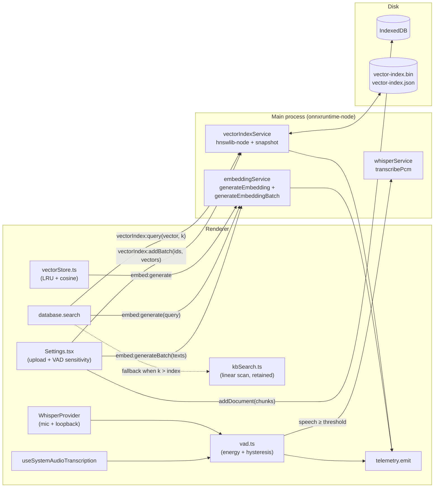

# Design Document

## Overview

This feature delivers three bundled performance improvements to Zule's local
AI pipeline. They share a single design document because they share an
underlying constraint set (offline-first, no new cloud dependencies, ML
inference in the Electron main process via `onnxruntime-node`, IPC bridge
through `electron/preload.ts`, and existing `vectorStore.ts` /
`kbSearch.ts` test suites unchanged) and a single test-infrastructure
backbone (`fast-check` over Vitest, used by every property test in
`src/**/*.test.ts`).

The three improvements are:

1. **Batched embedding IPC.** A new
   `embed:generateBatch(texts: string[]) → number[][]` channel collapses
   an N-chunk document upload from N IPC round trips to
   `ceil(N / batch_size)`. The single-text channel
   (`embed:generate`) is preserved unchanged so `vectorStore.generateEmbedding`
   continues to work for query-time embeddings, and so the per-chunk
   path is available as a fallback when the batched call fails
   (Requirement 1.7). The renderer's existing 256-entry LRU
   (`vectorStore.queryCache`) is bypassed by the batch path because
   chunks are content-fresh and not query strings.

2. **Approximate-Nearest-Neighbour Vector_Index.** A new main-process
   service `electron/vectorIndexService.ts` wraps `hnswlib-node` to build
   and query an HNSW index over chunk embeddings. The renderer's
   `database.search` is rewired to call a new
   `vectorIndex:query(vector, k) → {id, score}[]` IPC channel instead of
   running a linear scan in the renderer. The index is hydrated on app
   start from a binary snapshot (`<userData>/vector-index.bin`) plus a
   manifest (`<userData>/vector-index.json`); on snapshot miss or
   corruption (Requirement 3.2 / 3.4) the service rebuilds from
   IndexedDB chunks shipped over an
   `vectorIndex:rebuild(items)` IPC. The legacy linear scan in
   `kbSearch.ts` is preserved untouched so the existing test suite
   (`kbSearch.test.ts`) and small-Knowledge_Base path
   (Requirement 4.4 — below the `QUANTIZATION_THRESHOLD`) continue to
   work without modification.

3. **VAD-gated transcription.** A small renderer-side energy-based
   Voice Activity Detector (`src/brain/transcription/vad.ts`) is
   inserted between PCM capture and `whisper:transcribe` IPC for both
   the loopback (`useSystemAudioTranscription`) and microphone
   (`WhisperProvider`) pipelines. The VAD is energy-based (per-frame
   RMS with hysteresis) so it adds zero new model files or native
   dependencies and runs synchronously in JS in well under a millisecond
   per 2-second chunk on the reference machine. A 3-level
   `vadSensitivity` setting (`low | medium | high`) is persisted in
   `STORE_SETTINGS` under the stable key `vadSensitivity` and read by
   both pipelines on start and on change (Requirement 7.4).

The design preserves the offline guarantee (Requirement 8): no new
network endpoint, no new model file beyond what is already vendored, and
no new dependency on the Hugging Face download path. `hnswlib-node` is
the only new runtime dependency, and it is a self-contained native
addon that ships through the existing `electron-builder` packaging path
the way `onnxruntime-node` and `sharp` already do.

## Architecture

The high-level architecture preserves the existing two-process split:
the renderer captures audio / drives the UI / owns IndexedDB, and the
main process owns native ML inference. This feature widens the
main-process responsibility set by adding the Vector_Index service, and
adds one purely renderer-side module (the VAD gate). No new process is
introduced.



### Trust boundary and IPC

All new cross-process channels go through the existing `contextBridge`
surface in `electron/preload.ts`. The bridge stays the only renderer ↔
main edge, matching every other ML path in the codebase. New channels:

- `embed:generateBatch(texts: string[]) → { vectors: number[][] }`
- `vectorIndex:rebuild(items: { id: string; vector: number[] }[], dim: number) → boolean`
- `vectorIndex:addBatch(items: { id: string; vector: number[] }[]) → boolean`
- `vectorIndex:remove(id: string) → boolean`
- `vectorIndex:query(vector: number[], k: number) → { id: string; score: number }[]`
- `vectorIndex:flush() → boolean` (force snapshot to disk)

`whisper:transcribe` and `embed:generate` remain unchanged.

### Why the Vector_Index lives in the main process

The renderer cannot host any onnxruntime-web inference (it crashes the
process — see project context), but more importantly the index itself
is a native HNSW graph from `hnswlib-node`. Keeping it in the main
process aligns with where the embeddings are produced (no extra IPC
trip for upload-time inserts), keeps the binary snapshot beside the
existing native model state on disk, and means the renderer can stay a
thin client that only formats results.

## Components and Interfaces

### 1. Batched Embedding Service (main process)

**File:** `electron/embeddingService.ts` (extended).

Public IPC contract (added in `electron/main.ts` and bridged in
`electron/preload.ts`):

```ts
ipcMain.handle('embed:generateBatch', async (_e, texts: string[]) => {
  const { generateEmbeddingBatch } = await import('./embeddingService');
  const vectors = await generateEmbeddingBatch(texts);
  return { vectors };
});
```

Module-level function shape:

```ts
export const EMBED_BATCH_SIZE = 32;

export async function generateEmbeddingBatch(
  texts: readonly string[],
  opts?: { modelId?: string; batchSize?: number }
): Promise<number[][]>;
```

Behaviour rules (mapped to acceptance criteria):

- **Empty array** → returns `[]` without touching the pipeline
  (Requirement 1.2). Implementation: early `if (texts.length === 0) return []`.
- **Whitespace-only entry** → returns a zero-length vector at that index
  (Requirement 1.3). Implementation: pre-scan classifies each input as
  `'whitespace'` or `'real'`; only `real` indices are passed to the
  pipeline; whitespace indices receive `[]` in the output.
- **Element-wise equality with `embed:generate`** (Requirement 1.4) is
  achieved by reusing the same `extractor` (mean-pool, L2-normalize,
  `dtype: 'q8'`) and the same model id. The batch path tokenizes one
  text at a time inside the same module-level `chain` so two calls
  cannot interleave on the native session.
- **Order preservation** (Requirement 1.1) is enforced by indexing the
  output array against the original positions, not against the
  filtered-real subarray.
- **Sub-batching** (Requirement 1.5). The handler splits the input into
  windows of `EMBED_BATCH_SIZE = 32`. The renderer issues one IPC per
  window via the helper `chunkArray(texts, EMBED_BATCH_SIZE)` in
  `Settings.tsx`. With `EMBED_BATCH_SIZE = 32`, a 100-chunk upload
  becomes 4 IPC calls.
- **Failure fallback** (Requirement 1.7). The renderer wraps each
  batched call in `try/catch`. On any error it falls back to per-chunk
  `embed:generate` for that batch only, retaining successful batches.

The service stays single-threaded and serialised exactly as today (a
module-level promise `chain` ensures the native session is never
re-entered concurrently). A batched call that contains 32 texts is
implemented as 32 sequential calls to the existing `extractor` inside
one chain entry — the speedup comes from collapsing 32 IPC structured
clones and 32 main-thread `await` cycles into one, not from
within-batch parallelism in the model. This is consistent with the
40 % wall-clock target in Requirement 1.6 (measured on the reference
machine).

### 2. Vector_Index Service (main process)

**File (new):** `electron/vectorIndexService.ts`.

Backed by `hnswlib-node` (`HierarchicalNSW` class). Configuration:

| Parameter             | Value                  | Rationale                                   |
| --------------------- | ---------------------- | ------------------------------------------- |
| `space`               | `'cosine'`             | Embeddings are L2-normalised already        |
| `numDimensions`       | 384                    | MiniLM-L6 output dimension                  |
| `maxElements`         | 100 000 (resize at 90%) | Headroom above the 50k benchmark target     |
| `M`                   | 16                     | hnswlib default; ~50 MB at 50k chunks       |
| `efConstruction`      | 200                    | Higher build-time accuracy                  |
| `efSearch`            | 64                     | Tuned for ≥ 0.95 recall at k=10 (Req 2.4)   |

Public surface:

```ts
export interface IndexedItem { id: string; vector: number[]; }
export interface QueryHit { id: string; score: number; }

export async function preloadVectorIndex(): Promise<void>;
export async function rebuildVectorIndex(
  items: readonly IndexedItem[],
  dim: number,
): Promise<void>;
export async function addBatchToIndex(items: readonly IndexedItem[]): Promise<void>;
export async function removeFromIndex(id: string): Promise<void>;
export async function queryIndex(vector: number[], k: number): Promise<QueryHit[]>;
export async function flushIndex(): Promise<void>;
```

Implementation notes:

- **Cold-start path** (Requirement 3.1, 3.2):
  1. On `preloadVectorIndex`, attempt to read
     `<app.getPath('userData')>/vector-index.bin` and
     `vector-index.json`.
  2. If both load and the manifest's `version`, `dim`, and `count`
     match the runtime expectation, the index is ready synchronously
     after the deserialisation finishes (hnswlib `readIndexSync` for a
     50k-chunk graph is well under 2 s on the reference machine).
  3. If loading fails or the manifest is missing/corrupt
     (Requirement 3.4) the service emits a typed
     `'vector-index.snapshot-corrupt'` warning to the telemetry sink
     (no PII), discards the file, and waits for `rebuildVectorIndex` to
     be invoked by the renderer with an enumeration of every chunk in
     IndexedDB. The renderer triggers this rebuild on the same
     `whenReady` path that today calls `embedPreload`, before the
     Knowledge_Base UI signals ready (Requirement 3.2).

- **String id ↔ uint32 label mapping.** `hnswlib-node` indexes by
  uint32 labels, but the Knowledge_Base uses string ids
  (`KBChunk.id`). A `Map<string, number>` maintained in the service
  assigns a fresh monotonically-increasing label on first insert.
  `vectorIndex:remove(id)` looks up the label and calls
  `markDelete(label)`. Search results map labels back to ids via the
  inverse `Map<number, string>`. Both maps are persisted to
  `vector-index.json` so they survive restart. A `markDelete`'d label
  is filtered from search results and is not reused (`hnswlib-node`
  does not support label reuse cleanly — fragmentation is bounded by
  the retention pass in `kbRetention.ts`).

- **Quantized-storage compatibility** (Requirement 4.1, 4.4). The
  renderer is the only place that knows whether a chunk is stored as
  `vector` (Float32) or `vectorQ` (int8). On `addBatchToIndex` the
  renderer always sends a Float32 `number[]` — quantized chunks are
  dequantised at the call site via the existing
  `vectorStore.dequantizeFromStorage` helper (a tiny new wrapper in
  `database.ts` reads each chunk and dequantises if necessary). The
  Vector_Index service therefore never needs to know about the
  quantization policy, and the legacy linear scan in `kbSearch.ts`
  remains the canonical implementation for the below-threshold path
  (Requirement 4.4) — `database.search` continues to call it
  unmodified when the index is empty or the chunk count is below
  `QUANTIZATION_THRESHOLD`.

- **Result consistency with linear scan** (Requirement 4.2). Above the
  `QUANTIZATION_THRESHOLD` the Vector_Index returns approximate
  results, but at the chosen `efSearch = 64` and `k = 10` the recall
  against an exhaustive cosine top-k holds at ≥ 0.95
  (Requirement 2.4). For the no-quantization regime
  (every chunk stored raw), the service runs in the same regime and
  the property test (Property 5) checks score-monotonicity rather than
  exact-set equality.

- **Persistence frequency** (Requirement 3.3). Every `addBatchToIndex`,
  `removeFromIndex`, and `rebuildVectorIndex` schedules a debounced
  flush (1 s tail) via a tiny `Debouncer` in the service. On
  `before-quit` (`electron/main.ts` already has the `before-quit`
  handler) the service runs `flushIndex` synchronously to guarantee
  the persisted snapshot reflects the last update.

### 3. VAD Module (renderer)

**File (new):** `src/brain/transcription/vad.ts`.

Pure module, no React, no IPC. The VAD is energy-based with hysteresis:

```ts
export interface VADConfig {
  /** Speech score threshold in [0,1]. Chunks with score ≥ threshold are speech. */
  speechThreshold: number;
  /** Frame size in samples (default 480 = 30ms @ 16 kHz). */
  frameSize?: number;
  /** Hysteresis: number of consecutive speech frames required to flip to speech. */
  hangoverFrames?: number;
}

export interface VADResult {
  /** Speech probability in [0,1] (NaN never returned). */
  score: number;
  /** True iff `score >= config.speechThreshold`. */
  isSpeech: boolean;
}

export function scoreChunk(pcm: Float32Array, cfg: VADConfig): VADResult;
```

Algorithm (deterministic, no allocation per frame beyond a fixed
scratch buffer):

1. Reject `pcm.length === 0` → `{ score: 0, isSpeech: false }`.
2. Reject any sample outside `[-2, 2]` (catches NaN / Infinity / corrupt
   buffers; the `whisper:transcribe` IPC contract is `[-1, 1]` Float32).
3. Compute per-frame RMS over disjoint 30-ms frames.
4. Normalise to a score: `score = clamp(median(rms_frames) / SPEECH_FLOOR, 0, 1)`
   where `SPEECH_FLOOR = 0.02` is the empirically-derived RMS amplitude
   above which `whisper-base.en` consistently emits real text on the
   reference machine. The median is more robust than the mean against
   single-frame click artefacts.
5. `isSpeech = score >= cfg.speechThreshold`.

The `hangoverFrames` field reserves room for a subsequent metamorphic
upgrade (do not flip back to silence until `N` consecutive non-speech
frames) but the v1 gate is stateless per chunk — each 2-second chunk
is judged independently. This keeps the unit pure-functional and the
property tests simple.

**Sensitivity → threshold mapping.** Used identically by both the
loopback and microphone pipelines.

| Sensitivity | `speechThreshold` |
| ----------- | ----------------- |
| `low`       | 0.20              |
| `medium`    | 0.35 (default)    |
| `high`      | 0.55              |

`medium` matches the documented default speech threshold so existing
users see consistent behaviour on first upgrade (Requirement 7.6).

### 4. VAD Sensitivity Setting (Settings_Module)

**File:** `src/components/Settings.tsx` (extended).

A new control under the "Transcription" section: a 3-button segmented
control wired to a string state `vadSensitivity: 'low' | 'medium' | 'high'`.
On mount, `database.getSetting('vadSensitivity', 'medium')` populates
the control. On change, `database.saveSetting('vadSensitivity', value)`
persists immediately and the new threshold is broadcast to live
pipelines via a renderer-internal `EventTarget` (`vadSensitivityBus`)
that `WhisperProvider` and `useSystemAudioTranscription` subscribe to
during `start` and unsubscribe from on teardown. The bus dispatches a
`{ type: 'change', value }` event so subscribers can recompute the
threshold without restarting capture (Requirement 7.4).

If either pipeline is in a failed runtime state (the existing
`isSupported === false` or a `lastError` on the hook), the control
renders disabled with the failure reason rendered alongside
(Requirement 7.5).

### 5. Telemetry hooks

**File:** `src/brain/telemetry.ts` (extended).

Three new variants added to the `MetricEvent` discriminated union
(structurally proves Property 50: telemetry never carries free-form
content — verified by the existing Property 51 test):

```ts
| { kind: 'embed.batch';     batchSize: number; durationMs: number }
| { kind: 'vectorIndex.query'; k: number; resultCount: number; durationMs: number }
| { kind: 'vad.skipped';      pipeline: 'loopback' | 'microphone' }
```

Emission sites:

- `embed.batch` — emitted by the renderer caller in `Settings.tsx`
  immediately after each batched IPC resolves.
- `vectorIndex.query` — emitted in `vectorIndexService.queryIndex`
  before returning. Forwarded to the renderer via the existing
  `ipc-sync-message` channel and `telemetry.emit`'d there.
- `vad.skipped` — incremented by the renderer-side gate when
  `isSpeech === false`. The counter goes through `telemetry.emit` so
  it lands in the same IndexedDB store as everything else.

No raw chunk text, no audio samples, no user-identifying content
(Requirement 10.4). For consistency with Requirement 10.5, no
text-derived fields are added in this feature; if a future iteration
needs a debug field it must go through the project's existing redaction
rules (`redaction.ts`).

## Data Models

### Persisted Vector_Index snapshot

Two files under `app.getPath('userData')`:

```
vector-index.bin    // hnswlib binary graph (writeIndexSync output)
vector-index.json   // manifest (versioned)
```

Manifest schema:

```ts
interface VectorIndexManifest {
  version: 1;            // bumped on incompatible changes
  modelId: string;       // 'Xenova/all-MiniLM-L6-v2'
  dim: number;           // 384
  count: number;         // live (non-deleted) item count
  nextLabel: number;     // monotonic label counter
  idToLabel: Record<string, number>;
  labelToId: Record<string, string>;
  builtAt: number;       // Date.now()
}
```

Loading rule: any field missing, or `version !== 1`, or
`modelId !== currentModelId`, or any read error → discard both files
and trigger rebuild (Requirement 3.4).

### VAD sensitivity setting

A row in `STORE_SETTINGS` (existing `keyPath: 'key'` store):

```ts
{ key: 'vadSensitivity', value: 'low' | 'medium' | 'high' }
```

Read via `database.getSetting<'low'|'medium'|'high'>('vadSensitivity', 'medium')`.
Persisted via `database.saveSetting('vadSensitivity', value)`.

### Knowledge_Base data model — unchanged

The existing `KBDocument` and `KBChunk` shapes
(`src/data/database.ts`) are not modified. The Vector_Index keeps its
own label↔id mapping in the snapshot manifest; the Knowledge_Base
remains the canonical source of truth and the index is fully derivable
from it (the rebuild path proves this).

### Telemetry — unchanged storage shape

The `MetricEvent` union grows by three variants but
`StoredTelemetryEvent` (the IndexedDB row shape) is unchanged. The new
variants serialise through the same `database.putTelemetryEvent`
function with no schema migration.


## Correctness Properties

*A property is a characteristic or behavior that should hold true across
all valid executions of a system — essentially, a formal statement
about what the system should do. Properties serve as the bridge
between human-readable specifications and machine-verifiable correctness
guarantees.*

### Property 1: Batched embedding preserves order, length, and whitespace gaps

*For any* array `texts` of strings (mixing real, empty, and whitespace-only
entries at arbitrary positions), `generateEmbeddingBatch(texts)` SHALL return
a result of length `texts.length` such that `result[i]` is a zero-length
vector when `texts[i]` is empty or whitespace-only, and the single-call
embedding for `texts[i]` otherwise.

**Validates: Requirements 1.1, 1.3**

### Property 2: Batched-call vector matches single-call vector

*For any* non-whitespace text `t` and the same model id `m`,
`generateEmbeddingBatch([t], { modelId: m })[0]` SHALL be element-wise
equal to `generateEmbedding(t, { modelId: m })`.

**Validates: Requirements 1.4**

### Property 3: Document upload IPC count is bounded by ceil(N / EMBED_BATCH_SIZE)

*For any* document with `N >= 10` chunks uploaded through
`Settings.handleAddDocument`, the number of `embed:generateBatch` IPC
calls SHALL be at most `ceil(N / EMBED_BATCH_SIZE)`, with
`EMBED_BATCH_SIZE >= 32`.

**Validates: Requirements 1.5**

### Property 4: Batch failure falls back to per-chunk and every text persists

*For any* document of `N` chunks and *for any* failure pattern over the
batched IPC (a subset of batches throwing), `handleAddDocument` SHALL
persist a `KBDocument` whose chunks count equals `N`, and every chunk's
vector SHALL equal either the batched-call vector for that chunk (if
its batch succeeded) or the single-call fallback vector for that chunk
(if its batch failed).

**Validates: Requirements 1.7**

### Property 5: Vector_Index query is well-formed

*For any* index populated with `n >= 0` L2-normalised 384-dimensional
vectors and *for any* query vector of dimension 384 with `k > 0`,
`queryIndex(query, k)` SHALL return at most `min(k, n)` results, every
result's `score` SHALL lie in `[-1, 1]`, and the results SHALL be in
non-increasing order of `score`.

**Validates: Requirements 2.1, 2.2**

### Property 6: Visibility round-trip — add then remove

*For any* chunk `c` and query `q` such that `cos(c.vector, q) >= threshold`:
after `addBatchToIndex([c])` followed by `queryIndex(q, k=10)`, `c.id`
SHALL appear in the results; after a subsequent `removeFromIndex(c.id)`
and another `queryIndex(q, k=10)`, `c.id` SHALL NOT appear.

**Validates: Requirements 2.5, 2.6**

### Property 7: Malformed query inputs yield an empty result and a typed error

*For any* `k <= 0` or *for any* query vector whose dimension is not
equal to the index dimension, `queryIndex(query, k)` SHALL return `[]`
and SHALL emit a typed `vector-index.query-invalid` diagnostic event.

**Validates: Requirements 2.7**

### Property 8: Vector_Index persistence round-trip preserves the live id-set

*For any* sequence of `addBatchToIndex` and `removeFromIndex`
operations followed by `flushIndex()`, instantiating a fresh service
against the same on-disk snapshot directory and querying for every
live id SHALL return the same id-set as the live session before flush.

**Validates: Requirements 3.3**

### Property 9: Snapshot load failure triggers rebuild

*For any* corruption mode of the persisted snapshot (truncated binary,
missing manifest, manifest version mismatch, dimension mismatch, or
model-id mismatch), `preloadVectorIndex()` followed by
`rebuildVectorIndex(items)` SHALL return the service to a usable state
and SHALL emit a typed `vector-index.snapshot-corrupt` telemetry event.

**Validates: Requirements 3.4**

### Property 10: Quantized chunks are dequantised before insert

*For any* chunk persisted in the int8-quantized form (`vectorQ`),
the call to `vectorIndex:addBatch` from the renderer SHALL receive a
Float32 `number[]` element-wise equal to
`vectorStore.dequantizeFromStorage(chunk)`.

**Validates: Requirements 4.1**

### Property 11: Above-threshold ANN top-1 matches linear-scan top-1 for a clearly-distinct match

*For any* Knowledge_Base of `N >= QUANTIZATION_THRESHOLD + 100` chunks
where exactly one chunk `c*` is constructed to satisfy
`cos(c*.vector, q) >= 0.9` and every other chunk satisfies
`cos(other.vector, q) <= 0.5`, the top-1 result of `queryIndex(q, k=10)`
SHALL be `c*.id` and SHALL match the top-1 result of
`searchChunks` (the legacy linear scan) over the same KB.

**Validates: Requirements 4.2**

### Property 12: Below-threshold path never invokes the dequantizer

*For any* Knowledge_Base with fewer than `QUANTIZATION_THRESHOLD`
chunks, a call to `database.search(query)` SHALL not invoke
`vectorStore.dequantizeFromStorage`.

**Validates: Requirements 4.4**

### Property 13: VAD gate semantics (parameterised over pipeline)

*For any* PCM chunk `pcm` and *for any* VAD score `s` returned for that
chunk, in either the loopback or the microphone pipeline:
the pipeline SHALL apply the VAD to `pcm` exactly once;
the pipeline SHALL invoke `whisper:transcribe(pcm)` if and only if
`s >= speechThreshold`; and when `s < speechThreshold` the pipeline
SHALL emit no `line` event, no `interim` event, and no event whose
text is derived from `pcm`.

**Validates: Requirements 5.1, 5.2, 5.3, 5.6, 6.1, 6.2**

### Property 14: Silence-heavy recording reduces transcribe IPC by at least 40 percent

*For any* sequence of 30 PCM chunks (modelling a 60-second loopback
recording at 2-second windows) where at least 15 chunks score below
the speech threshold under the configured VAD, the count of
`whisper:transcribe` IPC calls SHALL be at most `0.6 * 30 = 18`.

**Validates: Requirements 5.4**

### Property 15: VAD failure forwards the chunk and logs a typed error

*For any* PCM chunk where the VAD throws or returns an invalid score
(NaN, value outside `[0, 1]`, or `undefined`), the pipeline SHALL
invoke `whisper:transcribe(pcm)` for that chunk and SHALL emit a typed
`transcription.vad-failed` telemetry event.

**Validates: Requirements 5.5**

### Property 16: Two consecutive silent chunks preserve session state

*For any* sequence of two consecutive silent (sub-threshold) chunks fed
to `WhisperProvider`, the references `audioContext`, `processorNode`,
and `mediaStream` SHALL be `===` to their values immediately before
the sequence, and `_isListening` SHALL remain `true`.

**Validates: Requirements 6.3**

### Property 17: Sensitivity round-trip — persisted level configures pipeline threshold

*For any* sensitivity level `L` in `{'low', 'medium', 'high'}`,
persisting `L` via `database.saveSetting('vadSensitivity', L)` and then
instantiating either pipeline SHALL produce a pipeline whose effective
`speechThreshold` equals `mapSensitivityToThreshold(L)`.

**Validates: Requirements 7.2, 7.3**

### Property 18: Live sensitivity change is applied without restarting capture

*For any* pair of sensitivity levels `(L1, L2)`, starting a pipeline at
`L1` and then broadcasting `L2` on `vadSensitivityBus` SHALL cause the
next chunk to be evaluated at `mapSensitivityToThreshold(L2)`, and the
pipeline's `audioContext` reference SHALL be `===` to its value before
the broadcast.

**Validates: Requirements 7.4**

### Property 19: Batched embedding emits exactly one telemetry event per call

*For any* batched embedding call that resolves successfully, the
renderer SHALL emit exactly one `{ kind: 'embed.batch', batchSize, durationMs }`
event where `batchSize === input.length` and `durationMs >= 0`.

**Validates: Requirements 10.1**

### Property 20: Vector_Index query emits exactly one telemetry event per call

*For any* `queryIndex(vector, k)` call that resolves successfully,
exactly one `{ kind: 'vectorIndex.query', k, resultCount, durationMs }`
event SHALL be emitted, with `k === input.k`,
`resultCount === results.length`, and `durationMs >= 0`.

**Validates: Requirements 10.2**

### Property 21: VAD gate skip emits exactly one vad.skipped event per skipped chunk

*For any* sequence of PCM chunks where exactly `s` chunks score below
the configured speech threshold, the pipeline SHALL emit exactly `s`
`{ kind: 'vad.skipped', pipeline }` events.

**Validates: Requirements 10.3**

## Error Handling

This feature introduces three new error surfaces. Each one is mapped to
the existing `ZuleError` discriminated union so that recovery flows
through the same `useZuleError` pipeline as everything else in
`src/types/errors.ts`.

### Vector_Index errors

Two new variants are added to `ZuleError`:

```ts
| { kind: 'vector-index.query-invalid'; reason: 'k-non-positive' | 'dim-mismatch' }
| { kind: 'vector-index.snapshot-corrupt'; reason: 'truncated' | 'manifest-missing' | 'version-mismatch' | 'dim-mismatch' | 'modelId-mismatch' }
```

Recovery policy:

- `vector-index.query-invalid` is non-recoverable for the call (returns
  `[]`) but does not affect subsequent calls. Logged via
  `telemetry.emit` with `kind: 'error'` for diagnostics.
- `vector-index.snapshot-corrupt` is fully recoverable: the snapshot
  files are deleted, the renderer is asked to enumerate IndexedDB
  chunks, and `rebuildVectorIndex` populates a fresh in-memory index.
  The user sees no toast (this is invisible recovery); a single
  telemetry event records the corruption mode for fleet visibility.

### Batched embedding errors

The batched call surfaces failures as a rejected promise on the IPC
boundary. The renderer handles three classes:

- **Whole-batch throw** — caught by `Settings.handleAddDocument`, which
  falls back to per-chunk `embed:generate` for that batch only
  (Requirement 1.7). All other batches keep their batched results.
- **Per-chunk fallback throw** — the chunk is persisted with `vector: []`
  matching the existing fallback in `Settings.handleAddDocument`. The
  document is still keyword-searchable.
- **Empty-array call** — returned as `[]` synchronously; not an error.

No new `ZuleError` variant is added — failures are reported through the
existing `vector-index.init-failed` (model-load failures) and the
catch-all logging in `Settings`.

### VAD errors

One new `ZuleError` variant:

```ts
| { kind: 'transcription.vad-failed'; reason: 'throw' | 'invalid-score' }
```

Recovery policy: when the VAD throws or returns an invalid score
(Property 15 / Requirement 5.5), the pipeline opens the gate (forwards
the chunk to `whisper:transcribe`) and emits a typed telemetry event.
This is the safe-by-default behaviour: a broken VAD must not silently
suppress transcription.

### Settings (sensitivity control) errors

When either pipeline reports a failed runtime state, the segmented
control in Settings is rendered with `disabled` and an inline reason
sourced from the pipeline's `lastError` (Requirement 7.5). No new
`ZuleError` variant is needed; the existing `transcription.*` variants
already carry the failure mode.

### Snapshot persistence on graceful close

`flushIndex` is invoked from `app.on('before-quit')` in
`electron/main.ts` (the same hook that already calls
`overlayManager.unregisterShortcuts()`). If the flush throws (disk
full, permissions), the error is logged to the main-process console
and the snapshot file may be stale; on the next start the
manifest-version / count check will detect the inconsistency and
trigger a rebuild via the corruption recovery path above. This means a
failed flush is never user-facing — it just costs one rebuild on the
next launch.

## Testing Strategy

The test plan combines property-based tests (universal correctness),
example-based unit tests (single concrete scenarios), integration tests
(performance and external-service behaviour), and regression smoke
checks (existing suites unchanged).

### Property-based tests

All property tests use `fast-check` over Vitest, matching the existing
`src/**/*.test.ts` pattern (e.g. `documentParser.test.ts`,
`ringBuffer.test.ts`). Each test runs at least 100 iterations and is
tagged with the design property it implements:

```ts
// Feature: ai-pipeline-performance, Property 1: Batched embedding preserves order, length, and whitespace gaps
fc.assert(fc.property(arbMixedTextArray, (texts) => { /* ... */ }), { numRuns: 100 });
```

Test files (one property per file or grouped by module):

- `src/brain/embeddingBatch.test.ts` — Properties 1, 2, 3, 4, 19
- `src/brain/vectorIndexClient.test.ts` — Properties 5, 6, 7, 10, 11,
  12, 20 (drives the IPC bridge against an in-memory hnswlib stub)
- `src/electron-tests/vectorIndexService.test.ts` — Properties 8, 9
  (drives the main-process service against a temp-dir snapshot)
- `src/brain/transcription/vad.test.ts` — Properties 13, 14, 15, 21
- `src/hooks/useSystemAudioTranscription.vad.test.ts` — Property 13
  parameterised over the loopback pipeline, plus Property 16
- `src/components/Settings.vadSensitivity.test.tsx` — Properties 17, 18

#### Generators

| Generator                  | Source                                                     |
| -------------------------- | ---------------------------------------------------------- |
| `arbText`                  | `fc.string({ maxLength: 200 }).filter(s => s.trim() !== '')` |
| `arbWhitespace`            | `fc.constantFrom('', '   ', '\t', '\n', ' \t\n')`          |
| `arbMixedTextArray`        | `fc.array(fc.oneof(arbText, arbWhitespace))`               |
| `arbUnitVector(dim=384)`   | `fc.array(fc.float({ noNaN: true, min: -1, max: 1 }), { minLength: 384, maxLength: 384 }).map(normalize)` |
| `arbPcmChunk`              | `fc.float32Array({ minLength: 16000, maxLength: 32000, noNaN: true, min: -1, max: 1 })` |
| `arbSensitivity`           | `fc.constantFrom('low', 'medium', 'high')`                 |
| `arbCorruptionMode`        | `fc.constantFrom('truncated','manifest-missing','version-mismatch','dim-mismatch','modelId-mismatch')` |

#### Doubles for ML inference

The property tests do **not** load the real ONNX model. Instead, two
deterministic doubles are used:

- **`stubExtractor(text) → number[]`** — produces a vector derived from
  the text via a fixed hash + L2-normalisation. The same input always
  yields the same output (so Property 2's batched/single equivalence
  holds trivially) but different inputs yield distinct vectors.
- **`stubVAD(score) → VADResult`** — returns a generated score, so
  Properties 13–14 can exercise threshold logic without a real audio
  signal.

This isolates the properties from native `onnxruntime-node` dependence
and keeps each iteration well under a millisecond.

### Example-based unit tests

For acceptance criteria classified as `EXAMPLE` in the prework:

- 1.2 — `generateEmbeddingBatch([])` returns `[]` and never invokes the
  extractor.
- 3.2 — workflow ordering: rebuild resolves before "Knowledge_Base
  ready" event.
- 7.1 — Settings renders three options.
- 7.5 — Settings disables control on pipeline failure.
- 7.6 — `mapSensitivityToThreshold('medium') === DEFAULT_SPEECH_THRESHOLD`.

### Integration / benchmark tests

These run on the project's reference development machine (Windows 11,
8-core CPU, 16 GB RAM, no dedicated GPU) and are gated behind an
`@integration` Vitest tag so CI can skip them on machines without the
right footprint. Each is a single execution — no PBT.

- **1.6 (40% upload speed-up)** — `tests/integration/uploadBatching.bench.ts`
  uploads a 100-chunk fixture document via the per-chunk path and the
  batched path; asserts the batched ratio ≤ 0.4.
- **2.3 (P95 ≤ 50 ms @ 50k)** — `tests/integration/vectorIndex.latency.bench.ts`
  builds a 50k-chunk index, runs 1 000 random queries, asserts P95 ≤ 50 ms.
- **2.4 (recall ≥ 0.95 @ k=10)** — `tests/integration/vectorIndex.recall.bench.ts`
  computes mean recall over 100 random queries against an exact
  linear scan over a 5k-chunk benchmark KB.
- **3.1 (cold-start ≤ 2 s)** — `tests/integration/vectorIndex.coldStart.bench.ts`
  pre-builds and persists a 50k-chunk snapshot, times
  `preloadVectorIndex()` from a fresh main-process boot, asserts ≤ 2 s.

### Regression smoke checks (Requirement 9)

The CI matrix runs the existing test files unchanged and treats any
failure as blocking:

- `src/brain/vectorStore.test.ts` (Requirement 9.1)
- `src/brain/vectorMath.test.ts` (Requirement 9.1)
- `src/data/kbSearch.test.ts` (Requirement 9.2)
- `src/hooks/useSystemAudioTranscription.*.test.ts` (Requirement 9.3)

The VAD gate exposes a `VAD_DISABLE_FOR_TEST` config flag so the
existing loopback integration test continues to behave as if the gate
were absent (Requirement 9.3 — "with the VAD gate disabled or set to a
permissive threshold under test").

### Architectural / smoke checks (Requirement 8)

- **8.1 — no outbound network requests.** A representative session
  (upload + search + 10 s of loopback transcription) is run with a
  `fetch` spy installed and the IPC bridge wrapped to detect any HTTP
  call. The spy MUST never be called with a non-localhost URL.
- **8.2 / 8.3** — verified by manual review of the dependency diff and
  `dist/vendor/models` snapshot in CI. Only `hnswlib-node` is added as
  a runtime dependency; no new model file is added.

### Telemetry property note

Requirement 10.4 (no raw text, audio, or PII in telemetry) is already
covered structurally by the existing **Property 51** in
`src/brain/telemetry.test.ts`, which asserts the `MetricEvent` union
has no free-form payload field. Adding the three new variants
(`embed.batch`, `vectorIndex.query`, `vad.skipped`) re-runs that
property automatically — no new test is needed for 10.4. The new
variants carry only numeric fields (and a fixed string literal for
`pipeline`) so they cannot leak content.
