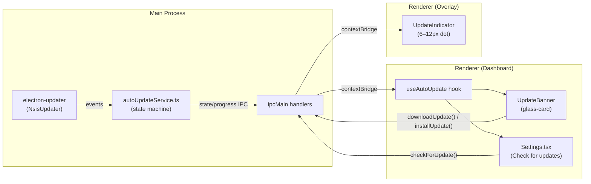
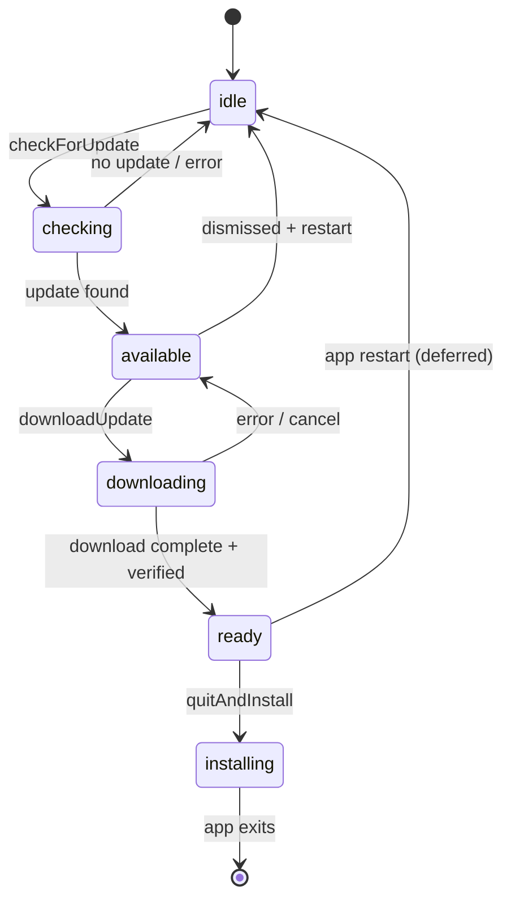

# Design Document

## Overview

This feature integrates `electron-updater` (the auto-update companion
package from `electron-builder`) into Zule's main process to deliver
silent background update checks, user-initiated checks, download progress
reporting, and a one-click "restart and install" flow — all surfaced
through the existing `contextBridge` IPC pattern and the established
glass-card/pill design language.

The implementation is bounded by three hard constraints:

1. **Offline-first.** Every network call to the Update_Source (GitHub
   Releases at `zule-ai/zule`) is fire-and-forget from the user's
   perspective. Failures are recorded as telemetry, never surfaced as
   blocking errors.
2. **Renderer/main split.** The `electron-updater` instance lives
   exclusively in the main process. The renderer drives it through new
   IPC channels added to `electron/preload.ts` and typed in
   `src/types/electron.d.ts`, following the existing invoke/on pattern.
3. **Windows NSIS only.** The feature targets the single platform the
   build pipeline produces. The NSIS installer's silent-install flag
   (`/S`) is used by `electron-updater`'s `quitAndInstall()` to restart
   the app after the user confirms.

The design introduces one new main-process module
(`electron/autoUpdateService.ts`), extends the preload bridge with six
new methods, adds two React components (`UpdateBanner`, `UpdateIndicator`),
and emits five new telemetry event kinds through the existing
`TelemetryModule`.

## Architecture

The auto-updater sits in the main process as a stateful singleton service
that wraps `electron-updater`'s `autoUpdater` object. It exposes its
lifecycle to the renderer via typed IPC channels and pushes state-change
events to both the Dashboard and Overlay windows.



### State Machine

The Auto_Updater service maintains a finite state machine with the
following states and transitions:



**State definitions:**

| State | Description |
|-------|-------------|
| `idle` | No update activity. Default on launch. |
| `checking` | Fetching `latest.yml` from the Update_Source. |
| `available` | A newer version exists; awaiting user action. |
| `downloading` | Installer bytes in flight; progress events emitting. |
| `ready` | Installer downloaded and integrity-verified. |
| `installing` | Installer launched; app exiting. |
| `error` | Transient; immediately transitions back to previous actionable state. |

## Components and Interfaces

### 1. `electron/autoUpdateService.ts` (Main Process)

The core service module. Responsible for:

- Instantiating `electron-updater`'s `autoUpdater` with `autoDownload: false`
  and `autoInstallOnAppQuit: false` (user-driven flow).
- Maintaining the state machine and broadcasting transitions over IPC.
- Throttling progress events to 1–10 per second (Requirements 5.3, 10.7).
- Recording telemetry events (Requirements 9.1–9.6).
- Graceful teardown on `app.before-quit`.

```typescript
// Simplified interface — full implementation in tasks
export interface UpdateState {
  status: 'idle' | 'checking' | 'available' | 'downloading' | 'ready' | 'installing';
  availableVersion: string | null;
  currentVersion: string;
  releaseNotes: string | null;
  progress: DownloadProgress | null;
  error: UpdateError | null;
}

export interface DownloadProgress {
  percent: number;       // [0, 100]
  bytesReceived: number;
  totalBytes: number;
}

export interface UpdateError {
  stage: 'check' | 'download' | 'integrity' | 'install';
  category: 'unreachable' | 'timeout' | 'server-error' | 'network' | 'storage' | 'integrity';
}
```

**Key design decisions:**

- `autoDownload: false` ensures the user explicitly opts in before bytes
  are consumed. This preserves the offline-first guarantee — no
  background bandwidth usage without consent.
- The service is lazy-loaded (`await import('./autoUpdateService')`) from
  `electron/main.ts` after the Dashboard window's `did-finish-load` event,
  keeping it off the synchronous startup path (Requirement 8.4).
- In dev mode (`!app.isPackaged`), the service short-circuits all network
  calls and remains in `idle` (Requirement 2.6).
- The service holds a `deferredInstall: boolean` flag for "Install on next
  quit" (Requirement 6.3). On `app.before-quit`, if the flag is set and
  the quit is user-initiated (not a crash/OS kill), it calls
  `autoUpdater.quitAndInstall(true, true)`.

### 2. IPC Bridge Extensions (`electron/preload.ts`)

Six new methods on the `electronAPI` surface:

| Method | Signature | IPC Channel |
|--------|-----------|-------------|
| `checkForUpdate` | `() => Promise<UpdateState>` | `'update:check'` |
| `downloadUpdate` | `() => Promise<void>` | `'update:download'` |
| `cancelDownload` | `() => Promise<void>` | `'update:cancel'` |
| `installUpdate` | `() => Promise<void>` | `'update:install'` |
| `deferInstall` | `() => Promise<void>` | `'update:defer'` |
| `onUpdateState` | `(cb: (state: UpdateState) => void) => () => void` | `'update:state'` |

The subscription method (`onUpdateState`) follows the same pattern as
`onSyncMessage` and `onOverlayError`: it registers an `ipcRenderer.on`
listener and returns an unsubscribe function. Progress events are
delivered through the same channel as state transitions (the `progress`
field is non-null only in `downloading` state).

The IPC bridge delivers events to **both** windows (Dashboard and
Overlay) following the existing `ipc-sync-message` fan-out pattern in
`electron/main.ts`. If a window has been destroyed, the send is skipped
silently (Requirement 10.8).

### 3. `src/types/electron.d.ts` Extensions

The `ElectronAPI` interface gains the six methods above plus the
`UpdateState`, `DownloadProgress`, and `UpdateError` type imports. All
methods are marked optional (`?:`) consistent with the existing pattern
for capabilities that are only available in the Electron runtime.

### 4. `src/hooks/useAutoUpdate.ts`

A React hook that:

- Subscribes to `window.electronAPI.onUpdateState` on mount, unsubscribes
  on unmount.
- Exposes the current `UpdateState` plus action dispatchers
  (`check`, `download`, `cancel`, `install`, `defer`, `dismiss`).
- Tracks a `dismissed: boolean` local state that hides the banner until
  next app restart (Requirement 4.7).
- Is consumed by both `UpdateBanner` and the Settings module.

### 5. `src/components/UpdateBanner.tsx`

A React component rendered conditionally at the top of the Dashboard
layout when the update state is `available`, `downloading`, or `ready`.

**Visual structure:**

```
┌─────────────────────────────────────────────── glass-card ───┐
│  🆕 Version X.Y.Z available (you're on A.B.C)               │
│                                                               │
│  [Rendered Markdown release notes, max 20k chars]            │
│  [Expand ▾]  (if truncated)                                  │
│                                                               │
│  ── downloading state ──────────────────────────────────────  │
│  ████████████░░░░░  67%  •  34.2 MB / 51.0 MB               │
│                                                               │
│  [Update now / Cancel / Restart and install]  [Later / Install on next quit]  │
└───────────────────────────────────────────────────────────────┘
```

- Uses `react-markdown` + `remark-gfm` (already in dependencies) for
  release-notes rendering.
- Applies `glass-card` container class and `pill` badges for version
  labels.
- The banner is rendered in the normal document flow (not `position: fixed`)
  so it pushes dashboard content down rather than overlapping it
  (Requirement 4.10).
- `aria-live="polite"` for screen-reader announcement of state changes.

### 6. `src/components/UpdateIndicator.tsx`

A minimal component rendered inside the Overlay shell when
`state.status === 'ready'`:

```tsx
<span
  className="update-indicator"
  aria-label="Update ready to install"
  style={{ width: 8, height: 8, borderRadius: '50%', background: '#4ade80' }}
/>
```

- 8px green dot, `pointer-events: none` (Requirement 7.4).
- Positioned via CSS within the overlay's existing layout — no change to
  the overlay's outer bounds (Requirement 7.3).
- Appears/disappears within 1000ms of the `ready` ↔ non-ready transition
  (Requirements 7.6, 7.7).

### 7. Settings Module Extension

A new section appended to `Settings.tsx`:

- "Check for updates" button + `Version X.Y.Z` label.
- Disabled while `status === 'checking' || status === 'downloading'`.
- Shows "You're up to date" toast for 5 seconds when no update is found.
- On error, shows a single failure-category message and re-enables the
  button (Requirement 3.7).

### 8. Telemetry Integration

Five new `MetricEvent` variants added to the discriminated union in
`src/brain/telemetry.ts`:

```typescript
| { kind: 'update.checked'; currentVersion: string; trigger: 'startup' | 'manual' }
| { kind: 'update.available'; currentVersion: string; availableVersion: string }
| { kind: 'update.downloaded'; availableVersion: string; durationMs: number }
| { kind: 'update.installed'; currentVersion: string }
| { kind: 'update.error'; stage: 'check' | 'download' | 'integrity' | 'install'; category: string }
```

All events are emitted from the main process and forwarded to the
renderer's telemetry sink via the existing `ipc-sync-message` channel
(same pattern as `vectorIndex.query` telemetry in `electron/main.ts`).

No user name, machine ID, network address, file path, or release-notes
body is included in any telemetry payload (Requirement 9.6).

## Data Models

### Update State (persisted across restart for deferred install)

The service persists a small JSON file at
`<userData>/update-state.json` containing:

```typescript
interface PersistedUpdateState {
  deferredInstall: boolean;     // "Install on next quit" was chosen
  availableVersion: string;     // The version that was downloaded
  installerPath: string;        // Relative path to cached installer
  downloadedAt: number;         // Unix timestamp
}
```

This file is:
- Written when a download completes successfully and the user chooses
  "Install on next quit".
- Read on `app.before-quit` to decide whether to launch the installer.
- Deleted after a successful install (detected by version comparison on
  next launch, Requirement 9.4).
- **Not** consumed after an abnormal termination — the file persists but
  the `deferredInstall` flag is only acted upon during a user-initiated
  quit (Requirement 6.6).

### Dismissed State (ephemeral, in-memory only)

The "Later" dismiss state is held in React state within `useAutoUpdate`.
It resets on every app restart (Requirement 4.8) so the banner
re-appears if the update is still pending.

## Correctness Properties

*A property is a characteristic or behavior that should hold true across all valid executions of a system — essentially, a formal statement about what the system should do. Properties serve as the bridge between human-readable specifications and machine-verifiable correctness guarantees.*

### Property 1: Semver comparison correctness

*For any* pair of semantic version strings (currentVersion, availableVersion) conforming to SemVer 2.0.0, the `isCandidateUpdate` function SHALL return `true` if and only if availableVersion is strictly greater than currentVersion under SemVer 2.0.0 precedence rules (including pre-release identifier comparison), and `false` otherwise.

**Validates: Requirements 1.6, 2.4, 4.9**

### Property 2: Manifest parsing completeness

*For any* YAML string representing a Latest_Release_Manifest, the `parseManifest` function SHALL return a valid parsed result containing version, artefact filename, file size, and integrity hash if and only if all four fields are present and well-formed; otherwise it SHALL return a parse-failure result. No partial result (with any of the four fields missing) shall ever be accepted.

**Validates: Requirements 1.2, 1.3**

### Property 3: Integrity verification rejects invalid artefacts

*For any* tuple (installerBytes, expectedHash, expectedSize) where either `hash(installerBytes) !== expectedHash` or `len(installerBytes) !== expectedSize`, the `verifyIntegrity` function SHALL return `false`. Conversely, for any tuple where both conditions hold, it SHALL return `true`.

**Validates: Requirements 1.4, 1.5, 5.8, 8.3**

### Property 4: At most one background check per launch

*For any* sequence of events within a single application launch (including multiple `did-finish-load` signals, window focus events, and timer fires), the Auto_Updater service SHALL emit at most one `update.checked` telemetry event with `trigger: 'startup'`.

**Validates: Requirements 2.3**

### Property 5: Errors return to previous actionable state

*For any* error encountered during the update lifecycle (network timeout, server error, integrity failure, storage error), the state machine SHALL transition to either `idle` (if the error occurred during `checking`) or `available` (if the error occurred during `downloading`), and SHALL never remain stuck in `checking` or `downloading` after an error.

**Validates: Requirements 2.7, 3.7, 5.7, 8.1, 8.2**

### Property 6: Non-actionable states disable user controls

*For any* update state in the set `{checking, downloading, installing}`, all user-facing action controls (the "Check for updates" button, "Update now", "Restart and install", and "Install on next quit") SHALL be rendered as non-interactive, rejecting both pointer and keyboard activation.

**Validates: Requirements 3.3, 6.7**

### Property 7: Banner renders complete update information

*For any* (availableVersion, currentVersion, releaseNotes) triple where the update state is `available` or `ready`, the rendered UpdateBanner SHALL contain the availableVersion string, the currentVersion string, and either the releaseNotes content (truncated to 20,000 characters if longer) or placeholder text (if releaseNotes is null/empty).

**Validates: Requirements 4.2, 4.3, 4.4**

### Property 8: Progress display computation

*For any* DownloadProgress event with `bytesReceived` in `[0, totalBytes]` and `totalBytes > 0`, the computed display values SHALL satisfy: `percent === Math.round(bytesReceived / totalBytes * 100)` (clamped to [0, 100]), `displayReceived === (bytesReceived / 1_048_576).toFixed(1)`, and `displayTotal === (totalBytes / 1_048_576).toFixed(1)`.

**Validates: Requirements 5.2**

### Property 9: Telemetry events conform to schema

*For any* update lifecycle telemetry event emitted by the Auto_Updater, the event SHALL have a `kind` field matching one of `{'update.checked', 'update.available', 'update.downloaded', 'update.installed', 'update.error'}`, and each variant SHALL carry exactly the fields specified for that kind: `update.checked` carries `currentVersion` (string) and `trigger` ('startup' | 'manual'); `update.available` carries `currentVersion` and `availableVersion` (both strings); `update.downloaded` carries `availableVersion` (string) and `durationMs` (non-negative integer); `update.installed` carries `currentVersion` (string); `update.error` carries `stage` from `{'check', 'download', 'integrity', 'install'}` and `category` (string from a documented finite set).

**Validates: Requirements 9.1, 9.2, 9.3, 9.5**

### Property 10: Telemetry events contain no forbidden fields

*For any* update lifecycle telemetry event emitted by the Auto_Updater, the event payload SHALL NOT contain any key whose value is an OS user name, account identifier, machine/device identifier, network address, file-system path, the Release_Notes body, or any field of the Latest_Release_Manifest other than the version string.

**Validates: Requirements 9.6**

### Property 11: Progress throttle respects frequency bounds

*For any* stream of raw progress events from `electron-updater` arriving at arbitrary frequency, the throttled output delivered to the renderer SHALL contain at least one event per 1000 milliseconds while the download is active, and at most 10 events per 1000 milliseconds.

**Validates: Requirements 5.3, 10.7**

### Property 12: Event delivery fan-out correctness

*For any* Auto_Updater state transition and any combination of (dashboardWindow, overlayWindow) destruction states, the IPC bridge SHALL deliver the state event to every non-destroyed window and SHALL silently skip every destroyed window without throwing.

**Validates: Requirements 10.6, 10.8**


## Error Handling

The auto-updater is designed for silent failure. Errors are categorized
and handled according to their origin and visibility requirements:

### Error Categories

| Category | Trigger | User-Visible? | State Transition |
|----------|---------|---------------|------------------|
| `unreachable` | TCP connection to GitHub fails within 10s | No (background) / Yes (manual) | → `idle` or → `available` |
| `timeout` | Response not received within 30s | No (background) / Yes (manual) | → `idle` or → `available` |
| `server-error` | HTTP 5xx from GitHub Releases | No (background) / Yes (manual) | → `idle` or → `available` |
| `network` | Connection drops during download | Yes (download was user-initiated) | → `available` |
| `storage` | Insufficient disk space for installer | Yes | → `available` |
| `integrity` | Hash or size mismatch after download | Yes | → `available` (artefact deleted) |

### Visibility Rules

1. **Background checks (startup-triggered):** All errors are silent. No
   toast, no banner change, no badge. The user never knows a check
   failed. Only telemetry records the failure.

2. **Manual checks (Settings button):** A single failure message is
   displayed in the Settings section naming the category (e.g.,
   "Could not reach update server"). The "Check for updates" button
   re-enables immediately.

3. **User-initiated downloads:** A single failure indication appears on
   the Update_Banner (inline text, not a modal). The banner returns to
   `available` state so the user can retry.

### Graceful Degradation

If `autoUpdateService.ts` fails to initialize (e.g., `electron-updater`
throws during import in a development build or a corrupted installation):

- The IPC handlers are registered as no-ops that reject with a typed
  `UpdateError { stage: 'check', category: 'unavailable' }`.
- The renderer's `useAutoUpdate` hook receives no state events and
  remains in its initial `idle` state.
- All existing application functionality is preserved unchanged
  (Requirement 11.5).

### Download Cancellation and Cleanup

- On cancel: `autoUpdater.downloadUpdate()` abort + partial file deletion.
- On app quit during download: abort within 2s budget, discard partial
  bytes (Requirement 8.5).
- On integrity failure: full artefact + blockmap deleted from the
  electron-updater cache directory.

### Abnormal Termination Protection

The `update-state.json` persistence file uses a two-field safety model:

1. `deferredInstall` is only honored when the app exits via the
   `app.before-quit` event (user-initiated quit).
2. On next cold start, the service checks if `currentVersion ===
   availableVersion` from the file. If so, the install already happened
   and the file is deleted. If not, and the file exists, the service
   treats it as a stale deferred-install from a crash — it preserves the
   installer but does NOT auto-launch it (Requirement 6.6).

## Testing Strategy

### Property-Based Tests (fast-check + Vitest)

The project already uses `fast-check` 3.23.2 with `vitest` 3.2.4. Each
property from the Correctness Properties section is implemented as a
single `fast-check` property test with a minimum of 100 iterations.

**Library:** `fast-check` (already in `devDependencies`)
**Runner:** `vitest --run`
**Config:** 100 iterations minimum per property

Each test is tagged with a comment referencing its design property:

```typescript
// Feature: auto-updater, Property 1: Semver comparison correctness
test.prop([semverArb(), semverArb()], (current, available) => {
  // ...
});
```

**Property tests cover:**

| Property | Test File | Generator Strategy |
|----------|-----------|-------------------|
| 1: Semver comparison | `src/brain/__tests__/semverCompare.test.ts` | Random semver triples (major.minor.patch[-prerelease]) |
| 2: Manifest parsing | `electron/__tests__/manifestParser.test.ts` | Random YAML with optional missing fields |
| 3: Integrity verification | `electron/__tests__/integrityCheck.test.ts` | Random byte arrays + hash/size pairs |
| 4: Single check per launch | `electron/__tests__/autoUpdateService.test.ts` | Random event sequences |
| 5: Error recovery | `electron/__tests__/autoUpdateService.test.ts` | Random error types × states |
| 6: Control disabling | `src/components/__tests__/UpdateBanner.test.ts` | Random update states |
| 7: Banner content | `src/components/__tests__/UpdateBanner.test.ts` | Random version/notes triples |
| 8: Progress computation | `src/hooks/__tests__/useAutoUpdate.test.ts` | Random (received, total) pairs |
| 9: Telemetry schema | `electron/__tests__/updateTelemetry.test.ts` | Random telemetry events |
| 10: No forbidden fields | `electron/__tests__/updateTelemetry.test.ts` | Random telemetry events |
| 11: Throttle bounds | `electron/__tests__/progressThrottle.test.ts` | Random event streams with timestamps |
| 12: Fan-out delivery | `electron/__tests__/ipcFanOut.test.ts` | Random window destruction combinations |

### Unit Tests (Example-Based)

Specific examples and edge cases not covered by properties:

- Settings "Check for updates" button presence and version label format
- Banner CSS class application (`glass-card`, `pill`)
- Keyboard accessibility of action buttons
- "Up to date" confirmation message display
- Overlay indicator dimensions and pointer-events CSS
- Dev-mode short-circuit (no network calls when `!app.isPackaged`)
- Graceful degradation when autoUpdateService fails to init

### Integration Tests

- Startup check timing (within 5s of `did-finish-load`)
- Progress event delivery frequency
- Installer launch and app exit timing
- Download abort on app quit within 2s budget

### Regression Tests

- Existing test suites under `src/brain`, `src/data`, `src/components`,
  `src/hooks` pass unchanged (Requirement 11.4)
- TypeScript compilation succeeds with the extended `ElectronAPI` interface
  (existing methods unchanged)
- Overlay window dimensions and controls unchanged when indicator is absent
