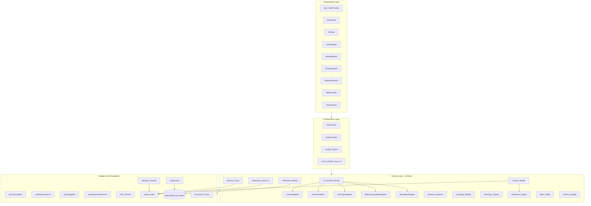
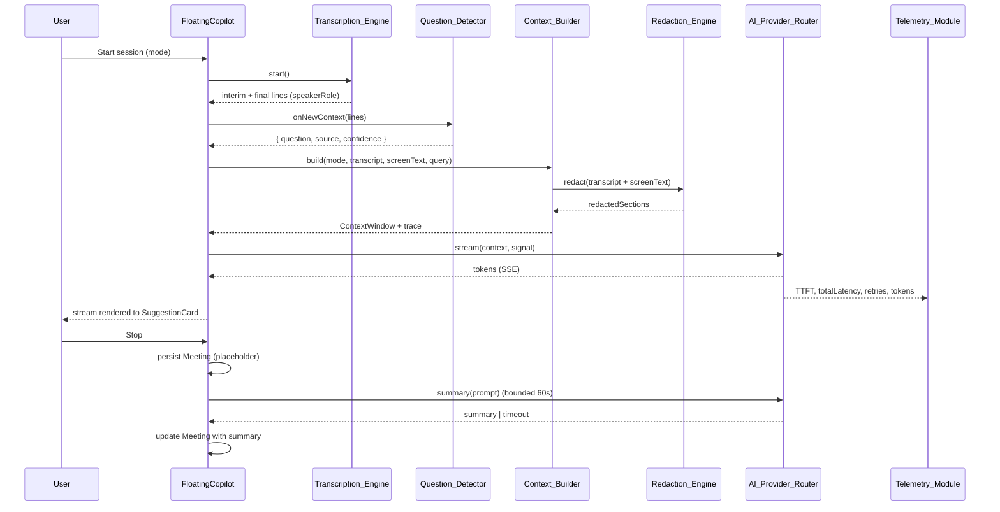
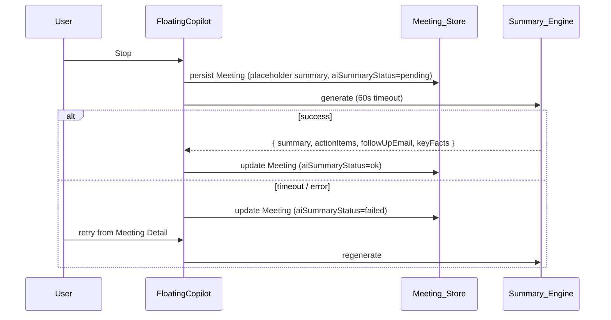

# Design Document

## Overview

Zule is a browser-based AI meeting copilot built as a Vite + React + TypeScript single-page application. The current build provides the skeleton — Web Speech API transcription, screen capture + Tesseract OCR, a Gemini provider, a sliding-window context manager, a Transformers.js MiniLM vector store, a regex-based question detector, an in-memory response cache, and a draggable floating overlay — but contains correctness, reliability, security, performance, and UX defects, and lacks several capabilities expected of Cluely-class assistants.

This design responds to all 30 requirements in `requirements.md` and is organized as four concentric layers running entirely in the browser: a **Presentation** layer (React components, overlay, detached window), an **Orchestration** layer (the `Copilot_Engine` reducer and the React contexts that own session lifecycle), a **Domain** layer (`src/brain/` — provider router, context builder, redaction engine, telemetry, coaching, memory, style profile, summary engine), and an **Adapters & Foundation** layer (hooks for browser APIs, the OCR Web Worker, IndexedDB persistence, the Transformers.js runtime, the local Whisper runtime, and a small WebCrypto helper).

The most consequential design decisions are:

1. **Provider adapters replace the Gemini-only "router."** A single `Provider_Adapter` interface is implemented per provider; the router becomes a thin orchestrator with timeout, retry, abort, and failover concerns.
2. **All cloud egress passes through `Redaction_Engine.apply` and a `prompt_assembly_trace`.** No transcript, screen text, or knowledge-base text is sent to a cloud `Provider_Adapter` without redaction. The Telemetry_Module never receives content payloads.
3. **Persistence is unified into a single `zule-unified` IndexedDB database** with explicit per-version migrations, validated import/export, and `QuotaExceededError` recovery affordances. The legacy `zule-store` database is migrated and deleted on first run.
4. **The Vector_Index, OCR worker, document parsers, Whisper runtime, and Provider_Adapters are code-split.** The landing page never pulls in heavy AI assets.
5. **Speakers are first-class.** Every transcript line carries a `speakerId`, a `speakerRole` (`user | other`), a detection method, and a confidence. The `Question_Detector` gates autonomous triggering on `speakerRole === 'other'`, fixing the audit defect where the user's own speech triggered the AI.
6. **Property-based testing is a deliberate, scoped tool.** Many of the pure pieces (chunker, redactor, JSON extractor, SSE parser, cosine similarity, confidence scorer, context-budget trimmer) are well-suited to PBT and are described as such. UI rendering, IndexedDB wiring, and provider HTTP calls are not.

The design preserves the present module boundaries where they work and refactors the modules that the audit identified as defective. Where remediation is too entangled to do in place — `useSpeechRecognition`, `aiProvider`, `responseCache`, `contextManager`, `useCrossWindowSync`, `documentParser` — the design specifies a replacement module and an adapter shim so the rest of the app keeps compiling during incremental migration.

## Architecture

### Layered View



### Active Session Sequence



### Module Boundaries and Replacement Plan

| Existing module | Disposition | Replacement / new module |
|---|---|---|
| `src/brain/aiProvider.ts` | Replace | `AI_Provider_Router` + `providers/{gemini,openai,anthropic,ollama,simulation}.ts` |
| `src/brain/contextManager.ts` | Replace | `Context_Builder` (tokenizer-aware) |
| `src/brain/responseCache.ts` | Replace | `Response_Cache v2` (cosine + LRU + IndexedDB) |
| `src/brain/questionDetector.ts` | Refactor | `Question_Detector` with locale packs, throttle, role gating |
| `src/brain/sentimentAnalyzer.ts` | Refactor | `Coaching_Module` (purified, bounds-checked) |
| `src/brain/speakerManager.ts` | Refactor | Per-session instance; remove module singleton |
| `src/brain/summaryEngine.ts` | Refactor | Robust JSON extraction; no orphan `setTimeout` |
| `src/brain/vectorStore.ts` | Refactor | Deferred init, query-embedding cache, quantization |
| `src/hooks/useSpeechRecognition.ts` | Replace | `useTranscription` (provider pluggable) |
| `src/hooks/useScreenCapture.ts` | Refactor | Downscale, perceptual hash, worker termination |
| `src/hooks/useCrossWindowSync.ts` | Replace | `Cross_Window_Sync v2` (versioned, heartbeats, fallback) |
| `src/utils/storage.ts` | Delete | Dead code — replaced by `src/data/database.ts` migration |
| `src/utils/documentParser.ts` | Refactor | Local worker, token-aware chunker |

### Code-Splitting and Cold-Start

The Vite build is configured with explicit dynamic imports so that the following are independent chunks loaded on demand: `Vector_Index` (Transformers.js), `Whisper_Runtime`, `OCR_Worker` (Tesseract), `Document_Parser` (PDF.js + mammoth), each `Provider_Adapter`. The landing page imports only React, the router shell, and the `ZuleProvider`. The PDF.js worker, the Tesseract worker, and the Transformers.js runtime are served from the application origin (copied to `public/` at build time) — never from `cdnjs.cloudflare.com` or other third-party CDNs (Requirement 21.5, 15.7). A bundle-size budget asserted in CI fails the build if the main chunk exceeds 300 KB gzip (Requirement 21.2).

### Stealth and Privacy

The detached-window pattern (`#detached`) is preserved as the primary stealth strategy: the host page no longer renders the suggestion card while the user has chosen to share the host's tab. In addition, the floating overlay sets `data-zule-stealth="true"` so the overlay is identifiable to OS-level capture filters and browser extensions (Requirement 15.5). Where the browser supports `Element.requestFullscreen` plus `BrowserCaptureMediaStreamTrack.cropTo`, the Stealth_Layer offers a "crop tab to content area" mode for tab capture (Requirement 15.6). A "panic hide" shortcut (default `Ctrl+Shift+\`) hides the overlay, mutes the microphone, stops screen capture, and pauses autonomous AI calls within 200 ms (Requirement 15.8). API keys are never embedded in URLs (Requirement 4.6) and are stored encrypted with AES-GCM keyed by PBKDF2(passphrase, 200 000 iters, SHA-256) (Requirement 15.1).

### Observability

`Telemetry_Module` is local-first. All metrics are written to a `telemetry` IndexedDB store, and a Diagnostics page renders the most-recent 24 hours. Content (transcript, screen text, API keys) never enters telemetry; this is enforced by a typed `MetricEvent` discriminated union with no free-form payload field plus an automated test (Requirement 19.5, 30.1). External telemetry is opt-in and metric-only.


## Components and Interfaces

This section enumerates each module that participates in the design. Interfaces are TypeScript and are intended to be the canonical signatures used by the implementation. Where a module replaces an existing one, the existing module is named.

### 1. Transcription_Engine (`src/hooks/useTranscription.ts`, `src/brain/transcription/`)

A pluggable transcription pipeline. Replaces `useSpeechRecognition`.

```ts
type TranscriptionProvider = 'web-speech' | 'local-whisper';
type SpeakerRole = 'user' | 'other';
type DetectionMethod = 'manual' | 'gap-heuristic' | 'voiceprint';

interface TranscriptionLine {
  id: string;
  text: string;
  timestamp: number;
  isInterim: boolean;
  speakerId: string;            // 'speaker-1' | 'speaker-2' | ...
  speakerRole: SpeakerRole;     // strictly 'user' | 'other'
  detection: DetectionMethod;
  detectionConfidence: number;  // 0..1
  asrConfidence: number;        // 0..1, when provider exposes
  language: string;             // BCP-47
  provider: TranscriptionProvider;
  possibleSpeakerChange?: boolean;
}

interface TranscriptionEngine {
  start(opts: { language: string; provider: TranscriptionProvider; speakerId: string }): Promise<void>;
  stop(): Promise<TranscriptionLine | null>; // returns final flushed interim line if any
  pause(): void;
  resume(): void;
  isListening: boolean;
  isSupported: boolean;
  on(event: 'line' | 'interim' | 'error' | 'permission', cb: (...args: any[]) => void): Off;
}
```

Behavioural rules:

- **Backoff and bounded restart** — On `onend` while `shouldRestart`, restart with `delay = min(8000, 250 * 2^k)` where `k` is the consecutive-restart counter. After 5 consecutive restarts without producing a final result inside 60 s, surface a recoverable error and pause auto-restart until the user resumes (Requirement 1.2, 1.3).
- **Interim flush on stop** — When the user invokes `stop()` while interim text is non-empty, the interim text is emitted as a final line with `asrConfidence` rounded to 0 and `detection: 'manual'`, marked low-confidence (Requirement 1.6).
- **Confidence filter** — Final lines whose `asrConfidence` is below `transcription.confidenceThreshold` (default 0.30) are dropped and counted in telemetry (Requirement 1.7).
- **Permission watcher** — A `navigator.permissions.query({name:'microphone'})` watcher emits a `permission-revoked` event on transition; the UI surfaces a one-click resume that re-requests `getUserMedia` (Requirement 1.8).
- **Language hot-swap** — Setting `recognition.lang` happens at `start` time only; changes mid-stream are queued and applied on next `start` (Requirement 1.9).
- **Local fallback** — If `provider === 'local-whisper'`, the engine loads a Whisper-class model via `Whisper_Runtime` and exposes its download progress through the same `ModelLoader` queue used by the embedding model (Requirement 2). On a baseline reference machine the first final segment SHALL appear within 4 s (Requirement 2.3).

### 2. Speaker_Module (per-session instance)

Replaces the module-level singleton. The `Copilot_Engine` constructs a fresh `SpeakerManager` at the start of every Active_Session so no state leaks across meetings (Requirement 3.1).

```ts
interface SpeakerProfile {
  id: string;            // 'speaker-1', 'speaker-2', ...
  name: string;
  color: string;
  avatarInitial: string;
  role: SpeakerRole;     // strictly 'user' | 'other'
}

class SpeakerManager {
  constructor(profiles?: SpeakerProfile[]);
  getActive(): SpeakerProfile;
  setActive(speakerId: string): void;
  classifyByGap(now: number): { id: string; method: 'manual' | 'gap-heuristic' };
  classifyByVoiceprint(audio: Float32Array): Promise<{ id: string; confidence: number }>;
}
```

The `speakerRole` written into a `TranscriptionLine` is always strictly `'user' | 'other'`; this fixes the audit defect in which a `speaker-1` id was written into a `speakerRole`-typed field, defeating the `Question_Detector`'s short-circuit on user-spoken text (Requirement 3.2, 3.3).

### 3. AI_Provider_Router (`src/brain/providerRouter.ts`)

```ts
interface Capabilities {
  streaming: boolean;
  imageInput: boolean;
  toolUse: boolean;
  maxInputTokens: number;
  pricePerMTokens?: { input: number; output: number };
}

interface ProviderResponse {
  text: string;
  promptTokens: number;
  completionTokens: number;
  modelId: string;
  providerId: string;
  isSimulated: boolean;
  status: number;
}

interface StreamCallbacks {
  onToken: (cumulativeText: string) => void;
  onComplete: (response: ProviderResponse) => void;
  onError: (err: Error) => void;
  onMetrics?: (m: { ttftMs: number; totalMs: number; retries: number; modelId: string }) => void;
}

interface ProviderAdapter {
  name: string;
  capabilities: Capabilities;
  countTokens(text: string): number;
  complete(prompt: PromptInput, opts: CallOpts): Promise<ProviderResponse>;
  streamGenerate(prompt: PromptInput, cb: StreamCallbacks, opts: CallOpts): Promise<void>;
}

class AI_Provider_Router {
  registerAdapter(adapter: ProviderAdapter): void;
  setPriority(order: string[]): void;     // e.g., ['gemini','anthropic','simulation']
  selectModel(input: { tokens: number; mode: CopilotMode; profile: Profile }): { providerId: string; modelId: string };
  stream(prompt: PromptInput, cb: StreamCallbacks, opts: CallOpts): Promise<void>;
  complete(prompt: PromptInput, opts: CallOpts): Promise<ProviderResponse>;
}
```

Router rules:

- **Header-based auth** — keys are passed in HTTP headers (e.g., `x-goog-api-key`, `Authorization: Bearer …`, `x-api-key`), never as `?key=` (Requirement 4.6).
- **Per-request timeout** — default 12 000 ms streaming, 6 000 ms non-streaming, configurable; the underlying `fetch` is aborted on timeout (Requirement 4.4).
- **Retry with jitter** — on 429/500/502/503/504, retry up to 3 times with exponential backoff starting at 500 ms ± 20 % jitter, stopping once cumulative wait exceeds 8 000 ms (Requirement 4.5).
- **AbortSignal honoured** — the streaming reader is cancelled within 200 ms of `signal.aborted`; `onComplete` is never invoked after abort (Requirement 4.7).
- **Robust SSE parsing** — frames are split on event boundaries (`\r?\n\r?\n`); partial frames are retained across `read()` calls (Requirement 4.8). This is implemented as a pure `parseSseFrames(buf: string): { events: SseEvent[]; rest: string }` so it can be property-tested.
- **Simulated isolation** — `response.isSimulated = true` propagates to `Response_Cache` which refuses to store; UI badges the answer accordingly (Requirement 4.9, 7.4).
- **Tier selection** — `selectModel` is a pure function of `tokens`, `mode`, `profile` with thresholds defined in Settings, replacing the brittle `gemini-1.5-pro` regex heuristic (Requirement 4.10, 29.2, 29.3).
- **Failover** — on transport error / 5xx / timeout, the router moves to the next adapter in priority order (Requirement 4.3).
- **Cost telemetry** — every call emits `{ providerId, modelId, promptTokens, completionTokens }` to `Telemetry_Module`; configured prices are multiplied to compute approximate cost (Requirement 28).

### 4. Context_Builder (`src/brain/contextBuilder.ts`)

Replaces `contextManager.ts`. Token-aware, modality-tagged, and emits a structured trace.

```ts
interface ContextWindow {
  systemPrompt: string;
  knowledge: ContextSection[];
  memory: ContextSection[];
  transcript: ContextSection;
  screen: ContextSection | null;
  userQuery: string;
  fullPrompt: string;
  trace: PromptAssemblyTrace;
}

interface ContextSection {
  label: '[KNOWLEDGE]' | '[MEMORY]' | '[AUDIO]' | '[SCREEN]';
  text: string;
  tokenCount: number;
  citationId?: string; // 'K1', 'M3', ...
  source?: { docId?: string; meetingId?: string; date?: number };
}

interface PromptAssemblyTrace {
  systemTokens: number;
  knowledgeTokens: number;
  memoryTokens: number;
  transcriptTokens: number;
  screenTokens: number;
  totalTokens: number;
  budgetTokens: number;
  droppedSections: string[]; // ordered: 'screen', 'older-transcript', ...
  modalitiesUsed: ('audio'|'screen'|'knowledge'|'memory')[];
}
```

Key behaviours:

- **Tokenizer-aware budget** — Tokens are counted by the active provider's tokenizer (`adapter.countTokens`); the assembled prompt is bounded by `context.budgetTokens` (default 8 000) (Requirement 5.1).
- **Priority drop order** — When over budget, sections are dropped in order `screen → older-transcript → lower-similarity-knowledge → older-knowledge`; section headers are preserved verbatim (Requirement 5.2).
- **Window caps** — Default 30 final transcript lines and 5 knowledge chunks; both configurable (Requirement 5.3).
- **Implicit retrieval query** — If `userQuery` is empty, the retrieval query is the most recent question-shaped utterance per `Question_Detector`, falling back to the last 200 characters of final transcript (Requirement 5.4).
- **Citation ids** — Knowledge chunks are labelled `[K1]`, `[K2]` and memory chunks `[M1]`, `[M2]`; the system prompt instructs the model to reference these ids (Requirement 5.5, 24.1).
- **Multi-modal labelling** — Each section is wrapped with its `[AUDIO] / [SCREEN] / [KNOWLEDGE] / [MEMORY]` label so the model can reason about modality, and the `trace.modalitiesUsed` array drives the modality badges in the UI (Requirement 23.1, 23.4).
- **Fusion hints** — When entities present in `[SCREEN]` also appear in the latest `[AUDIO]` line, a one-line fusion hint is appended (Requirement 23.2).
- **Image keyframe (uplift)** — When the configured adapter has `capabilities.imageInput` and the user opted in, the `Screen_Capture_Module` provides a downscaled keyframe that travels alongside OCR text (Requirement 23.3).
- **Redaction last** — All transcript and screen text passes through `Redaction_Engine.apply` before being included in any prompt sent to a cloud adapter (Requirement 15.3). The redaction step is skipped when the active adapter is local-runtime if the user has explicitly chosen that profile.
- **Language directive** — A short directive matching the user's recognition language (e.g., "Respond in en-US.") is appended (Requirement 17.4).
- **Style directive (uplift)** — When personalization is enabled, the compact style descriptor from `Style_Profile` is appended (Requirement 22.2).

### 5. Question_Detector (`src/brain/questionDetector.ts`, refactored)

```ts
interface DetectionResult {
  question: string;
  type: 'direct' | 'behavioral' | 'technical' | 'opinion' | 'clarification';
  confidence: number;
  urgencyScore: number;
  source: 'final' | 'interim';
}

class QuestionDetectorStream {
  constructor(opts: { debounceMs?: number; interimThrottleMs?: number; locale?: string });
  onNewContext(lines: TranscriptionLine[], cb: (r: DetectionResult) => void): void;
  onInterimText(interim: string, cb: (r: DetectionResult) => void): void;
  reset(): void;
}
```

Rules:

- **Speaker gating** — Only fires when the latest line's `speakerRole === 'other'` (Requirement 3.3, 8.6).
- **Independent suppression** — Interim and final triggers track separate `lastTriggered` strings; a final trigger is allowed when its text differs from the most-recent interim trigger by at least one whole word (Requirement 8.3).
- **Final debounce** — Default 1 500 ms (Requirement 8.1).
- **Interim throttle** — At most one autonomous request per 4 000 ms regardless of interim update frequency (Requirement 8.2).
- **Structured event** — Always emits `{ question, type, confidence, urgencyScore, source }` (Requirement 8.4).
- **Locale packs** — Patterns are loaded per BCP-47 locale prefix (`en`, `es`, `fr`, `de`, `ja`, `zh`); for unsupported locales the detector falls back to a single trailing-punctuation rule (Requirement 8.5, 17.3).
- **Trailing-`?` floor** — When the active speaker is `other` and the latest final line ends with `?`, the detector emits a trigger with confidence ≥ 0.6 even if no other pattern matches (Requirement 8.6).

### 6. Coaching_Module (`src/brain/coaching.ts`)

A purified version of `sentimentAnalyzer.ts`.

```ts
interface CoachingMetrics {
  sentiment: 'positive' | 'negative' | 'neutral';
  score: number;            // -1..1
  fillerCount: number;
  fillerWords: string[];
  wordsPerMinute: number;
  confidenceScore: number;  // 0..100
}

function getFullAnalysis(input: {
  text: string;            // pre-redaction full transcript text
  totalWordCount: number;  // user-attributed words only
  durationSeconds: number; // duration during which user was the active speaker
}): CoachingMetrics;
```

Properties of this function:

- **Pure** — Identical inputs yield identical outputs regardless of wall-clock or hidden module state (Requirement 9.5).
- **Bounded confidence** — `confidenceScore ∈ [0, 100]` for any non-negative `wpm` and any `fillerRatio ∈ [0, 1]` (Requirement 9.6).
- **Whole-word filler matching** — `\b<filler>\b` regex anchored on word boundaries; multi-word fillers are matched with whitespace tolerance (Requirement 9.2).
- **User-only WPM** — Aggregates only lines whose `speakerRole === 'user'` and only the elapsed time during which the user was the active speaker (Requirement 9.3).
- **Pace nudges** — When pace falls below 90 wpm or rises above 180 wpm sustained for 15 s of user speech, the orchestrator surfaces a non-blocking visual nudge (Requirement 9.4).
- **Update cadence** — The `Copilot_Engine` calls this at a configurable cadence (default 2 000 ms) once the session has been running for at least 5 s (Requirement 9.1).

### 7. Vector_Index (`src/brain/vectorStore.ts`, refactored)

```ts
class VectorIndex {
  initialize(): Promise<void>;                           // deferred-promise pattern, no async executor
  generateEmbedding(text: string): Promise<Float32Array>;
  cosineSimilarity(a: Float32Array, b: Float32Array): number;
  subscribeProgress(cb: ProgressCallback): Off;
  invalidateQueryCache(): void;
}
```

- **Deferred-promise initialization** — The init promise is constructed without an `async` executor, removing the `new Promise(async …)` anti-pattern (Requirement 6.1).
- **Init retry** — On init failure, the next `generateEmbedding` retries with exponential backoff up to 3 attempts (Requirement 6.2).
- **Query-embedding LRU** — A session-scoped LRU of 256 most-recent distinct query strings; invalidated when the embedding model changes (Requirement 6.3).
- **Quantization** — When stored count exceeds 1 000, document chunk vectors are quantized to int8 with per-vector `min`/`max` metadata, achieving ≥ 4× storage reduction (Requirement 6.4).
- **Configurable retrieval** — Threshold and `maxResults` are parameters, defaults `0.40` and `5` (Requirement 6.5).
- **Retention cap** — Knowledge_Base default 2 000 chunks; on insertion that would exceed the cap, evict oldest chunks of `type ∈ {notes, meeting-fact}` first (Requirement 6.6).
- **Cache invalidation on delete** — Document deletion invalidates any cached query results referencing that document (Requirement 6.7).

### 8. Response_Cache v2 (`src/brain/responseCache.ts`)

```ts
class ResponseCache {
  constructor(opts: { similarityThreshold: number; maxEntries: number; persist: boolean });
  get(query: string): Promise<{ hit: AIResponse | null; similarity: number }>;
  set(query: string, response: AIResponse): Promise<void>;
  clear(): Promise<void>;
  invalidateAll(): void;
}
```

- **Cosine matching** — Uses `Vector_Index.generateEmbedding` for cache keys; matches by cosine similarity (Requirement 7.1). Replaces the Jaccard implementation that missed paraphrases such as "what is X" vs "explain X".
- **LRU bound** — Default 256 entries; oldest evicted (Requirement 7.2).
- **IndexedDB persistence** — Entries persist in a dedicated `responseCache` store; a Settings toggle clears and disables persistence (Requirement 7.3).
- **Reject bad entries** — Refuses to store when `response.isSimulated`, when `response.text` is empty after trim, or when the originating provider reported a non-2xx status (Requirement 7.4).
- **Cache-hit telemetry** — Emits `cache.hit` with similarity score; served responses are annotated `fromCache: true` (Requirement 7.5).

### 9. Redaction_Engine (`src/brain/redaction.ts`)

```ts
type RedactionRule =
  | { kind: 'regex'; pattern: string; flags: string; replacement: string }
  | { kind: 'entity'; entity: 'email' | 'phone' | 'credit-card' | 'iban' | 'us-ssn'; replacement?: string };

interface RedactionEngine {
  apply(text: string, rules: RedactionRule[]): string;
  applyToSections(sections: ContextSection[], rules: RedactionRule[]): ContextSection[];
}
```

- **Idempotent** — `apply(apply(x, R), R) === apply(x, R)` for any rule set `R` and any text `x` (Requirement 30.2). Built-in entity classes use replacements that do not themselves match the rule (e.g., `[REDACTED:EMAIL]`).
- **Sequential, declarative rule order** — Regex rules apply first (user-defined), then built-in entity rules; user-defined rules can override built-ins by appearing first.
- **No persisted side-effects** — `apply` is a pure function over `(text, rules)`.

### 10. Memory_Store (`src/brain/memoryStore.ts`)

A per-user durable store of facts derived from prior meetings, distinct from the user-uploaded Knowledge_Base.

```ts
interface MemoryFact {
  id: string;
  text: string;
  embedding: Float32Array;
  source: { meetingId: string; date: number };
  createdAt: number;
}

class MemoryStore {
  add(text: string, source: { meetingId: string; date: number }): Promise<MemoryFact | null>; // dedups
  search(query: string, opts?: { maxResults?: number }): Promise<{ fact: MemoryFact; score: number }[]>;
  forget(id: string): Promise<void>;
  applyRedactionAndSave(facts: string[], source: { meetingId: string; date: number }, rules: RedactionRule[]): Promise<MemoryFact[]>;
}
```

- **Dedup on similarity > 0.92** — On insertion, if cosine similarity to an existing fact exceeds 0.92, retain the longer text and merge `source` arrays (Requirement 10.6).
- **Redacted-on-write** — Facts pass through `Redaction_Engine.apply` before storage (Requirement 10.5, 15.3).
- **Hard-delete on forget** — `forget(id)` removes the row and its embedding (Requirement 24.3).
- **Search alongside KB** — `Context_Builder` calls both `Vector_Index.search` (KB) and `MemoryStore.search` and labels memory chunks `[MEMORY: meeting:{id}, {date}]` (Requirement 24.1).

### 11. Style_Profile (`src/brain/styleProfile.ts`) — Uplift

```ts
interface StyleProfile {
  vocabulary: Map<string, number>;       // term frequency
  averageSentenceLength: number;
  hedgingRate: number;                   // 'maybe', 'I think' fraction
  toneClass: 'direct' | 'reserved' | 'enthusiastic' | 'analytical';
  pairwiseEdits: { before: string; after: string }[];
}

class StyleProfileStore {
  observeUserUtterance(text: string): void;
  observeEdit(before: string, after: string): void;
  toDirective(): string; // compact prompt fragment
  export(): StyleProfile;
  import(profile: StyleProfile): void;
  clear(): Promise<void>;
}
```

- Updated only from user-attributed lines (Requirement 22.1).
- `toDirective()` produces a < 80-token compact prompt fragment such as "User prefers short, declarative sentences with low hedging."
- Edits to AI suggestions update `pairwiseEdits` (Requirement 22.3).
- Storable, exportable, importable, clearable via Settings (Requirement 22.4).

### 12. Telemetry_Module (`src/brain/telemetry.ts`)

```ts
type MetricEvent =
  | { kind: 'ttft'; ms: number; modelId: string; providerId: string }
  | { kind: 'totalLatency'; ms: number; modelId: string; providerId: string }
  | { kind: 'retry'; count: number; providerId: string }
  | { kind: 'cache.hit'; similarity: number }
  | { kind: 'cache.miss' }
  | { kind: 'transcript.drop'; reason: 'low-confidence' | 'empty' | 'speaker-self' }
  | { kind: 'ocr.skipped'; reason: 'unchanged' | 'tiny-frame' }
  | { kind: 'embedding.cache'; outcome: 'hit' | 'miss' }
  | { kind: 'memory.size'; chunks: number }
  | { kind: 'tokens'; promptTokens: number; completionTokens: number; modelId: string; providerId: string }
  | { kind: 'error'; name: string; message: string; stack: string; breadcrumb: string[] }
  | { kind: 'latency.degraded' };

class TelemetryModule {
  emit(event: MetricEvent): void;     // local IndexedDB
  enqueueExternal(event: MetricEvent): void; // only when opt-in; metric-only
  query(rangeMs: number): Promise<MetricEvent[]>;
  clearAll(): Promise<void>;
}
```

The discriminated union has no free-form payload field, which structurally prevents transcript/screen-text/API-key leakage. An automated test scans every variant for forbidden field names (Requirement 19.5, 30.1).

### 13. Latency_Budget

```ts
interface LatencyBudgetConfig { ttftMs: number; totalMs: number }

class LatencyBudget {
  constructor(cfg: LatencyBudgetConfig);
  start(): { onRequestSent(): void; onFirstToken(): void; onComplete(): { ttft: number; total: number } };
  reportFromCache(): void;
}
```

`Copilot_Engine` records `t_detected`, `t_request_sent`, `t_first_token`, `t_complete` per autonomous trigger; warm-cache hits flow into a separate metric stream so they do not mask provider regressions (Requirement 14). When TTFT exceeds the configured budget for two consecutive requests, the UI shows a non-blocking "latency degraded" indicator and `Telemetry_Module` emits `latency.degraded`.

### 14. Cross_Window_Sync v2 (`src/hooks/useCrossWindowSync.ts`)

Replaces the existing hook. Uses a discriminated-union message schema, monotonic versioning, heartbeats, and a `localStorage`-event fallback.

```ts
type SyncMessage =
  | { kind: 'state-update'; version: number; payload: SyncState }
  | { kind: 'snapshot-request'; version: number }
  | { kind: 'snapshot-response'; version: number; payload: SyncState }
  | { kind: 'heartbeat'; version: number; timestamp: number }
  | { kind: 'host-action'; version: number; action: ClientAction };

interface CrossWindowSync {
  send(msg: SyncMessage): void;
  on(event: 'state' | 'host-loss' | 'reconnect', cb: (...args: any[]) => void): Off;
  isConnected: boolean;
}
```

- **Monotonic version** — Receivers reject `state-update` messages whose `version` is below the most-recently-applied version (Requirement 11.1).
- **Snapshot on open** — The detached window sends `snapshot-request`; the host replies with `snapshot-response` within 500 ms (Requirement 11.2).
- **Heartbeats** — The host emits `heartbeat` every 5 000 ms; the detached window shows `host disconnected` after 15 000 ms of silence and offers a "reconnect" affordance (Requirement 11.3, 11.6).
- **Fallback** — If `BroadcastChannel` is undefined, the same schema is sent through `localStorage` events (Requirement 11.4).
- **Popup-block recovery** — When `window.open` returns null, the orchestrator surfaces a recoverable error guiding the user to allow popups for the origin and leaves the in-page overlay visible (Requirement 11.5).

### 15. Screen_Capture_Module (`src/hooks/useScreenCapture.ts`, refactored)

- **Downscale before OCR** — Each captured frame is rendered to a canvas with a maximum 1280-pixel longest edge before being passed to the worker (Requirement 13.1).
- **Perceptual-hash skip** — A 64-bit perceptual hash (`pHash`) of each frame is computed; OCR is skipped when Hamming distance from the previous OCR-ed frame is below 5 bits (configurable) (Requirement 13.2). `Telemetry_Module` records `ocr.skipped` events.
- **Worker termination** — When capture stops, the worker is terminated; on next start it is recreated lazily (Requirement 13.3).
- **Language-pack lazy load** — Non-English OCR languages are loaded on demand and cached (Requirement 13.4).
- **`play()` rejection handling** — A rejected `videoElement.play()` surfaces a recoverable error and stops the capture stream (Requirement 13.5).
- **Recent-OCR ring buffer** — Most-recent 5 OCR results plus timestamps are retained so `Context_Builder` can reason about screen change rather than the latest frame only (Requirement 13.6).

### 16. OCR_Worker (`src/workers/ocrWorker.ts`, refactored)

- **Watchdog supervision** — Three thrown errors within 30 s terminate and recreate the worker once; on a subsequent error the watchdog disables OCR for the session (Requirement 20.3).
- **Exposes `terminate()`** — Used by `Screen_Capture_Module` on stop.

### 17. Document_Parser (`src/utils/documentParser.ts`, refactored)

- **Local PDF.js worker** — `pdfjsLib.GlobalWorkerOptions.workerSrc` is set to a path served from `public/` rather than `cdnjs.cloudflare.com` (Requirement 21.5, 15.7).
- **Accepted extensions** — `.txt`, `.md`, `.json`, `.pdf`, `.docx`; other extensions are rejected with a non-blocking toast error, never `alert()` (Requirement 25.3, 18.7).
- **Encrypted PDF handling** — `getDocument` errors of class `PasswordException` surface a recoverable error to the user (Requirement 25.1).
- **DOCX paragraphs preserved** — `mammoth.extractRawText` output is split on `\n\n` to retain paragraph breaks (Requirement 25.2).
- **Token-aware chunker** — When the embedding model exposes a tokenizer, chunks are sized in tokens (default 300 tokens, 50 token overlap); otherwise word-sized chunks are produced as a fallback (Requirement 25.4).
- **Round-trip property** — `chunkText(input)` joined with overlap removed contains every word of `input` in order, for any plain-text input shorter than 10 000 words (Requirement 25.5).

### 18. Settings_Store and CryptoVault (`src/data/database.ts`, `src/utils/cryptoVault.ts`)

- **Encrypted key vault** — API keys are encrypted with AES-GCM. The encryption key is derived via PBKDF2(SHA-256, 200 000 iterations) from a user-supplied passphrase (Requirement 15.1).
- **Unlock UX** — On session start, if any cloud provider is configured, the UI prompts for the passphrase; until the vault is unlocked, the router refuses to use cloud providers (Requirement 15.2).
- **Profiles** — `profile ∈ { speed, balanced, cost, privacy }`; the router reads `profile` to select model tier; `Question_Detector`'s confidence threshold and `Response_Cache`'s similarity threshold widen or tighten per profile (Requirement 29). `profile === privacy` forces ephemeral memory and refuses cloud providers.
- **Ephemeral mode** — `privacy.mode === ephemeral` instructs `Meeting_Store` not to persist transcripts or summaries; the session is held in memory only (Requirement 15.4).
- **Locale, recognition language, OCR language** — Stored as independent settings (Requirement 17.1).

### 19. Meeting_Store and Stop-Session Flow

The stop-session sequence is reordered so transcript and analytics are persisted before summary generation begins (Requirement 27.1):



- **Idempotent placeholder write** — Closing the tab during summary generation never loses the meeting (Requirement 27.1, 27.3).
- **Cancellable summary** — A cancel button leaves the meeting persisted with `aiSummaryStatus = failed` (Requirement 27.4).
- **Action items have id, completion state, source quote, timestamp** — `Summary_Engine` extracts source quotes from the transcript by indexing into the closest matching transcript line (Requirement 10.4).
- **Robust JSON extraction** — A pure `extractJsonObject(text: string): object | null` locates the outermost balanced `{ … }`, tolerating leading/trailing whitespace, surrounding markdown code fences, embedded fences, and trailing commentary. On failure, a single retry asks the model to "respond ONLY with JSON" (Requirement 10.2, 10.3). The function is property-tested.
- **No orphan async** — Fact saving uses a top-level promise tracker (`PendingTaskTracker.add(promise)`), not `setTimeout(…, 0)` (Requirement 10.7).
- **Memory facts saved with redaction** — Extracted `keyFacts` are passed through `Redaction_Engine.apply` before being added to `Memory_Store`, with `source: meeting:{id}` (Requirement 10.5).

### 20. FloatingCopilot lifecycle

- **Abort in-flight on unmount** — The component holds an `AbortController` for the live stream; `useEffect` cleanup invokes `abort()` (Requirement 12.1).
- **Abort on manual override** — A new manual submit aborts any in-flight autonomous stream and discards tokens received after `signal.aborted` (Requirement 12.2).
- **Re-clamp on resize** — A `resize` listener clamps `(x, y)` to viewport bounds (Requirement 12.3).
- **Symmetric show/hide** — Escape hides; the same shortcut (`Ctrl+Shift+H`) toggles hide (Requirement 12.4, 18.4).
- **No useEffect-fire on per-render-recreated callbacks** — `triggerAI` is memoised with `useCallback` over stable dependencies; `useEffect` keyed on transcript references only the memoised callback. As a defensive measure the effect computes the trigger inline and reads the latest `triggerAI` from a ref (Requirement 12.5).
- **8-direction reposition shortcuts** — Arrow keys with `Ctrl+Alt` reposition the overlay by a configurable step, plus `Ctrl+Alt+0` recenter (Requirement 18.4).

### 21. Toast and ErrorBoundary

- All recoverable errors flow through `react-hot-toast` with `role="status"` for non-blocking and `role="alert"` for blocking. `alert()` is removed from `Settings.tsx` and elsewhere (Requirement 18.7).
- `ErrorBoundary` reports caught errors to `Telemetry_Module` with stack and a content-free breadcrumb (Requirement 19.3).
- A top-level `unhandledrejection` listener does the same and surfaces a non-blocking toast when in an Active_Session (Requirement 20.5).

### 22. ModelLoader

A single queue UI overlay used for all background asset downloads (embedding model, Whisper model, Tesseract language packs). When more than one task is in flight, they are listed in a single panel rather than as overlapping toasts (Requirement 20.4). Each task exposes a cancel affordance (Requirement 21.4).

### 23. Content-Security-Policy

`index.html` ships a CSP `<meta>` tag with `script-src 'self'` plus the explicit origins required by configured providers (`https://generativelanguage.googleapis.com`, `https://api.openai.com`, `https://api.anthropic.com`, `https://huggingface.co`, `https://cdn-lfs.huggingface.co`). Workers are served from the application origin (Requirement 15.7).

### 24. i18n

A small i18n module exposes `t(key, params?)` resolving against bundled JSON dictionaries for English, Spanish, French, German, Japanese, and Simplified Chinese. UI strings are migrated incrementally; `getModeLabel`/`getModeIcon` are augmented to read from the dictionary (Requirement 17.2). Streaming AI text is rendered inside an `aria-live="polite"` region (Requirement 18.2). Reduced-motion preferences disable framer-motion entrance/exit/loop animations (Requirement 18.5).

### 25. Evaluation Harness (Uplift)

Every AI suggestion exposes thumbs-up / thumbs-down buttons. Ratings are persisted with `{ ratingId, promptHash, modelId, providerId, latencyMs, modalitiesUsed, rating }` (Requirement 26.1). Settings exposes an Evaluation tab summarizing aggregate ratings per provider, per mode, per modality combination (Requirement 26.2). Opt-in external telemetry includes ratings without prompt or response text (Requirement 26.3).


## Data Models

This section defines the canonical types persisted to IndexedDB and exchanged between modules. All identifiers are strings; all timestamps are `number` (epoch milliseconds).

### Database

A single `zule-unified` IndexedDB database holds every store. The legacy `zule-store` database is migrated and deleted during the v3 → v4 upgrade. The migration sequence is idempotent and logged.

```ts
const DB_NAME = 'zule-unified';
const DB_VERSION = 4; // up from 3

const STORE_MEETINGS         = 'meetings';
const STORE_SETTINGS         = 'settings';
const STORE_DOCUMENTS        = 'documents';
const STORE_MODES            = 'custom_modes';
const STORE_MEMORY           = 'memory_facts';
const STORE_TELEMETRY        = 'telemetry';
const STORE_RESPONSE_CACHE   = 'response_cache';
const STORE_RATINGS          = 'ratings';
const STORE_STYLE_PROFILE    = 'style_profile';
```

### TranscriptionLine (in-memory + persisted in `Meeting.transcript`)

```ts
interface TranscriptionLine {
  id: string;
  text: string;
  timestamp: number;
  isInterim: boolean;
  speakerId: string;          // 'speaker-1', 'speaker-2', ...
  speakerRole: 'user' | 'other';
  detection: 'manual' | 'gap-heuristic' | 'voiceprint';
  detectionConfidence: number; // 0..1
  asrConfidence: number;       // 0..1
  language: string;            // BCP-47
  provider: 'web-speech' | 'local-whisper';
  possibleSpeakerChange?: boolean;
}
```

### Meeting (`STORE_MEETINGS`)

```ts
interface Meeting {
  id: string;                  // 'meeting-<id>'
  title: string;
  mode: CopilotMode;
  startedAt: number;
  endedAt: number;
  duration: number;            // seconds
  transcript: TranscriptionLine[];
  summary: string;
  aiSummaryStatus: 'pending' | 'ok' | 'failed';
  actionItems: ActionItem[];
  followUpEmail?: string;
  keyFacts?: string[];         // pre-redaction list, persisted only when not in privacy/ephemeral
  modalitiesUsed: ('audio' | 'screen' | 'knowledge' | 'memory')[];
  metrics: MeetingMetrics;
  privacyMode: 'standard' | 'ephemeral';
}

interface ActionItem {
  id: string;
  text: string;
  completed: boolean;
  sourceQuote?: string;
  sourceLineId?: string;
  createdAt: number;
}

interface MeetingMetrics {
  aiSuggestionCount: number;
  fillerCount: number;
  avgConfidence: number;
  wordsPerMinute: number;
  promptTokens: number;
  completionTokens: number;
  approxCostUsd: number;
}
```

Indexes on `STORE_MEETINGS`: `startedAt`, `mode`.

### KBDocument (`STORE_DOCUMENTS`)

```ts
interface KBDocument {
  id: string;
  title: string;
  content: string;
  type: 'resume' | 'project' | 'job-description' | 'notes' | 'sales-script' | 'meeting-fact' | 'custom';
  chunks: KBChunk[];
  createdAt: number;
}

interface KBChunk {
  text: string;
  vector: Float32Array | { quantized: Int8Array; min: number; max: number };
  index: number;          // ordinal within document
}
```

Indexes: `type`, `createdAt`. The retention cap (default 2 000 chunks total across documents) is enforced at insertion time, evicting oldest `notes`/`meeting-fact` chunks first (Requirement 6.6).

### MemoryFact (`STORE_MEMORY`)

```ts
interface MemoryFact {
  id: string;
  text: string;            // post-redaction
  embedding: Float32Array; // not quantized; small-volume
  source: { meetingIds: string[]; firstSeen: number; lastSeen: number };
  createdAt: number;
}
```

Insertion runs cosine-similarity dedup against existing facts (threshold 0.92); on dedup, the longer text is retained and `meetingIds` are merged (Requirement 10.6).

### Settings record (`STORE_SETTINGS`)

```ts
type Settings = {
  // Core
  theme: 'dark' | 'light';
  uiLocale: string;            // BCP-47
  recognitionLanguage: string; // BCP-47
  ocrLanguage: string;         // Tesseract code (e.g., 'eng', 'spa')
  defaultMode: CopilotMode;
  profile: 'speed' | 'balanced' | 'cost' | 'privacy';

  // Providers (encrypted ciphertext per provider)
  providers: Array<{
    id: 'gemini' | 'openai' | 'anthropic' | 'ollama' | 'simulation';
    enabled: boolean;
    priority: number;
    apiKeyCipher?: string; // base64(AES-GCM)
    baseUrl?: string;
    pricePerMTokens?: { input: number; output: number };
  }>;

  // Transcription
  transcription: {
    provider: 'web-speech' | 'local-whisper';
    confidenceThreshold: number; // default 0.30
  };

  // Privacy / Stealth
  privacy: { mode: 'standard' | 'ephemeral' };
  redaction: { rules: RedactionRule[] };
  panicShortcut: string; // default 'Ctrl+Shift+\\'

  // Performance
  context: { budgetTokens: number; maxTranscriptLines: number; maxKbChunks: number };
  cache: { similarityThreshold: number; maxEntries: number; persist: boolean };
  latency: { ttftMs: number; totalMs: number };

  // Personalization (uplift)
  personalization: { enabled: boolean };

  // Telemetry
  telemetry: { external: { enabled: boolean; endpoint?: string } };

  // Data retention
  retention: { meetingMaxAgeDays: number; transcriptMaxLines: number };
};
```

Each setting is persisted as a single `{ key, value }` record (compatible with the existing `STORE_SETTINGS` shape).

### Custom mode (`STORE_MODES`)

```ts
interface CustomMode {
  id: string;
  label: string;
  icon: string;
  description: string;
  systemPrompt: string;
  createdAt: number;
}
```

### Response cache entry (`STORE_RESPONSE_CACHE`)

```ts
interface CachedResponse {
  id: string;             // hash of normalized query
  normalizedQuery: string;
  embedding: Float32Array;
  response: AIResponse;
  createdAt: number;
  lastUsedAt: number;
}
```

### Telemetry event (`STORE_TELEMETRY`)

```ts
type TelemetryRecord = MetricEvent & { id: string; at: number };
```

### Rating (`STORE_RATINGS`) — Uplift

```ts
interface Rating {
  id: string;
  promptHash: string;     // sha-256 of post-redaction prompt
  modelId: string;
  providerId: string;
  latencyMs: number;
  modalitiesUsed: ('audio' | 'screen' | 'knowledge' | 'memory')[];
  rating: 1 | -1;
  createdAt: number;
}
```

### Style profile (`STORE_STYLE_PROFILE`) — Uplift

```ts
interface StoredStyleProfile {
  id: 'default';
  vocabulary: Array<[string, number]>; // serialized Map
  averageSentenceLength: number;
  hedgingRate: number;
  toneClass: 'direct' | 'reserved' | 'enthusiastic' | 'analytical';
  pairwiseEdits: { before: string; after: string }[];
  updatedAt: number;
}
```

### Migration plan

```text
v0 -> v1: create meetings, settings, documents stores (existing)
v1 -> v2: add indexes on meetings (startedAt, mode), documents (type, createdAt)
v2 -> v3: add custom_modes (existing)
v3 -> v4:
  - create memory_facts, telemetry, response_cache, ratings, style_profile
  - migrate any rows from legacy 'zule-store' database into 'zule-unified'
  - delete 'zule-store' database
  - re-encode unencrypted API keys: read settings.apiKey, prompt user for passphrase,
    write providers[].apiKeyCipher, then delete the plaintext setting
```

The migration is idempotent: reopening the v4 database re-runs only the steps the schema does not yet reflect.

### Export / Import

```ts
interface ExportedData {
  version: 4;
  exportedAt: number;
  meetings: Meeting[];
  settings: Array<{ key: string; value: unknown }>;
  documents: KBDocument[];
  modes: CustomMode[];
  memoryFacts: MemoryFact[];     // optional
  styleProfile?: StoredStyleProfile;
  ratings?: Rating[];
}
```

Import validates the payload structurally (`version: number`, `exportedAt: number`, each array typed) before any store is mutated. Validation failure produces a non-blocking toast and leaves all stores untouched (Requirement 16.3).

### Cross-window sync state

```ts
interface SyncState {
  isDetached: boolean;
  transcript: TranscriptionLine[];
  interimText: string;
  streamingText: string;
  aiResponse: AIResponse | null;
  isLoading: boolean;
  isStreaming: boolean;
  elapsedTime: number;
  coaching: CoachingMetrics | null;
  activeMode: CopilotMode;
  modalitiesUsed: ('audio' | 'screen' | 'knowledge' | 'memory')[];
}
```

`SyncMessage` is the discriminated union defined in §14, replacing the `payload: any` shape (Requirement 11.7).


## Correctness Properties

*A property is a characteristic or behavior that should hold true across all valid executions of a system — essentially, a formal statement about what the system should do. Properties serve as the bridge between human-readable specifications and machine-verifiable correctness guarantees.*

PBT is appropriate for this feature because the audit defects and Cluely-parity uplifts concentrate in **pure logic** modules: the SSE parser, the JSON extractor, the redaction engine, the document chunker, the cosine similarity and quantization helpers, the context-budget trimmer, the question detector's debounce/throttle, the confidence scorer, the LRU response cache, the AES-GCM crypto vault, the model selector, the backoff calculator, the position clamp, the perceptual-hash bucket size, and the telemetry payload guard. UI rendering, IndexedDB wiring, and live HTTP calls to providers are handled by example-based tests and integration tests instead.

The properties below are derived from the prework analysis. Each property is universally quantified, links back to the originating acceptance criteria, and is intended to be implemented as a single property-based test using fast-check (the project's chosen library — see Testing Strategy).

### Property 1: Restart backoff is bounded and monotonic

*For all* non-negative integer attempt counts `k`, `restartBackoff(k) === Math.min(8000, 250 * 2 ** k)` in milliseconds, and for any `k1 ≤ k2`, `restartBackoff(k1) ≤ restartBackoff(k2)`.

**Validates: Requirements 1.2, 4.5**

### Property 2: Supervisor pauses after 5 consecutive restarts inside 60 s

*For all* finite event sequences over `{ restart(t), finalResult(t), reset(t) }` with timestamps `t` in any order, the supervisor enters the `paused` state if and only if there exists a window of length ≤ 60 000 ms containing five `restart` events with no intervening `finalResult` or `reset`.

**Validates: Requirements 1.3, 20.3**

### Property 3: Stop flushes interim text exactly once and only when non-empty

*For all* transcripts `T: TranscriptionLine[]` and any interim string `s`, `flushOnStop(T, s)` returns a transcript whose length is `T.length + (s.trim() === '' ? 0 : 1)`. When a flush occurs, the appended line carries `asrConfidence === 0`, `isInterim === false`, and `detection === 'manual'`.

**Validates: Requirements 1.6**

### Property 4: Confidence filter is a strict pass-through

*For all* transcript lines `L` and any threshold `θ ∈ [0, 1]`, `applyConfidenceFilter(L, θ)` keeps `L` if and only if `L.asrConfidence ≥ θ`. The count of dropped lines for any input array equals the count of inputs whose `asrConfidence < θ`.

**Validates: Requirements 1.7**

### Property 5: Every transcript line satisfies the schema invariant

*For all* `TranscriptionLine` values produced by `Transcription_Engine`, the line satisfies `speakerRole ∈ {'user','other'}`, `detection ∈ {'manual','gap-heuristic','voiceprint'}`, `detectionConfidence ∈ [0,1]`, `asrConfidence ∈ [0,1]`, `language` is a non-empty BCP-47 string, and `provider ∈ {'web-speech','local-whisper'}`.

**Validates: Requirements 2.4, 3.2, 3.7**

### Property 6: Question_Detector never fires on user-attributed lines

*For all* recent-context arrays `C: TranscriptionLine[]` whose final element has `speakerRole === 'user'`, `detectQuestion(C) === null`.

**Validates: Requirements 3.3**

### Property 7: Active speaker assignment respects toggle history

*For all* sequences of operations over `{ setActive(id), emit() }`, every line emitted between `setActive(idₖ)` and the next `setActive(idₖ₊₁)` carries `speakerId === idₖ` and the corresponding `speakerRole`.

**Validates: Requirements 3.4**

### Property 8: Voiceprint diarization falls back below 0.55 confidence

*For all* `(audioBuffer, manualAssignment)` pairs and any classifier output `(predictedId, confidence)`, the resolved id equals `predictedId` when `confidence ≥ 0.55` and equals `manualAssignment` otherwise.

**Validates: Requirements 3.5**

### Property 9: Provider failover preserves priority order and terminates

*For all* finite arrays of provider attempts `[(p₁, outcome₁), ..., (pₙ, outcomeₙ)]` with `outcomeᵢ ∈ {success, transport-error, status-5xx, timeout}`, `AI_Provider_Router.stream` calls providers in declared priority order and returns `success` if any attempt is `success`, otherwise returns the last attempt's error after exhausting the array.

**Validates: Requirements 4.3**

### Property 10: Per-request timeout aborts when latency exceeds budget

*For all* timeout values `T > 0` and any latency `L > 0`, the wrapped `fetch` resolves with the response if `L < T` and rejects with an `AbortError` whose `signal.aborted === true` if `L > T`.

**Validates: Requirements 4.4**

### Property 11: API keys never appear in URLs

*For all* providers `P ∈ {gemini, openai, anthropic, ollama}`, any non-empty `apiKey`, and any prompt input, the URL constructed by `P.streamGenerate` does not contain `apiKey` as a substring.

**Validates: Requirements 4.6**

### Property 12: SSE parser is invariant under chunk boundaries

*For all* finite sequences of well-formed SSE events `E = [e₁, …, eₙ]`, let `S = serialize(E)` be the wire encoding. For any partition of `S` into chunks `[c₁, …, cₘ]`, the parser fed `c₁ … cₘ` in order yields exactly `E`.

**Validates: Requirements 4.8**

### Property 13: Response_Cache refuses to store invalid responses

*For all* `(query: string, response: AIResponse)` pairs where `response.isSimulated || response.text.trim() === '' || response.status < 200 || response.status > 299`, `cache.set(query, response)` is a no-op (the cache size is unchanged).

**Validates: Requirements 4.9, 7.4**

### Property 14: Model selection is monotonic in input tokens

*For all* `(tokens, mode, profile)` triples, `selectModel(tokens, mode, profile).inputCapacity ≥ tokens`. For any `tokens₁ ≤ tokens₂` with the same `(mode, profile)`, `selectModel(tokens₁, mode, profile).inputCapacity ≤ selectModel(tokens₂, mode, profile).inputCapacity`. When `profile === 'speed'`, the selected model's `latencyTier` is the lowest available; when `profile === 'cost'`, the selected model's `pricePerMTokens.input` is the lowest available; when `profile === 'privacy'`, the selected model belongs to the local runtime.

**Validates: Requirements 4.10, 29.2, 29.3, 29.4**

### Property 15: Context_Builder produces an output that respects the budget and drop order

*For all* inputs `(mode, transcript, screenText, userQuery, knowledgeChunks, memoryChunks, budgetTokens, maxLines, maxKbChunks)`, the output `C: ContextWindow` satisfies all of:

1. `C.trace.totalTokens ≤ budgetTokens`,
2. The transcript contains at most `maxLines` final lines,
3. `C.knowledge.length ≤ maxKbChunks`,
4. Every kept knowledge chunk has a citation id `[Kn]` referenced in `C.fullPrompt`,
5. Every kept memory chunk has a citation id `[Mn]` referenced in `C.fullPrompt`,
6. Section headers (`[AUDIO]`, `[SCREEN]`, `[KNOWLEDGE]`, `[MEMORY]`) appear verbatim in `C.fullPrompt` for sections that are kept,
7. `C.trace.droppedSections` is a prefix of `['screen', 'older-transcript', 'lower-similarity-knowledge', 'older-knowledge']` order.

**Validates: Requirements 5.1, 5.2, 5.3, 5.5, 5.6, 23.1, 24.1**

### Property 16: Implicit retrieval query falls back deterministically

*For all* `(transcript, userQuery)` inputs where `userQuery.trim() === ''`, the retrieval query equals the most recent question-shaped utterance detected by `Question_Detector` if one exists in the recent context, otherwise the last 200 characters of final transcript text, otherwise the empty string.

**Validates: Requirements 5.4**

### Property 17: Vector_Index search bounds and threshold are honoured

*For all* `(query, threshold, maxResults)` inputs and any in-memory document set, the result `R` satisfies `R.length ≤ maxResults` and every `r ∈ R` has `r.score ≥ threshold`. The result is sorted by `score` descending.

**Validates: Requirements 6.5**

### Property 18: Quantization is approximately reversible and shrinks storage

*For all* `Float32Array` inputs `v` of length `n ≥ 1`, `dequantize(quantize(v))` is component-wise within `(max(v) - min(v)) / 254` of `v`. The quantized representation occupies at most `n + 8` bytes (versus `4n` bytes for the input), which is at least `4×` smaller for `n ≥ 8`.

**Validates: Requirements 6.4**

### Property 19: Knowledge_Base retention cap is preserved under insertion

*For all* finite insert sequences against `Knowledge_Base` with cap `C` and eviction policy `policy`, the post-state size is at most `C`. For any sequence containing chunks of `type ∈ {notes, meeting-fact}` and chunks of other types, when the cap is exceeded the evicted chunks are exclusively of `type ∈ {notes, meeting-fact}` until either the cap is satisfied or that subset is exhausted.

**Validates: Requirements 6.6**

### Property 20: Response_Cache LRU bound

*For all* finite insert sequences against `Response_Cache` with capacity `M`, after every insertion the cache holds at most `M` entries, and an eviction (when one occurs) removes the least-recently-used entry.

**Validates: Requirements 7.2**

### Property 21: Question_Detector debounce and throttle invariants

*For all* finite event sequences of final-transcript triggers and any debounce window `Δ_d ≥ 0`, no two emitted triggers occur within `Δ_d` ms of each other on the final path. For all interim-trigger sequences and any throttle window `Δ_t ≥ 0`, the count of emitted interim triggers within any `Δ_t`-ms window is at most one.

**Validates: Requirements 8.1, 8.2**

### Property 22: Final triggers are independent of interim suppression

*For all* `(interim, final)` pairs where `final` differs from `interim` by at least one whole word, a final trigger fires when `final` arrives even if `interim` already fired.

**Validates: Requirements 8.3**

### Property 23: Trailing-`?` floor

*For all* recent-context arrays `C` whose final element has `speakerRole === 'other'` and whose final text ends with `?`, `detectQuestion(C)` returns a non-null result with `confidence ≥ 0.6`.

**Validates: Requirements 8.6**

### Property 24: Coaching is a pure function

*For all* tuples `(text, totalWordCount, durationSeconds)` with `totalWordCount ≥ 0` and `durationSeconds ≥ 0`, two calls to `getFullAnalysis(text, totalWordCount, durationSeconds)` produce deeply equal outputs, regardless of wall-clock time, prior calls, or hidden module state.

**Validates: Requirements 9.5, 9.2**

### Property 25: Confidence score is bounded

*For all* `wpm ≥ 0` and any `fillerRatio ∈ [0, 1]`, `0 ≤ calculateConfidence(wpm, fillerRatio) ≤ 100`.

**Validates: Requirements 9.6**

### Property 26: User-only WPM aggregation

*For all* transcripts `T` and any `(userActiveDurationSeconds)`, `calculateWPM(T)` is computed using only words from lines whose `speakerRole === 'user'` and uses `userActiveDurationSeconds` as the denominator.

**Validates: Requirements 9.3**

### Property 27: Pace nudge state machine

*For all* finite sequences of WPM samples `[w₁, …, wₙ]` taken at user-speech timestamps `[t₁, …, tₙ]`, the orchestrator enters the "nudge" state if and only if the sequence contains a sustained sub-sequence of length covering at least 15 s in which every sample is below 90 or every sample is above 180.

**Validates: Requirements 9.4**

### Property 28: JSON extractor is round-trip exact

*For all* JSON objects `O` and any wrapper `W` consisting of leading whitespace, optional surrounding markdown code fences, optional embedded code fences, and optional trailing commentary, `extractJsonObject(W.before + JSON.stringify(O) + W.after)` deep-equals `O`.

**Validates: Requirements 10.2**

### Property 29: Action items satisfy the schema

*For all* parsed `ActionItem` records emitted by `Summary_Engine`, the record has a non-empty string `id`, a boolean `completed`, a `createdAt` of type number, and (when present) a `sourceQuote` of type string and a `sourceLineId` referring to a line in the meeting's transcript.

**Validates: Requirements 10.4**

### Property 30: Memory_Store dedup invariant

*For all* finite insert sequences against `Memory_Store`, the post-state contains no two facts whose embedding cosine similarity exceeds 0.92. When a near-duplicate is detected, the retained fact's `text` is the longer of the two and its `source.meetingIds` is the union of both inputs.

**Validates: Requirements 10.6**

### Property 31: Memory facts are saved redacted with source tag

*For all* `(facts, meetingId, rules)` inputs to `MemoryStore.applyRedactionAndSave`, every persisted `MemoryFact f` satisfies (a) `Redaction_Engine.apply(f.text, rules) === f.text`, and (b) `f.source.meetingIds.includes(meetingId)`.

**Validates: Requirements 10.5**

### Property 32: Cross-window receivers reject regressing versions

*For all* finite sequences of `state-update` messages `[m₁, …, mₙ]` with versions `[v₁, …, vₙ]` and any starting accepted version `v₀`, the receiver applies `mₖ` if and only if `vₖ > max(v₀, v₁, …, vₖ₋₁)`.

**Validates: Requirements 11.1**

### Property 33: Heartbeat-based host-loss detection

*For all* sequences of heartbeats arriving with timestamps `[h₁, …, hₘ]` and any pollable wall clock `T`, the detached window enters the `host-loss` state at the first poll for which `T - max(h₁, …, hₘ) ≥ 15 000`.

**Validates: Requirements 11.3, 11.6**

### Property 34: Position clamp keeps the overlay on-screen

*For all* `(x, y, viewportW, viewportH, elemW, elemH)` with `viewportW ≥ elemW > 0` and `viewportH ≥ elemH > 0`, `clampPosition({x,y}, {viewportW, viewportH}, {elemW, elemH})` returns `{cx, cy}` with `0 ≤ cx ≤ viewportW - elemW` and `0 ≤ cy ≤ viewportH - elemH`. The clamp is idempotent: `clamp(clamp(p, v, s), v, s) === clamp(p, v, s)`.

**Validates: Requirements 12.3, 18.4**

### Property 35: Hide-toggle is symmetric

*For all* hide-toggle states `s ∈ {hidden, visible}`, applying the toggle shortcut twice returns to `s`.

**Validates: Requirements 12.4**

### Property 36: Manual submit aborts in-flight stream and discards late tokens

*For all* token-arrival sequences in which an `AbortController.abort()` is called at time `t_abort`, no `onToken` callback is delivered to the UI for tokens whose arrival time `t > t_abort`, and `onComplete` is not invoked for the aborted request.

**Validates: Requirements 12.2**

### Property 37: Downscale preserves aspect ratio and the longest-edge bound

*For all* `(w, h, maxEdge)` with `w > 0`, `h > 0`, and `maxEdge > 0`, `downscaleSize(w, h, maxEdge)` returns `(w', h')` such that `max(w', h') ≤ maxEdge`, the aspect ratio satisfies `|w' / h' - w / h| ≤ 1 / min(w', h')` (rounding tolerance), and the function is idempotent for inputs already within `maxEdge`.

**Validates: Requirements 13.1**

### Property 38: Perceptual-hash skip is reflexive and bounded

*For all* image frames `F`, `hammingDistance(phash(F), phash(F)) === 0`. For all `(F₁, F₂)` and any threshold `θ`, the OCR pipeline skips `F₂` if and only if `hammingDistance(phash(F₁), phash(F₂)) < θ`.

**Validates: Requirements 13.2**

### Property 39: Recent-OCR ring buffer is bounded

*For all* finite OCR-result insert sequences of length `n ≥ 0`, the ring buffer's size equals `min(n, 5)` and contains the most recent `min(n, 5)` results in arrival order.

**Validates: Requirements 13.6**

### Property 40: Latency budget routes cache hits to a separate stream

*For all* observed request outcomes, every event whose `fromCache === true` is recorded in the `cache.hit` metric stream and never in the TTFT metric stream. Every event whose `fromCache === false` records exactly one TTFT sample.

**Validates: Requirements 14.4**

### Property 41: Latency-degraded indicator after two consecutive over-budget requests

*For all* finite sequences of TTFT samples `[s₁, …, sₙ]` and any budget `B`, the indicator transitions to `degraded` at the first index `k ≥ 2` with `sₖ₋₁ > B ∧ sₖ > B`.

**Validates: Requirements 14.3**

### Property 42: AES-GCM key vault round-trips arbitrary plaintext

*For all* non-empty UTF-8 plaintext strings `P` and any non-empty passphrase `K`, `decrypt(encrypt(P, K), K) === P`. For any `K ≠ K'`, `decrypt(encrypt(P, K), K')` either rejects or returns a value not equal to `P` (with overwhelming probability).

**Validates: Requirements 15.1**

### Property 43: Vault-locked router refuses cloud providers

*For all* router calls made while the vault is locked, the router selects only providers whose `id ∈ {ollama, simulation}` (or surfaces an unlock prompt and rejects).

**Validates: Requirements 15.2**

### Property 44: Redaction is applied before any cloud egress and is idempotent

*For all* `(transcript, screenText, rules, providerId)` with `providerId ∈ {gemini, openai, anthropic}`, the prompt payload sent to the provider satisfies `apply(payload, rules) === payload` (i.e., no regex pattern in `rules` matches the payload). Furthermore, for any text `x` and rules `R`, `apply(apply(x, R), R) === apply(x, R)`.

**Validates: Requirements 15.3, 30.2**

### Property 45: Ephemeral mode does not persist

*For all* meetings recorded with `privacyMode === 'ephemeral'`, no `Meeting`, `MemoryFact`, or `Rating` record exists in IndexedDB after the session ends.

**Validates: Requirements 15.4**

### Property 46: Migration is idempotent

*For all* prior database states `D` (covering versions 0 through 4), running the migration sequence twice produces a state equal to running it once: `migrate(migrate(D)) === migrate(D)`.

**Validates: Requirements 16.2**

### Property 47: Import validation is total

*For all* JSON values `J`, `validateExport(J)` returns `{ ok: true, value }` if and only if `J` conforms to the `ExportedData` schema. When validation fails, no IndexedDB store is mutated.

**Validates: Requirements 16.3**

### Property 48: Retention rules eliminate overdue records

*For all* meeting sets `M` and any `(maxAgeDays, maxLines)`, `applyRetention(M, maxAgeDays, maxLines)` returns a set in which no meeting has `(now - meeting.startedAt) > maxAgeDays * 86_400_000` and no meeting has `meeting.transcript.length > maxLines`.

**Validates: Requirements 16.5**

### Property 49: i18n catalog completeness

*For all* keys `k` registered by any UI component and any locale `L ∈ {en, es, fr, de, ja, zh-Hans}`, `t(k, L)` returns a non-empty string.

**Validates: Requirements 17.2**

### Property 50: Language directive is appended to system prompts

*For all* mode system prompts `S` and any BCP-47 language tag `L`, `appendLanguageDirective(S, L)` produces a string that contains both the original `S` and the substring `L`.

**Validates: Requirements 17.4**

### Property 51: Telemetry events never leak content

*For all* `MetricEvent` values `e` produced by `Telemetry_Module.emit` and any forbidden values `(apiKey, transcript, screenText)`, none of `e`'s string fields contains any of the forbidden values as a substring. The `MetricEvent` discriminated union has no field whose name or value type is `string` other than the explicitly typed identifiers (`modelId`, `providerId`, `name`, `message`, `stack`, `breadcrumb[]`, `reason`, `outcome`, `kind`).

**Validates: Requirements 19.4, 19.5, 26.3**

### Property 52: ErrorBoundary records content-free errors

*For all* errors `E` caught by `ErrorBoundary` while session content `(transcript, screenText)` is in memory, the recorded `error` MetricEvent contains `E.name`, `E.message`, `E.stack`, and a breadcrumb array of fixed-vocabulary tokens, but no substring from the session content.

**Validates: Requirements 19.3**

### Property 53: Style profile import-export round trip

*For all* `StyleProfile` values `P`, `importStyleProfile(exportStyleProfile(P))` deep-equals `P`.

**Validates: Requirements 22.4**

### Property 54: Style profile updates only from user-attributed lines

*For all* sequences of `observeUserUtterance(line)` calls, the running profile changes only on calls where `line.speakerRole === 'user'`.

**Validates: Requirements 22.1**

### Property 55: Style directive token bound

*For all* `StyleProfile` values `P`, `P.toDirective()` is a string of at most 80 tokens by the active provider's tokenizer.

**Validates: Requirements 22.2**

### Property 56: Document chunker round-trip

*For all* plain-text inputs `s` shorter than 10 000 words and any chunker parameters `(chunkSize, overlap)` with `0 < overlap < chunkSize`, `dedupOverlap(chunkText(s, chunkSize, overlap)).join(' ').split(/\s+/)` equals `s.split(/\s+/)`.

**Validates: Requirements 25.5**

### Property 57: Token-aware chunker respects size

*For all* inputs `s` and parameters `(chunkSize, overlap)`, every chunk produced by `chunkText(s, chunkSize, overlap)` has at most `chunkSize` tokens by the active tokenizer.

**Validates: Requirements 25.4**

### Property 58: DOCX paragraph preservation

*For all* DOCX inputs containing `n ≥ 1` paragraphs, the parser output contains at least `n - 1` occurrences of `\n\n`.

**Validates: Requirements 25.2**

### Property 59: Document parser extension validation

*For all* file names with extension `e`, `parseDocument` accepts the file if and only if `e ∈ {txt, md, json, pdf, docx}`. Rejected files surface a non-blocking toast (no `alert()`).

**Validates: Requirements 25.3, 18.7**

### Property 60: Cost calculation is non-negative and additive

*For all* `(promptTokens ≥ 0, completionTokens ≥ 0, pricePerMTokens.{input, output} ≥ 0)`, the computed cost `c = (promptTokens / 1e6) * pricePerMTokens.input + (completionTokens / 1e6) * pricePerMTokens.output` satisfies `c ≥ 0`. For any partition of a request set into subsets, the sum of subset costs equals the total cost (within floating-point tolerance).

**Validates: Requirements 28.1, 28.2, 28.3**

### Property 61: Rating aggregation conserves count

*For all* rating sets `R`, the sum across providers of `aggregate(R).byProvider[p].count` equals `R.length`. The same holds across modes and across modality combinations.

**Validates: Requirements 26.2**

### Property 62: Stop-session retry preserves persisted meeting

*For all* finite sequences of summary attempts where each attempt has outcome `success | timeout | error`, the meeting record persists across attempts. After the first attempt, `meeting.aiSummaryStatus ∈ {pending, ok, failed}`; after a retry that succeeds, `aiSummaryStatus === 'ok'` and the meeting still exists in `STORE_MEETINGS` with a non-empty summary.

**Validates: Requirements 27.3**


## Error Handling

Zule runs entirely in the browser. Every external surface — microphone, screen capture, IndexedDB, Web Speech API, Tesseract worker, fetch to providers, Whisper runtime, Transformers.js — has its own failure modes. The strategy below is layered so that errors are categorised once at the boundary, then carried through the system as typed values rather than as ad-hoc `throw`s.

### Error categories

```ts
type ZuleError =
  | { kind: 'transcription.permission-denied' }
  | { kind: 'transcription.permission-revoked' }
  | { kind: 'transcription.unsupported' }
  | { kind: 'transcription.no-speech' }
  | { kind: 'transcription.audio-capture' }
  | { kind: 'transcription.network'; recoverable: true }
  | { kind: 'screen.permission-denied' }
  | { kind: 'screen.autoplay-blocked' }
  | { kind: 'screen.unsupported' }
  | { kind: 'ocr.worker-failed'; consecutiveFailures: number }
  | { kind: 'provider.network'; providerId: string }
  | { kind: 'provider.timeout'; providerId: string }
  | { kind: 'provider.rate-limited'; providerId: string; retryAfterMs?: number }
  | { kind: 'provider.server-error'; providerId: string; status: number }
  | { kind: 'provider.unauthorized'; providerId: string }
  | { kind: 'provider.aborted' }
  | { kind: 'storage.quota-exceeded' }
  | { kind: 'storage.corrupted' }
  | { kind: 'storage.import-invalid'; reason: string }
  | { kind: 'crypto.decrypt-failed' }
  | { kind: 'crypto.passphrase-wrong' }
  | { kind: 'document.unsupported-extension'; ext: string }
  | { kind: 'document.encrypted-pdf' }
  | { kind: 'cross-window.popup-blocked' }
  | { kind: 'cross-window.host-disconnected' }
  | { kind: 'cross-window.broadcast-unsupported' }
  | { kind: 'unhandled-rejection'; name: string };
```

### Recovery policy

| Error | UX response | Recovery action |
|---|---|---|
| `transcription.permission-denied` / `permission-revoked` | Toast `role="alert"` with one-click resume | `getUserMedia` re-request (Requirement 1.5, 1.8) |
| `transcription.unsupported` | Toast plus an offer to switch to local Whisper | Persist `transcription.provider = 'local-whisper'` and start it (Requirement 1.10) |
| `transcription.no-speech` / `audio-capture` | Logged silently; non-fatal event | Continue listening (Requirement 1.4) |
| `screen.autoplay-blocked` | Toast `role="alert"` | Stop the stream and prompt user to retry (Requirement 13.5) |
| `ocr.worker-failed` | Toast `role="status"` after 3 failures in 30 s | Watchdog terminates and recreates worker once; on subsequent failure, OCR disabled for the session (Requirement 20.3) |
| `provider.network` / `timeout` / `server-error` | Toast `role="status"` per attempt; final-failure toast `role="alert"` | Retry per Property 1; failover per Property 9 (Requirement 4.3, 4.5) |
| `provider.rate-limited` | Same as above | Honour `retryAfterMs` if present, else exponential backoff |
| `provider.unauthorized` | Toast `role="alert"` directing user to Settings | Vault re-prompt (Requirement 15.1) |
| `provider.aborted` | Silent | Discarded (Requirement 12.2) |
| `storage.quota-exceeded` | Toast `role="alert"` with two actions | "Delete oldest meetings" / "Delete oldest knowledge chunks" (Requirement 16.4) |
| `storage.corrupted` | Toast `role="alert"` with export option | Offer JSON export of recoverable data, then DB reset |
| `storage.import-invalid` | Toast `role="alert"` with reason | No store mutation (Requirement 16.3) |
| `crypto.decrypt-failed` / `passphrase-wrong` | Toast `role="alert"` with re-enter passphrase | Vault unlock retry |
| `document.unsupported-extension` | Toast `role="status"` | No file added; never `alert()` (Requirement 18.7, 25.3) |
| `document.encrypted-pdf` | Toast `role="alert"` | User can supply password (future) or skip |
| `cross-window.popup-blocked` | Toast `role="alert"` with instructions | Overlay stays in-page (Requirement 11.5) |
| `cross-window.host-disconnected` | Detached window banner with reconnect | Reconnect or close (Requirement 11.6) |
| `cross-window.broadcast-unsupported` | Silent fallback | Use `localStorage`-event channel (Requirement 11.4) |
| `unhandled-rejection` | Toast `role="status"` while session active | `Telemetry_Module.emit({kind:'error',…})` (Requirement 20.5) |

### Error transport

Domain modules return `Result<T, ZuleError>` rather than throwing. The orchestration layer translates `ZuleError` into a toast and a telemetry event in one place — the `useZuleError` hook:

```ts
function useZuleError(): (e: ZuleError) => void;
```

This hook is the single place that calls `toast.error`/`toast.success` and `Telemetry_Module.emit`, eliminating the spread of `console.error` and `alert` calls across the codebase.

### Defensive boundaries

- The `ErrorBoundary` wraps `Dashboard`, `Settings`, `MeetingDetail`, `FloatingCopilot`, and `DetachedCopilot`. On catch, the boundary emits a content-free error event (Property 52).
- A top-level `unhandledrejection` listener on `window` is installed in `main.tsx` and routes through `useZuleError` (Requirement 20.5).
- `Promise` chains in the orchestration layer use `.catch(useZuleError)` rather than swallowing.
- The `PendingTaskTracker` ensures background promises (e.g., memory-fact saves on stop) outlive component unmount and do not become orphans (Requirement 10.7).

### Offline graceful degradation

When `navigator.onLine === false`, the orchestrator surfaces a non-blocking offline banner and switches the router to `local-runtime` if configured, otherwise to `simulation`. The Knowledge_Base continues to serve retrievals from already-loaded vectors. The local-Whisper provider, if configured, continues to transcribe (Requirement 20.1, 20.2).

### Bounded fault recovery

Every module that can fail in a loop has an explicit bound:

- Transcription auto-restart: bounded by 5 consecutive failures in 60 s (Property 2)
- Provider retry: bounded by 3 attempts and 8 000 ms cumulative wait (Property 1)
- OCR worker watchdog: 1 forced recreation, then disabled (Requirement 20.3)
- Vector_Index init: 3 attempts (Requirement 6.2)
- Summary_Engine: 1 retry with stricter "respond ONLY with JSON" instruction (Requirement 10.3)

These bounds make the error surface area finite and testable.

## Testing Strategy

The project uses **Vitest** as the unit and property test runner and **fast-check** as the property-based testing library, both compatible with Vite's TypeScript pipeline. Integration tests run in **Playwright** against a Vite preview server. WCAG checks are automated with **axe-core** through `@axe-core/playwright`.

### Library and configuration choices

- `vitest` — fast, ESM-native, drops in alongside the existing Vite config.
- `fast-check` — TypeScript-native PBT library; supports async properties and shrinking; used for every property in §Correctness Properties.
- `@vitest/coverage-v8` — for the 80 % coverage gate on `src/brain/` (Requirement 30.4).
- `@playwright/test` — for the Active_Session integration test (Requirement 30.3).
- `@axe-core/playwright` — for WCAG 2.1 AA checks (Requirement 18.6).

### Test layout

```
src/
  brain/
    backoff.ts           backoff.test.ts          (unit + PBT)
    sse.ts               sse.test.ts              (unit + PBT)
    redaction.ts         redaction.test.ts        (unit + PBT)
    coaching.ts          coaching.test.ts         (unit + PBT)
    contextBuilder.ts    contextBuilder.test.ts   (unit + PBT)
    questionDetector.ts  questionDetector.test.ts (unit + PBT)
    responseCache.ts     responseCache.test.ts    (unit + PBT)
    summaryEngine.ts     summaryEngine.test.ts    (unit + PBT, focuses on extractJsonObject)
    providerRouter.ts    providerRouter.test.ts   (unit, mocked adapters)
    telemetry.ts         telemetry.test.ts        (unit + PBT, content-leak guard)
    cryptoVault.ts       cryptoVault.test.ts      (unit + PBT, round-trip)
    vectorStore.ts       vectorStore.test.ts      (unit, quantization PBT)
  hooks/
    useTranscription.test.tsx    (unit, supervisor PBT)
    useScreenCapture.test.tsx    (unit + PBT, perceptual hash)
  utils/
    documentParser.test.ts        (unit + PBT, chunker round-trip)
e2e/
  active-session.spec.ts          (Playwright)
  a11y.spec.ts                    (axe-core)
  stealth.spec.ts                 (Playwright + tab capture)
```

### Property test discipline

Every property test:

- runs **at least 100 iterations** (the fast-check default; explicit `numRuns: 100` is asserted in CI).
- includes a comment block referencing the design property: `// Feature: cluely-parity-uplift, Property N: <text>`.
- generates inputs via fast-check arbitraries with edge-case coverage for empty strings, Unicode, very long inputs, and boundary numerical values.
- shrinks deterministically; failing examples are pinned via `fc.assert(prop, { seed, path })` once they are observed in CI.

Sample shape:

```ts
// Feature: cluely-parity-uplift, Property 25: confidence score is bounded
test('calculateConfidence is bounded in [0,100]', () => {
  fc.assert(
    fc.property(
      fc.float({ min: 0, max: 1000, noNaN: true }),
      fc.float({ min: 0, max: 1, noNaN: true }),
      (wpm, fillerRatio) => {
        const c = calculateConfidence(wpm, fillerRatio);
        expect(c).toBeGreaterThanOrEqual(0);
        expect(c).toBeLessThanOrEqual(100);
      }
    ),
    { numRuns: 100 }
  );
});
```

### Unit-test priorities

Unit tests cover, with concrete examples beyond the property tests:

- `chunkText` — empty string, single word, exact-multiple-of-chunk-size, very long input
- `analyzeSentiment` — entirely positive, entirely negative, mixed, unicode emoji
- `countFillers` — `drumstick um` (matches once), `umbrella` (matches zero times), `you know` (whitespace tolerance)
- `calculateWPM` — duration zero, integer rounding
- `detectQuestion` / `detectInterimQuestion` — each pattern category, the trailing-`?` floor, suppression on `speakerRole === 'user'`
- `normalizeText` — punctuation, mixed case, unicode whitespace
- SSE parser — heartbeat lines (`:`), partial frames, multi-event frames
- JSON extractor — leading whitespace, code fences, embedded fences, trailing commentary, malformed JSON returning null
- `cosineSimilarity` — orthogonal vectors (0), identical vectors (1), opposite vectors (-1)
- `Context_Builder` token-budget trimming — over-budget by various amounts, header preservation
- `clampPosition` — boundary cases, viewport smaller than element

These cover the explicit list in Requirement 30.1.

### Integration tests

A Playwright spec drives a full Active_Session lifecycle (Requirement 30.3):

1. Load the app, unlock the vault with a known passphrase.
2. Stub the `Provider_Adapter` HTTP layer to return a deterministic stream.
3. Stub `getUserMedia` and `getDisplayMedia` to return synthesized media.
4. Start a session, drive transcript by injecting `SpeechRecognitionEvent`s.
5. Verify the question detector triggers, the stream renders, and on stop the meeting is persisted with summary, action items, and follow-up email.
6. Re-open the meeting from the dashboard and verify the persisted state.

A second Playwright spec drives the stealth scenarios: screen-share into the browser tab, verify the overlay does not appear in the captured stream when the detached window is in use, and verify the `data-zule-stealth` attribute is set.

A third Playwright spec drives accessibility: load the dashboard, settings, and active session and run `axe.run()` against each, asserting zero violations at WCAG 2.1 AA.

### Smoke tests

CI runs the following non-PBT checks:

- TypeScript compile (`tsc -b`).
- Bundle-size assertion: main chunk gzip ≤ 300 KB; if not, fail the build (Requirement 21.2).
- Static asset hosting: assert the PDF.js worker URL, Tesseract worker URL, and Transformers.js runtime URL all start with `/` (self-hosted) (Requirement 15.7, 21.5).
- Lint check forbidding `?key=` substring in any `provider/*.ts` URL construction (Requirement 4.6).
- Lint check forbidding `alert(` in `src/components/`(Requirement 18.7).
- Lint check for `aria-label` on icon-only buttons in `src/components/copilot/*` (Requirement 18.1).
- Coverage gate: V8 coverage on `src/brain/` ≥ 80 % statements (Requirement 30.4).

### Telemetry-leak guard test

A dedicated test (Property 51) generates random `MetricEvent` instances of every variant and forbidden values for `(apiKey, transcriptText, screenText)`. The test asserts that no `MetricEvent` field's serialized JSON contains any forbidden value as a substring. This test is always part of the CI gate; it does not depend on coverage.

### Notes on what is *not* property-tested

- React component rendering — covered by example-based React Testing Library tests where useful, but the UI is otherwise driven through the Playwright integration spec.
- Live HTTP behaviour of provider APIs — covered by the integration spec with mocked adapters, plus a small set of opt-in network tests run only on developer machines.
- IndexedDB internals — covered by example-based round-trip tests in Vitest using `fake-indexeddb`.
- Tesseract OCR accuracy — out of scope; we test the wrapper, not Tesseract itself.
- Web Speech API accuracy — out of scope; we test the supervisor, the speaker attribution, and the confidence filter.

