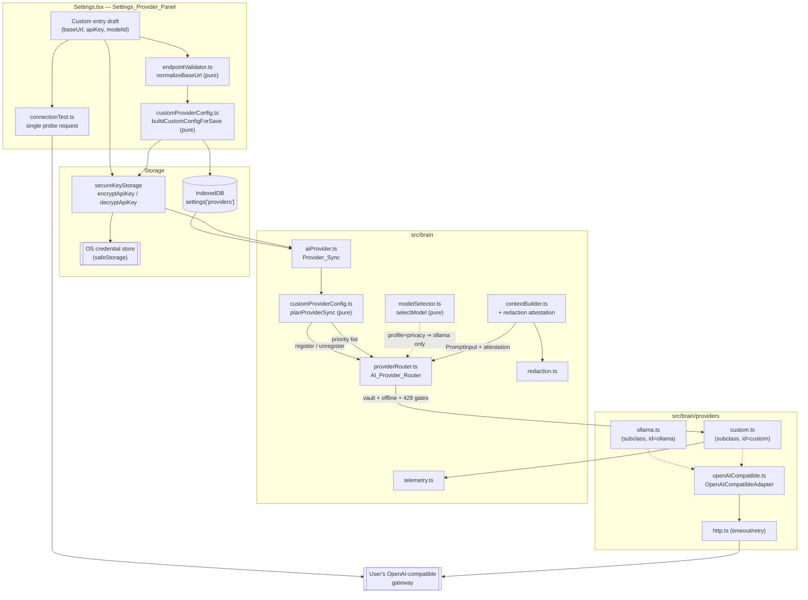
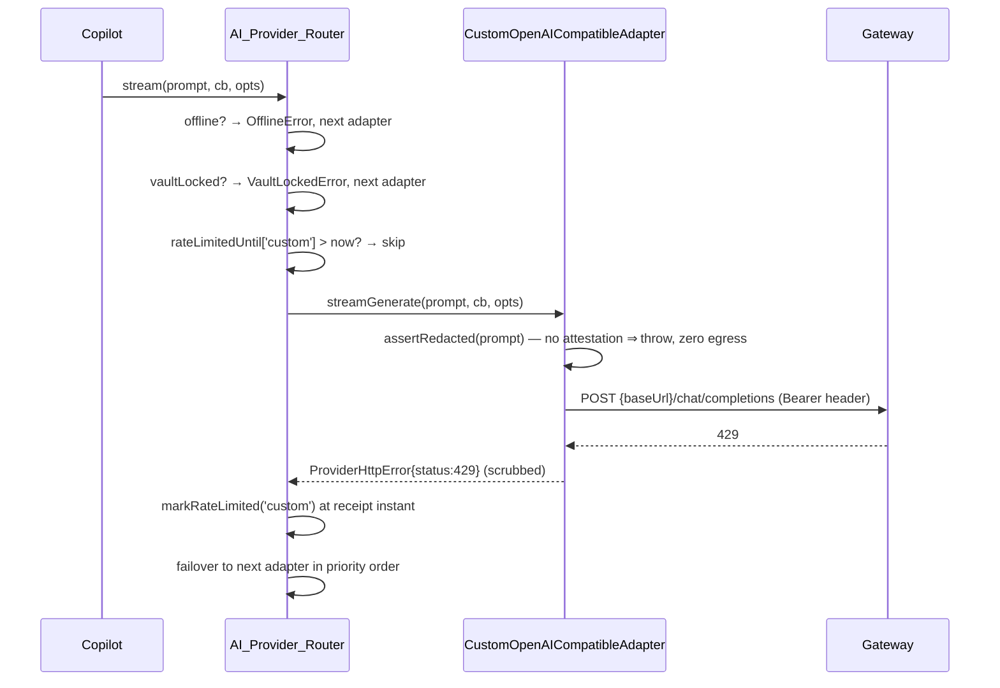

# Design Document

## Overview

This feature adds an optional **Custom (OpenAI-compatible)** provider so the User
can route Zule's AI assistant through a third-party gateway (freemodel.dev,
OpenRouter, Groq, Together, self-hosted vLLM, remote LM Studio) using their own
Base_URL, API_Key, and Model_ID.

The design is shaped by three decisions, in descending order of importance:

1. **The custom provider is a cloud provider.** It carries the distinct
   identifier `custom` and is deliberately *not* added to
   `providerRouter.ts`'s `LOCAL_PROVIDER_NAMES` allowlist. Everything that
   already guards Gemini/OpenAI/Anthropic — the CryptoVault-locked gate, the
   offline gate, the 429 cooldown, redaction before egress, the `privacy`
   Profile exclusion in `modelSelector.ts` — therefore applies to it with no
   new gate logic. The one thing that *must not* happen is registering a remote
   gateway under the `ollama` id: that id is exempt from the vault and offline
   gates and would ship live transcripts and Knowledge_Base excerpts off-device
   while the application believes it is offline (Requirement 2.2).

2. **Reuse the existing transport.** `OllamaCompatibleAdapter` already speaks
   the exact wire protocol these gateways expose: `POST {baseUrl}/chat/completions`,
   `Authorization: Bearer …`, OpenAI-dialect SSE terminated by `data: [DONE]`,
   chunk-boundary-safe frame parsing via `src/brain/sse.ts`, and a token-usage
   fallback estimator. Rather than fork it, the adapter body is lifted into a
   provider-agnostic `OpenAICompatibleAdapter` base whose identity, timeouts,
   and default model are constructor-injected. `OllamaCompatibleAdapter` becomes
   a thin subclass that pins the old defaults (so `ollama.test.ts` keeps passing
   unchanged), and `CustomOpenAICompatibleAdapter` is a second thin subclass
   that pins `providerId = 'custom'`, cloud-grade timeouts, a redaction guard,
   a secret scrubber, and token telemetry.

3. **Push every decision into a pure module.** Base_URL validation, the
   Settings save/merge path, and the Provider_Sync register/unregister/skip
   decision are extracted as pure functions (`endpointValidator.ts`,
   `customProviderConfig.ts`) so the safety-critical branches are testable
   without IndexedDB, Electron, or a network. The IndexedDB and React layers
   become thin drivers over those functions.

The provider ships **disabled by default**, is never a Zule default, and the
Settings panel refuses to flip `enabled` to `true` until the User has
acknowledged the data-egress disclosure — gateways such as freemodel.dev relay
prompts to upstream vendors through an intermediary with no data-processing
agreement, and the User is told so in plain language before anything is sent.

### Research notes

- **Wire format.** OpenRouter, Groq, Together, vLLM's OpenAI server, LM Studio,
  and freemodel.dev all expose `POST {base}/chat/completions` with
  `Authorization: Bearer`, the same `choices[0].message.content` /
  `choices[0].delta.content` shapes, the same `usage.{prompt_tokens,
  completion_tokens}` block, and the `data: [DONE]` stream sentinel. The
  existing `buildRequestBody` / `extractCompletionText` / `extractDeltaContent`
  / `extractUsage` helpers in `ollama.ts` already tolerate the shim variations
  (array-form `content`, missing `usage`), so no new parsing work is required.
- **Base_URL convention.** Gateways differ on whether the documented base
  already includes a version segment (`https://openrouter.ai/api/v1`,
  `https://api.groq.com/openai/v1`, `http://localhost:1234/v1`). The adapter
  therefore appends only `/chat/completions` and never synthesises `/v1` — the
  User's Base_URL is used verbatim after normalisation. This differs from the
  `ollama` branch in `aiProvider.ts`, which appends `/v1` when missing; that
  heuristic is correct for Ollama and wrong for a general gateway.
- **Token counting.** No gateway exposes a remote tokenizer endpoint, and the
  model behind a gateway is unknown at design time, so `countTokens` keeps the
  inherited `ceil(len/4)` estimator. It over-counts slightly on dense text,
  which is the safe bias for `Context_Builder`'s prompt budget.

## Architecture



### Where the safety gates sit



The router already implements all three gates and a 300 000 ms cooldown
(`RATE_LIMIT_COOLDOWN_MS = 5 * 60 * 1000`). Because the gates key off
"adapter name is not in `LOCAL_PROVIDER_NAMES`", the custom provider inherits
them by construction. The only router change this feature needs is an
`unregisterAdapter` method (Requirement 1.5) — there is currently no way to
remove an adapter once registered.

## Components and Interfaces

### 1. Endpoint_Validator — `src/brain/providers/endpointValidator.ts` (new, pure)

```ts
export const MAX_BASE_URL_LENGTH = 2048;

export type BaseUrlResult =
  | { ok: true; url: string }
  | { ok: false; reason: 'empty' | 'too-long' | 'unparseable' | 'unsupported-scheme' };

/**
 * Trims, validates, and normalises a User-supplied Base_URL.
 * Normalisation = trim whitespace, then strip every trailing '/'.
 * Accepts only absolute URLs whose protocol is 'http:' or 'https:'.
 */
export function normalizeBaseUrl(raw: string): BaseUrlResult;
```

Implementation rules:

- `raw.trim()`; empty → `{ ok: false, reason: 'empty' }`.
- Length check against `MAX_BASE_URL_LENGTH` *before* parsing so a pathological
  input cannot reach `new URL`.
- `new URL(trimmed)` inside `try/catch`; a throw → `'unparseable'`. This is what
  makes "absolute" precise: `new URL` without a base rejects relative paths.
- `url.protocol` must be exactly `'http:'` or `'https:'`; anything else
  (`ftp:`, `file:`, `ws:`, `javascript:`) → `'unsupported-scheme'`.
- Return `trimmed.replace(/\/+$/, '')` — the *input* text with trailing slashes
  removed, not `url.href`, because `URL` canonicalisation would re-add a path
  slash and re-order query parameters that some gateways require verbatim.
- The function is idempotent: `normalizeBaseUrl(normalizeBaseUrl(x).url).url === normalizeBaseUrl(x).url`.

### 2. Custom provider config helpers — `src/brain/providers/customProviderConfig.ts` (new, pure)

This module holds every decision the Settings panel and Provider_Sync make, so
neither of them contains branching logic that requires a browser to test.

```ts
export const CUSTOM_PROVIDER_ID = 'custom' as const;
export const CUSTOM_PROVIDER_LABEL = 'Custom (OpenAI-compatible)';

export const MAX_API_KEY_LENGTH = 512;
export const MAX_MODEL_ID_LENGTH = 200;
export const MIN_PRIORITY = 1;
export const MAX_PRIORITY = 10;

export type CustomField = 'baseUrl' | 'apiKey' | 'modelId';

/** Clamp a keystroke-level input value to its field maximum (Requirement 1.2). */
export function clampField(field: CustomField, raw: string): string;

/** Ensure the entry list holds exactly one `custom` entry (Requirements 1.1, 1.7). */
export function mergeCustomEntry(saved: readonly ProviderConfig[]): ProviderConfig[];

export type SaveResult =
  | { ok: true; config: ProviderConfig }
  | { ok: false; field: CustomField; reason: string };

/**
 * Validates a draft and produces the record to persist. Does NOT encrypt —
 * the caller supplies the already-produced cipher (or `undefined` to retain
 * the previous one) so this stays pure (Requirements 1.3, 1.8, 3.11).
 */
export function buildCustomConfigForSave(input: {
  previous: ProviderConfig;
  enabled: boolean;
  priority: number;
  baseUrlDraft: string;
  modelIdDraft: string;
  apiKeyDraft: string;          // '' means "retain previous cipher"
  apiKeyCipher?: string;        // present only when apiKeyDraft was non-empty
}): SaveResult;

export type SyncDecision =
  | { action: 'register'; baseUrl: string; modelId: string; apiKey: string }
  | { action: 'unregister'; reason: 'disabled' }
  | { action: 'skip'; reason: 'incomplete'; missing: CustomField[] }
  | { action: 'skip'; reason: 'absent' };

/** Decide what Provider_Sync must do with the custom entry (Requirements 1.4–1.6). */
export function resolveCustomRegistration(input: {
  config: ProviderConfig | undefined;
  decryptedApiKey: string;
  currentlyRegistered: boolean;
}): SyncDecision;

export interface SyncPlan {
  /** Provider ids to (re)register, in ascending priority order. */
  register: string[];
  /** Provider ids to remove from the router. */
  unregister: string[];
  /** The priority list handed to `router.setPriority`. */
  priority: string[];
  /** Human-readable, credential-free diagnostics. */
  diagnostics: Array<
    | { kind: 'custom.disabled-while-registered' }
    | { kind: 'custom.config-incomplete'; missing: CustomField[] }
  >;
}

/** Whole-config planner. Pure; never mutates its inputs (Requirements 1.4–1.6). */
export function planProviderSync(
  configs: readonly ProviderConfig[],
  decryptedKeys: Readonly<Record<string, string>>,
  registered: ReadonlySet<string>,
): SyncPlan;
```

Behaviour rules worth pinning:

- **Blankness** is `value.trim().length === 0`, so a Base_URL, key, or Model_ID
  of tabs/newlines/unicode spaces counts as empty (Requirements 1.6, 3.4).
- `resolveCustomRegistration` checks `enabled === false` **first**: a disabled
  entry yields `unregister` when it is currently registered and `skip: 'absent'`
  otherwise. This ordering is what makes Requirement 1.5 hold regardless of
  whether the other fields are filled in.
- `missing` is built in the fixed order `['baseUrl', 'apiKey', 'modelId']` and
  contains exactly the blank fields, so the diagnostic names each of them
  (Requirement 1.6).
- The functions are non-mutating: `planProviderSync` builds new arrays and never
  writes back to `configs`, which is how "leave the persisted values unchanged"
  (Requirement 1.5) is guaranteed structurally rather than by convention.
- **Priority normalisation.** `buildCustomConfigForSave` clamps `priority` into
  `[MIN_PRIORITY, MAX_PRIORITY]` and rejects non-integers (Requirement 1.3).
  `Settings.handleSaveProviders` assigns `priority = index + 1` for every entry
  from its position in the list, making the persisted values 1-based. This is
  compatible with the existing consumers: `aiProvider.ts` and the panel only
  ever *sort* by `priority`, never read absolute values.
- **Initialisation.** `mergeCustomEntry` appends
  `{ id: 'custom', enabled: false, priority: max(existing.priority) + 1, baseUrl: '', modelId: '' }`
  (clamped to `MAX_PRIORITY`) when no `custom` entry exists, and de-duplicates
  to the first occurrence when several exist (Requirements 1.1, 1.7). "Lower
  priority than every other entry" means *lowest precedence*, i.e. the
  numerically greatest value and last position in the failover order.

### 3. OpenAICompatibleAdapter — `src/brain/providers/openAICompatible.ts` (new, extracted)

The body of today's `OllamaCompatibleAdapter` moves here verbatim, with four
values lifted into constructor options and every hard-coded `PROVIDER_ID`
replaced by `this.providerId`:

```ts
export interface OpenAICompatibleAdapterOptions {
  providerId: string;                 // 'ollama' | 'custom' | …
  baseUrl: string;
  defaultModelId: string;
  apiKey?: string;
  capabilities?: Capabilities;
  streamingTimeoutMs?: number;
  nonStreamingTimeoutMs?: number;
  fetchImpl?: typeof fetch;
  /** Called once per completed request with the resolved usage. */
  onUsage?: (u: { modelId: string; promptTokens: number; completionTokens: number }) => void;
  /** Last-chance transform applied to every error message before it escapes. */
  scrubError?: (message: string) => string;
  /** Pre-flight guard; throwing aborts the request before any fetch. */
  preflight?: (prompt: PromptInput) => void;
}

export class OpenAICompatibleAdapter implements ProviderAdapter { … }
```

`ollama.ts` keeps its public surface (`OllamaCompatibleAdapter`,
`OllamaCompatibleAdapterOptions`) and its defaults
(`http://localhost:11434/v1`, `llama3.1`, 120 000 ms both ways, zero pricing) by
subclassing and passing `providerId: 'ollama'`. `ollama.test.ts` and every
existing import site are unaffected.

The module-private helpers (`buildRequestBody`, `throwIfNotOk`,
`extractCompletionText`, `extractDeltaContent`, `extractUsage`) move with the
class. `throwIfNotOk` gains one line: the assembled message passes through
`scrubError` before the `ProviderHttpError` is constructed.

### 4. Custom_Provider_Adapter — `src/brain/providers/custom.ts` (new)

```ts
export interface CustomProviderAdapterOptions {
  baseUrl: string;          // already normalised by Endpoint_Validator
  modelId: string;          // non-blank
  apiKey?: string;
  capabilities?: Capabilities;
  pricePerMTokens?: { input: number; output: number };
  fetchImpl?: typeof fetch;
  telemetrySink?: (e: MetricEvent) => void;   // defaults to `telemetry.emit`
}

export class CustomOpenAICompatibleAdapter extends OpenAICompatibleAdapter {
  readonly name = 'custom';
}
```

Differences from the Ollama subclass, each traceable to a requirement:

| Concern | Value / behaviour | Requirement |
| --- | --- | --- |
| `name` / `providerId` | `'custom'` — never `'ollama'` | 2.1, 2.2 |
| Timeouts | `http.ts` cloud defaults (6 000 ms non-streaming, 12 000 ms streaming) | — |
| Base_URL | used verbatim; only `/chat/completions` appended, no `/v1` synthesis | — |
| Constructor validation | throws when `baseUrl` or `modelId` is blank, so an incompletely configured adapter cannot exist | 1.6 |
| `preflight` | `assertRedacted(prompt)` — see below | 2.9, 2.10 |
| `scrubError` | `scrubSecret(message, apiKey)` | 3.7 |
| `onUsage` | emits one `{ kind: 'tokens', providerId: 'custom', modelId, promptTokens, completionTokens }` | 3.8 |
| Capabilities | `streaming: true`, `imageInput: false`, `toolUse: false`, `maxInputTokens: 32_000`, `pricePerMTokens` from config (default `{0,0}`) | — |

`imageInput` and `toolUse` default to `false` because an arbitrary gateway model
is not known to be multimodal or tool-capable; sending image parts to a
text-only model produces a hard 400 on most gateways. Both are overridable via
`capabilities` for a User who knows their endpoint supports them.

**Secret scrubbing.**

```ts
/** Replaces every occurrence of `secret` (and its Bearer form) with a fixed mask. */
export function scrubSecret(text: string, secret?: string): string;
```

`scrubSecret` is a pure, exported helper: it returns `text` unchanged when
`secret` is blank or shorter than 8 characters (avoiding pathological masking of
common substrings), and otherwise replaces all occurrences of `secret` and
`` `Bearer ${secret}` `` with `'[REDACTED:APIKEY]'`. It is applied to the
adapter's error messages, to the Connection_Test result, and to every
Provider_Sync log line (Requirements 3.7, 3.9). It exists because a careless
gateway can echo the request's `Authorization` header back inside a 4xx body,
and `throwIfNotOk` embeds the first 200 characters of that body in the message.

**Redaction guard.** `PromptInput` gains an optional attestation
(see Data Models). The adapter's `preflight`:

```ts
function assertRedacted(prompt: PromptInput): void {
  const a = prompt.redaction;
  if (!a || a.applied !== true || a.segmentsRedacted !== a.segmentsTotal) {
    throw new RedactionIncompleteError(CUSTOM_PROVIDER_ID);
  }
}
```

It runs before the request body is serialised and before any `fetch`, so a
missing or partial attestation produces zero HTTP requests to the Base_URL
(Requirement 2.10). The adapter holds no local state and never touches
IndexedDB, so "retain the unsent text in local storage unmodified" holds
structurally — the transcript, screen text, and Knowledge_Base rows are
untouched by a request that never left.

### 5. Redaction attestation — `contextBuilder.ts` / `contextManager.ts`

Requirement 2.9 requires that redaction has been applied to *every* transcript,
screen, and Knowledge_Base segment in a custom-provider request body.
`Context_Builder` is already the single redaction site (`redactText` over each
`ContextSection`), so the design does not move redaction into the adapter —
that would redact twice and could not see the segment structure anyway. Instead
`Context_Builder` reports what it did, and the adapter refuses to transmit
unattested prompts:

```ts
export interface RedactionAttestation {
  /** True only when every section passed through `redaction.apply`. */
  applied: boolean;
  /** Number of User-defined + built-in rules applied (0 is legitimate). */
  ruleCount: number;
  segmentsTotal: number;
  segmentsRedacted: number;
}
```

`buildContext` counts the sections it emits and the sections it passed through
`redactText`, and stamps `{ applied: segmentsRedacted === segmentsTotal, … }` on
its output. When `settings.skipRedaction` is `true`, it stamps
`{ applied: false, … }` — that flag stays available for local-only paths, and a
prompt built with it can never reach the custom provider.

An empty rule set is *not* a failure: applying an empty User rule set over every
segment is a completed application, so `ruleCount: 0` with
`segmentsRedacted === segmentsTotal` attests successfully.

One existing site must change: `contextManager.buildContextWindow` currently
passes `skipRedaction: true` ("Legacy path did not redact"), which would block
the custom provider outright. It is updated to read the `redactionRules` setting
and pass `skipRedaction: false`. This is a strict improvement for the cloud
adapters already reachable from that path.

### 6. Provider_Sync — `src/brain/aiProvider.ts` (extended)

`ensureProvidersSynced` becomes a thin driver over `planProviderSync`:

1. Read `providers` from IndexedDB and run `mergeCustomEntry`.
2. Decrypt each `apiKeyCipher` via `decryptApiKey`. A decrypt failure returns
   `''`, which the planner treats as a blank key — so a key that cannot be
   decrypted (keystore moved machines) degrades to `skip: 'incomplete'` rather
   than to a request with no credential.
3. Run `planProviderSync(configs, keys, registeredNames)`.
4. Apply the plan: instantiate and `registerAdapter` for each `register` id
   (custom via `await import('./providers/custom')`, matching the existing
   per-adapter dynamic-import pattern for chunk splitting), call
   `router.unregisterAdapter(id)` for each `unregister` id, then
   `router.setPriority(plan.priority)`.
5. Emit each diagnostic through `console.warn` **and** the copilot error surface,
   after `scrubSecret`. `custom.disabled-while-registered` is the configuration
   error required by Requirement 1.5; `custom.config-incomplete` names each
   empty field per Requirement 1.6.

The module tracks `registeredNames: Set<string>` alongside the existing
`lastSyncedConfigHash` so step 3 can tell "registered and now disabled" from
"never registered". The config-hash short-circuit is retained; because the hash
covers the whole `providers` array, any enable/disable transition invalidates it.

The custom adapter is constructed with the *normalised* Base_URL straight from
storage — no `/v1` suffixing (contrast the `ollama` branch, which appends `/v1`
because that is Ollama's documented layout).

### 7. AI_Provider_Router — `src/brain/providerRouter.ts` (extended)

One addition and one assertion:

```ts
/** Remove an adapter so no subsequent request can be routed to it (Requirement 1.5). */
unregisterAdapter(name: string): boolean;
```

It deletes from `this.adapters`, drops the name from `this.priority`, and clears
any `rateLimitedUntil` entry, returning whether an adapter was present.

`LOCAL_PROVIDER_NAMES` stays exactly `new Set(['ollama', 'simulation'])` and is
exported (currently module-private) so a test can assert its membership
directly — the single most important invariant in this feature
(Requirement 2.2). No other router logic changes:

- The vault-locked and offline gates already `continue` past any adapter whose
  name is outside the allowlist, before `complete` / `streamGenerate` is
  reached, which is what gives zero invocations and zero HTTP egress
  (Requirements 2.3, 2.4). When the loop ends with a `VaultLockedError` or
  `OfflineError` as the last error, that error is rethrown verbatim rather than
  wrapped, so the caller can distinguish the cause (Requirement 2.5).
- `is429Error` keys on the numeric `status` an adapter attaches, so the custom
  adapter's `ProviderHttpError` is classified without message sniffing;
  `markRateLimited` stamps `Date.now() + 300_000` at the moment the error is
  caught, which is the receipt instant (Requirement 2.7).
- Because `getOrderedAdapters()` re-derives the order from `this.priority` on
  every call and the cooldown map only *skips* entries, an adapter leaving
  cooldown is automatically back in its original position, still behind the
  vault and offline gates (Requirement 2.8).

### 8. Model_Selector — `src/brain/modelSelector.ts` (unchanged)

`selectModel` already filters the registry to `providerId === LOCAL_PROVIDER_ID`
(`'ollama'`) under `profile === 'privacy'`, and throws `ModelSelectorError`
naming the missing local provider when that filter is empty. Since the custom
provider's id is `custom`, Requirements 2.6 and 2.11 hold with no code change.
The design adds a regression property (Property 9) rather than new logic,
because the correctness of this behaviour now depends on the custom id staying
outside the local allowlist.

### 9. Connection_Test — `src/brain/providers/connectionTest.ts` (new)

```ts
export type ConnectionTestResult =
  | { ok: true; latencyMs: number; modelEcho?: string }
  | { ok: false; category: ConnectionTestFailure; status?: number; detail: string };

export type ConnectionTestFailure =
  | 'invalid-url' | 'missing-model' | 'unauthorized' | 'forbidden'
  | 'not-found' | 'rate-limited' | 'server-error'
  | 'network' | 'timeout' | 'bad-response';

export async function testCustomProviderConnection(input: {
  baseUrl: string; apiKey: string; modelId: string;
  fetchImpl?: typeof fetch; timeoutMs?: number;
}): Promise<ConnectionTestResult>;
```

A single non-streaming `POST {normalised}/chat/completions` with
`{ model, messages: [{ role: 'user', content: 'ping' }], max_tokens: 1, stream: false }`,
a 6 000 ms timeout via `fetchWithTimeout`, and **no** `retryWithJitter` — a
configuration probe should report the first failure, not retry into it.

Two deliberate choices:

- The probe body is the fixed literal `'ping'`. It contains zero transcript,
  screen, or Knowledge_Base content, so it is not subject to the redaction
  attestation and does not need the vault-locked or offline gates: nothing about
  the User's data can leak through it. It does not go through the router at all.
- `detail` is a short, `scrubSecret`-ed classification string (e.g.
  `HTTP 401`), never the raw body and never the URL, so a gateway echoing the
  `Authorization` header cannot surface it in the UI (Requirements 3.3, 3.9).

### 10. Settings_Provider_Panel — `src/components/Settings.tsx` (extended)

Additions to the existing AI Providers section:

- `DEFAULT_PROVIDERS` gains
  `{ id: 'custom', enabled: false, priority: 6, baseUrl: '', modelId: '' }`;
  `PROVIDER_LABELS.custom = 'Custom (OpenAI-compatible)'` and
  `PROVIDER_DESCRIPTIONS.custom = 'Any OpenAI-compatible endpoint (OpenRouter, Groq, vLLM, LM Studio…)'`.
- The load effect runs `mergeCustomEntry` on the persisted array (replacing the
  current `DEFAULT_PROVIDERS.map` merge, which silently drops persisted ids that
  are not in the defaults).
- A three-input row rendered only for `provider.id === 'custom'`: Base_URL
  (`type="text"`, `maxLength={2048}`), API_Key (`type={reveal ? 'text' : 'password'}`,
  `maxLength={512}`, with the existing eye/eye-off toggle), Model_ID
  (`type="text"`, `maxLength={200}`). Each `onChange` routes through
  `clampField`, so a paste that exceeds the maximum is truncated rather than
  accepted (Requirement 1.2). `aria-invalid` and an inline error message are
  bound to a `customBaseUrlError` state for Requirement 1.8.
- **Stored keys are never loaded into the input.** The existing load effect
  decrypts every provider's cipher into `providerKeys`; for `custom` it instead
  records `hasStoredKey.custom = true` and leaves the input value `''` with
  placeholder `'•••••••••••• (saved — leave blank to keep)'`. Saving with a
  blank input omits `apiKeyCipher` from the update so the stored cipher is
  retained (Requirements 1.10, 3.1). The other providers' existing behaviour is
  untouched; extending the masked-placeholder treatment to them is a follow-up.
- **Save path.** `handleSaveProviders` assigns `priority = index + 1`, then for
  the custom entry: `clampField` the drafts → `encryptApiKey` when the key draft
  is non-empty → `buildCustomConfigForSave`. On `{ ok: false }` it aborts the
  whole save (leaving `providers` in IndexedDB byte-identical), sets the field
  error, and shows a toast. An `encryptApiKey` rejection takes the same abort
  path with a "credential could not be secured" message (Requirement 3.10).
  Note `encryptApiKey` currently falls back to a `plain:`-prefixed value when
  `safeStorage` is unavailable rather than throwing; the save path treats a
  returned `plain:` prefix as a *warning* (surfaced in the toast) and a thrown
  error as the Requirement 3.10 failure.
- **Data-egress disclosure.** Above the inputs, a persistent notice states that
  prompts — including transcript text and Knowledge_Base excerpts — are sent to
  the configured endpoint, that a gateway may relay them to upstream vendors,
  and that Zule has no data-processing agreement with either. The Power
  (enable) toggle for the custom entry is disabled until an acknowledgement
  checkbox is ticked; ticking it stamps `acknowledgedEgressAt: Date.now()` on
  the entry. The gate lives entirely in the panel's enable path, so the
  persisted `enabled` flag remains the single source of truth that
  Provider_Sync reads (Requirements 1.4, 1.6 are unaffected).
- **Test connection** button beside the save button, enabled when the draft has
  all three fields; renders the `ConnectionTestResult` category as a toast plus
  an inline status pill.

## Data Models

### ProviderConfig — extended (`src/data/database.ts`)

```ts
export interface ProviderConfig {
  id: 'gemini' | 'openai' | 'anthropic' | 'ollama' | 'simulation' | 'custom';
  enabled: boolean;
  /** 1-based failover position; integer in [1, 10]. Lower = tried earlier. */
  priority: number;
  /** Ciphertext from `secureKeyStorage.encryptApiKey`. Never plaintext for `custom`. */
  apiKeyCipher?: string;
  /** Normalised absolute http(s) prefix; `/chat/completions` is appended by the adapter. */
  baseUrl?: string;
  /** NEW — the `model` field value sent in the request body. */
  modelId?: string;
  /** Optional User-supplied pricing so Spend_Tracker can cost custom requests. */
  pricePerMTokens?: { input: number; output: number };
  /** NEW — epoch ms at which the User acknowledged the data-egress disclosure. */
  acknowledgedEgressAt?: number;
}
```

`modelId` is a new first-class field rather than a reuse of `apiKeyCipher`. The
`ollama` entry currently smuggles its model id through `apiKeyCipher`
(`Settings.tsx` stores it verbatim, `aiProvider.ts` reads
`config.apiKeyCipher?.trim()` as the model tag). Repeating that for a provider
that has a *real* secret in `apiKeyCipher` would guarantee a credential leak
into the request body, so `custom` uses `modelId` and `apiKeyCipher` strictly
for the ciphertext. No migration is needed: the field is optional and absent
records read as `undefined`.

No IndexedDB schema change and no `DB_VERSION` bump — `providers` is a single
row in `STORE_SETTINGS` whose value is a JSON array.

### Persisted example

```json
{
  "id": "custom",
  "enabled": true,
  "priority": 6,
  "baseUrl": "https://openrouter.ai/api/v1",
  "modelId": "meta-llama/llama-3.1-8b-instruct",
  "apiKeyCipher": "enc:v1:BASE64…",
  "acknowledgedEgressAt": 1751500000000
}
```

### PromptInput — extended (`src/types/ai.ts`)

```ts
export interface RedactionAttestation {
  applied: boolean;
  ruleCount: number;
  segmentsTotal: number;
  segmentsRedacted: number;
}

export interface PromptInput {
  systemPrompt: string;
  userText: string;
  fullPrompt: string;
  images?: Array<{ mimeType: string; base64: string }>;
  /** NEW — stamped by Context_Builder; required by the custom adapter. */
  redaction?: RedactionAttestation;
}
```

Optional so every existing construction site (including `toPromptInput` in
`aiProvider.ts` and the simulation adapter's tests) keeps compiling. Absent is
treated as "not attested", i.e. the custom adapter refuses it.

`ProviderId` also gains `'custom'`.

### Telemetry — no new variant

The existing `{ kind: 'tokens'; promptTokens; completionTokens; modelId; providerId }`
variant already carries exactly the four fields Requirement 3.8 names, and the
`MetricEvent` union's no-free-form-payload shape structurally prevents a
credential from being recorded. The custom adapter is the first production
emitter of this variant; `Spend_Tracker.aggregate` consumes it unchanged and
costs custom requests using the config's `pricePerMTokens`.

### ZuleError — two new variants (`src/types/errors.ts`)

```ts
| { kind: 'provider.redaction-incomplete'; providerId: string }
| { kind: 'provider.config-incomplete'; providerId: string; missing: string[] }
```

Both are content-free: `missing` holds field *names*, never values.

## Correctness Properties

*A property is a characteristic or behavior that should hold true across all
valid executions of a system — essentially, a formal statement about what the
system should do. Properties serve as the bridge between human-readable
specifications and machine-verifiable correctness guarantees.*

### Property 1: Base_URL validation and normalisation

*For any* string `s`, `normalizeBaseUrl(s)` SHALL return `ok: true` if and only
if `s.trim()` is at most 2048 characters and parses as an absolute URL whose
protocol is `http:` or `https:`; when `ok`, the returned `url` SHALL have no
leading or trailing whitespace and no trailing `/` character, and
`normalizeBaseUrl(url).url` SHALL equal `url`.

**Validates: Requirements 1.3, 1.8**

### Property 2: Input length clamping

*For any* string `s` and *for any* field in `{baseUrl, apiKey, modelId}`, the
value committed by the Settings_Provider_Panel change handler SHALL be a prefix
of `s` whose length is at most the field maximum (2048, 512, 200 respectively),
and SHALL equal `s` exactly when `s.length` is within that maximum.

**Validates: Requirements 1.2**

### Property 3: The entry list holds exactly one initialised Custom_Provider

*For any* persisted provider array (including arrays with zero, one, or several
`custom` entries and arbitrary priority values), the merged entry list SHALL
contain exactly one entry whose id is `custom`; when the input contained none,
that entry SHALL have `enabled === false`, an empty Base_URL, an empty Model_ID,
no API_Key cipher, and a priority value numerically greater than every other
entry's priority.

**Validates: Requirements 1.1, 1.7**

### Property 4: Save round-trip preserves the four persisted values

*For any* valid draft (arbitrary enabled flag, integer priority in [1, 10],
absolute http(s) Base_URL decorated with arbitrary leading/trailing whitespace
and trailing slashes, and arbitrary Model_ID with surrounding whitespace),
persisting the draft and re-loading it SHALL yield the same enabled flag, the
same priority, the normalised Base_URL, and the trimmed Model_ID; and saving the
re-loaded values again SHALL be a fixed point.

**Validates: Requirements 1.3**

### Property 5: A rejected save is a no-op on persisted state and never writes plaintext

*For any* previously persisted provider array and *for any* rejection cause in
`{non-absolute Base_URL, non-http(s) scheme, API_Key longer than 512 characters,
Secure_Key_Storage encryption failure}`, the save SHALL leave the persisted
`providers` value deep-equal to its prior value, SHALL write no field containing
the submitted API_Key plaintext, and SHALL surface an error indication naming the
offending field.

**Validates: Requirements 1.8, 3.10, 3.11**

### Property 6: The API_Key is persisted only as ciphertext, and a blank save retains it

*For any* API_Key of 1 to 512 characters, after a save every string field of the
persisted Custom_Provider_Config SHALL exclude the plaintext key, the stored
cipher SHALL decrypt back to the key, and a subsequent save performed with an
empty API_Key input SHALL leave the stored cipher unchanged while rendering no
character of the key in the API_Key control.

**Validates: Requirements 1.9, 1.10, 3.1**

### Property 7: Provider_Sync's plan is a total, non-mutating function of configuration

*For any* provider configuration array and *for any* set of currently registered
adapter names, `planProviderSync` SHALL produce a plan in which: `custom`
appears in `register` and in `priority` if and only if its entry is enabled and
its trimmed Base_URL, decrypted API_Key, and trimmed Model_ID are all non-blank;
`custom` appears in `unregister` with a `disabled-while-registered` diagnostic if
and only if it is currently registered and its entry is disabled; a
`config-incomplete` diagnostic whose `missing` set equals exactly the set of
blank required fields is present if and only if the entry is enabled with at
least one blank field; and in every case the input configuration objects SHALL be
unmodified.

**Validates: Requirements 1.4, 1.5, 1.6**

### Property 8: Cloud gates block the Custom_Provider with zero invocations and zero egress

*For any* set of registered adapters that includes `custom`, *for any* priority
ordering of them, *for any* gate state in which the CryptoVault is locked or the
application reports no connectivity, and *for any* entry point in
`{complete, stream}`, the AI_Provider_Router SHALL invoke the
Custom_Provider_Adapter's `complete` and `streamGenerate` zero times, SHALL issue
zero HTTP requests through the adapter's injected fetch, SHALL — when no
allowlisted adapter remains — reject with an error identifying the vault-locked
or offline cause and the refused provider, and SHALL leave a snapshot of the
local transcript, screen-text, and Knowledge_Base state deep-equal to its value
before the call.

**Validates: Requirements 2.2, 2.3, 2.4, 2.5**

### Property 9: The `privacy` Profile never selects the Custom_Provider

*For any* model registry containing at least one entry whose `providerId` is
`custom`, *for any* token count, and *for any* mode, `selectModel` with
`profile: 'privacy'` SHALL either return an entry whose `providerId` is `ollama`
or throw a selection error naming the missing local provider; it SHALL never
return an entry whose `providerId` is `custom`.

**Validates: Requirements 2.6, 2.11**

### Property 10: A 429 suppresses the Custom_Provider for exactly 300 000 ms and then restores its position

*For any* priority ordering containing `custom` and *for any* elapsed offset `t`
measured from the instant a 429 response is received: when `t < 300000` the
router SHALL invoke the Custom_Provider_Adapter zero times and issue zero HTTP
requests to the Base_URL; when `t >= 300000` and the vault is unlocked and the
application reports connectivity, the router SHALL attempt the adapters in the
same order as before the 429, with `custom` at its original position.

**Validates: Requirements 2.7, 2.8**

### Property 11: Redaction is complete before egress, or there is no egress

*For any* User-defined rule set and *for any* set of transcript, screen-text, and
Knowledge_Base segments, the request body the Custom_Provider_Adapter transmits
SHALL contain each segment's redacted form as produced by the Redaction_Engine
over that rule set; and *for any* prompt whose redaction attestation is absent,
not applied, or reports fewer redacted segments than total segments, the adapter
SHALL issue zero HTTP requests to the Base_URL, SHALL reject with a
redaction-incomplete error, and SHALL leave the local transcript, screen-text,
and Knowledge_Base state deep-equal to its prior value.

**Validates: Requirements 2.9, 2.10**

### Property 12: The credential travels only in the Authorization header

*For any* API_Key value (including absent, empty, and whitespace-only) and *for
any* prompt, the request the Custom_Provider_Adapter issues SHALL carry the
`Authorization: Bearer <key>` header if and only if the key is non-blank, SHALL
carry the key in no other header value, SHALL exclude the key from the serialised
request body, and SHALL use a request URL whose path, query string, and fragment
exclude the key.

**Validates: Requirements 3.2, 3.3, 3.4**

### Property 13: No surface emits the credential

*For any* API_Key of at least 8 characters, *for any* upstream failure response
(arbitrary status and body, including bodies that echo the key or the
`Authorization` header verbatim), and *for any* emitting surface in
`{adapter error, Provider_Sync log, Connection_Test result, Copilot_Error_Surface
message}`, every emitted string — the error message, every own enumerable
property of the error, every console output, and every User-visible message —
SHALL exclude the API_Key value and the `Authorization` header value.

**Validates: Requirements 3.7, 3.9**

### Property 14: Exactly one token-usage event per completed request

*For any* completed Custom_Provider request (streaming or non-streaming) and
*for any* usage block the gateway reports (complete, partial, absent, or
negative), exactly one telemetry event of kind `tokens` SHALL be recorded, whose
provider id is `custom`, whose model id is the configured Model_ID, whose prompt
and completion token counts are non-negative integers, and none of whose fields
contains the API_Key value.

**Validates: Requirements 3.8**

### Property 15: The reveal toggle is a round trip over masking

*For any* API_Key text typed into the Custom_Provider API_Key control, while the
reveal control is off the rendered control SHALL present every character as the
same uniform masking character and no rendered text SHALL contain the typed
value; while it is on the rendered control SHALL present the typed value
unmasked; and toggling the control twice SHALL return the rendered
representation to its starting state.

**Validates: Requirements 3.5, 3.6**

## Error Handling

Every failure path routes through an existing mechanism: `ProviderHttpError` for
wire failures, the `ZuleError` union plus `useZuleError` for User-visible
surfaces, and `telemetry.emit({ kind: 'error', … })` for diagnostics. Nothing
new is invented for error transport.

### Configuration-time failures (Settings_Provider_Panel)

| Cause | Handling | Requirement |
| --- | --- | --- |
| Base_URL non-empty and not absolute http(s) | Abort the entire save; `providers` untouched; `aria-invalid` on the Base_URL control plus inline message; toast | 1.8 |
| API_Key longer than 512 characters | `clampField` truncates at the keystroke; a programmatic over-length submission aborts the save with a message naming the API_Key field; stored cipher retained | 3.11 |
| `encryptApiKey` throws | Abort the save; stored cipher retained; no plaintext written; "credential could not be secured" toast | 3.10 |
| `encryptApiKey` returns a `plain:` value (no OS keystore) | Save proceeds, warning toast that the key is stored unencrypted because the OS credential store is unavailable | 3.10 (adjacent) |
| `setSetting('providers', …)` rejects (quota, corruption) | Existing `storage.quota-exceeded` / `storage.corrupted` path; the panel's in-memory draft is left intact so the User can retry | — |

Every message passes through `scrubSecret` before it reaches a toast, the
console, or the error surface.

### Sync-time failures (Provider_Sync)

| Cause | Handling | Requirement |
| --- | --- | --- |
| Enabled entry with a blank Base_URL / API_Key / Model_ID | Skip registration, exclude `custom` from the priority list, emit `{ kind: 'provider.config-incomplete', providerId: 'custom', missing: [...] }` | 1.6 |
| Entry disabled while its adapter is registered | `router.unregisterAdapter('custom')`, emit the same variant with an empty `missing` plus a disabled-specific message; persisted config untouched | 1.5 |
| `decryptApiKey` returns `''` (keystore moved machines) | Treated as a blank key → the `config-incomplete` path above, naming `apiKey`. The provider is never registered without a credential | 1.6, 3.4 |

### Request-time failures (Custom_Provider_Adapter)

| Cause | Classification | Router behaviour |
| --- | --- | --- |
| Missing / partial redaction attestation | `RedactionIncompleteError` (`code: 'REDACTION_INCOMPLETE'`) thrown before any fetch | Not retryable and not a failover trigger — surfaced immediately so the User learns the prompt was refused rather than silently downgraded |
| 401 / 403 | `ProviderHttpError` with `status` | Non-retryable → surfaced as `provider.unauthorized` |
| 404 (wrong Base_URL or unknown Model_ID) | `ProviderHttpError` `status: 404` | Non-retryable → surfaced with a hint to re-run the Connection_Test |
| 429 | `ProviderHttpError` `status: 429`, `retryAfterMs` when the header is present | `markRateLimited('custom')` at the receipt instant, then failover; skipped for 300 000 ms |
| 5xx | `ProviderHttpError` | Retried by `retryWithJitter` (up to 3 attempts, 8 000 ms cumulative cap), then failover |
| Transport error / timeout | `TypeError` / `AbortError` from `fetchWithTimeout` | Failover to the next adapter in priority order |
| Malformed SSE frame | Skipped by the existing parser; the stream continues | — |
| Response with no readable body | `cb.onError` | Failover |

All adapter error messages are prefixed `CustomOpenAICompatibleAdapter:` and
pass through `scrubSecret`. The adapter never attaches the request headers or
the Base_URL query string to the error object.

### Vault / offline / privacy refusals

`VaultLockedError` and `OfflineError` are already thrown verbatim by the router
and already carry the refused provider name. The copilot surfaces them through
the existing path in `aiProvider.ts` (both are re-thrown rather than falling back
to simulation). Under the `privacy` Profile with no `ollama` entry, `selectModel`
throws `ModelSelectorError` naming the missing local provider — unchanged
behaviour, now load-bearing for Requirement 2.11.

## Testing Strategy

### Framework

Vitest 3.2.4 with `fast-check` 3.23.2, matching every other property test in
`src/**/*.test.ts`. New test files follow the existing colocation convention:

- `src/brain/providers/endpointValidator.test.ts`
- `src/brain/providers/customProviderConfig.test.ts`
- `src/brain/providers/custom.test.ts`
- `src/brain/providers/connectionTest.test.ts`
- `src/brain/providerRouter.customProvider.test.ts`
- `src/components/__tests__/SettingsCustomProvider.test.tsx`

Existing suites that must keep passing unmodified: `ollama.test.ts` (the base-class
extraction is behaviour-preserving), `openai.test.ts`, `http.test.ts`,
`providerRouter.test.ts`, `modelSelector.test.ts`, `redaction.test.ts`,
`contextBuilder.test.ts`.

### Property tests

Property-based testing applies to this feature: the safety-critical logic is a
set of pure functions (`normalizeBaseUrl`, `clampField`, `mergeCustomEntry`,
`buildCustomConfigForSave`, `planProviderSync`, `scrubSecret`, `selectModel`) plus
adapter and router behaviour that is fully observable through an injected `fetch`
and an injected clock. Every property in the section above is implemented as
**exactly one** `fast-check` property test with **at least 100 runs**
(`fc.assert(fc.property(...), { numRuns: 100 })`), tagged with a comment in the
project's format:

```ts
// Feature: custom-openai-compatible-provider, Property 8: Cloud gates block the
// Custom_Provider with zero invocations and zero egress
```

Test harness notes:

- **Fetch spy.** Adapters take `fetchImpl`; the router tests register a
  `CustomOpenAICompatibleAdapter` built over a `vi.fn()` fetch and assert
  `fetch.mock.calls.length === 0` for the gate properties. "Zero HTTP requests to
  the configured Base_URL" is therefore checked directly rather than inferred.
- **Clock.** The 429 cooldown property drives `vi.useFakeTimers()` and
  `vi.advanceTimersByTime(t)` with `t` generated in `fc.integer({ min: 0, max: 600_000 })`,
  so the 300 000 ms boundary is exercised from both sides.
- **Secure_Key_Storage.** Stubbed with an in-memory `Map` keyed by a fake cipher
  prefix, plus a mode that throws, so Properties 5 and 6 run without Electron.
- **Local-store snapshot.** Properties 8 and 11 snapshot the fake IndexedDB
  contents (`JSON.stringify` of the meetings / documents / settings stores) before
  and after the refused call and assert equality — the machine-checkable reading
  of "retain the unsent text in local storage unmodified".
- **Secret generators.** Properties 12 and 13 generate keys from
  `fc.string({ minLength: 8, maxLength: 512 })` and deliberately construct
  upstream response bodies that embed the key, so the scrubber is tested against
  the case that actually leaks in practice.
- **DOM.** Properties 2, 6, and 15 use `@testing-library/react` against the
  Settings panel, matching `src/components/__tests__`.

### Unit tests (examples, edge cases, and constants)

Property tests cover the universal behaviour; unit tests stay deliberately few
and cover what has no meaningful input variation:

- `CustomOpenAICompatibleAdapter.name === 'custom'` (Requirement 2.1).
- `LOCAL_PROVIDER_NAMES` equals exactly `new Set(['ollama', 'simulation'])`, and
  registering the custom adapter does not add to it (Requirement 2.2). This is
  the single most important regression guard in the feature.
- `PROVIDER_LABELS.custom === 'Custom (OpenAI-compatible)'` (Requirement 1.1).
- Base_URL `'https://example.com/v1'` yields the endpoint
  `'https://example.com/v1/chat/completions'` — no `/v1` synthesis, in contrast
  to the `ollama` branch.
- One streaming happy path against a canned SSE fixture ending in `data: [DONE]`,
  asserting cumulative `onToken` text and a single `onComplete` — inherited
  behaviour, pinned once for the new subclass.
- Each `ConnectionTestFailure` category mapped from a canned response
  (401 → `unauthorized`, 404 → `not-found`, 429 → `rate-limited`,
  500 → `server-error`, network throw → `network`, timeout → `timeout`,
  non-JSON body → `bad-response`).
- Edge cases folded into generators rather than separate tests: the 512/513 and
  2048/2049 length boundaries, whitespace-only field values, a Base_URL with a
  query string, a Model_ID containing `/` and `:`.

### Integration checks (not property tests)

- End-to-end Settings → IndexedDB → Provider_Sync → router registration, run once
  against the fake IndexedDB: save a complete config, assert `custom` is
  registered and last in the priority list; disable it, re-sync, assert the
  adapter is gone and the persisted record is unchanged.
- `npx tsc --noEmit` for both tsconfig projects, since the `ProviderConfig` id
  union and `PromptInput` both widen.

### Not property-tested

The data-egress disclosure copy and the acknowledgement checkbox layout are UI
presentation, covered by a single rendering assertion that the notice and the
disabled-until-acknowledged toggle exist. `secureKeyStorage`'s use of Electron
`safeStorage` is an OS integration and is exercised through the stub, not through
generated inputs.
