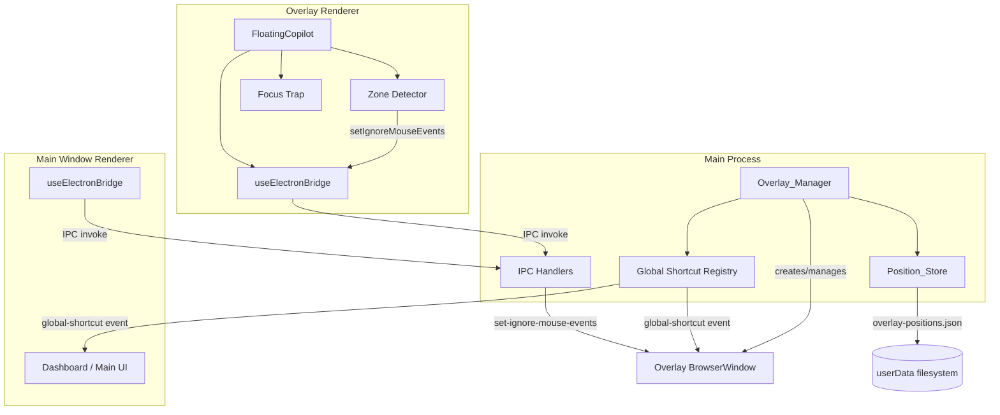
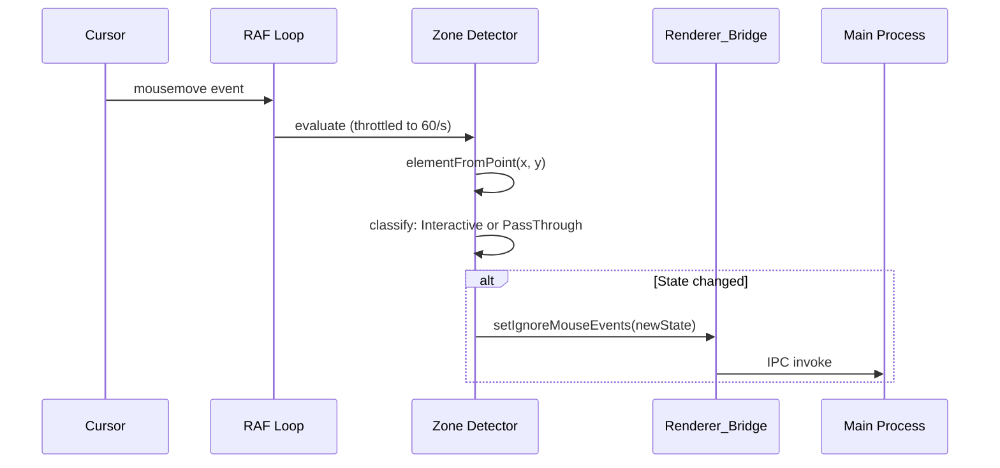
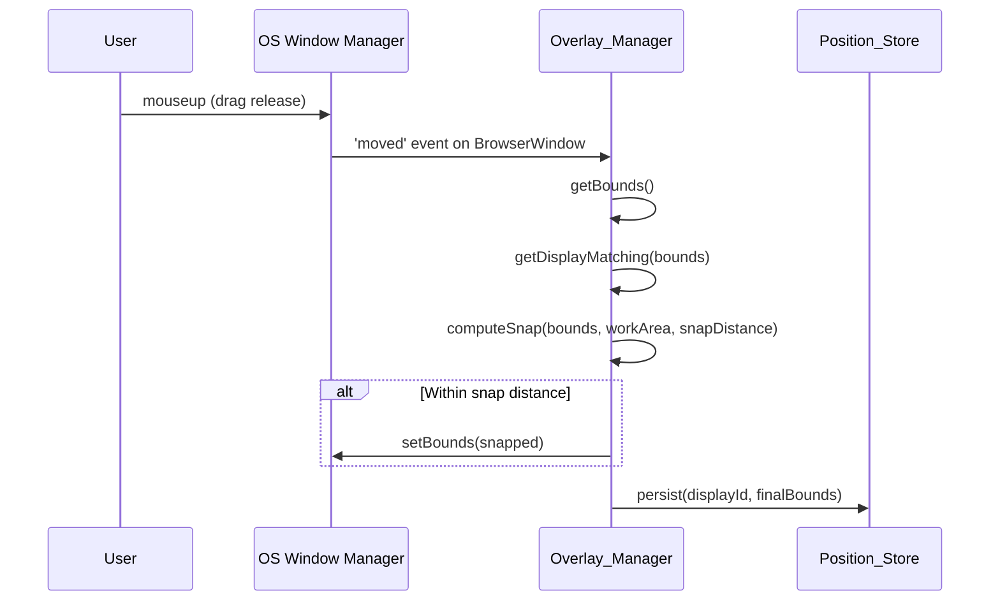

# Design Document: Desktop Overlay Window

## Overview

This design defines the native desktop overlay window layer for Zule AI's Electron app. It delivers Cluely-style overlay behavior: a frameless, transparent, always-on-top capsule that hovers above every desktop window, is invisible to screen capture, supports click-through for non-interactive regions, snaps to screen edges, persists position per monitor, never steals focus, and renders the existing `FloatingCopilot` React component inside it.

The implementation extends the existing scaffolding in `electron/main.ts` by extracting an `Overlay_Manager` module, adding a `Position_Store` for per-display persistence, implementing renderer-side click-through zone detection, and providing an edge-snapping algorithm with multi-monitor support.

### Key Design Decisions

1. **Module extraction over inline expansion** — The current `createOverlayWindow()` and IPC handlers in `main.ts` will be extracted into a dedicated `electron/overlayManager.ts` module to keep the main process entry point lean and testable.
2. **Renderer-driven zone detection** — Click-through toggling is driven from the renderer (via `elementFromPoint` + RAF throttle) rather than main-process hit-testing, because the renderer knows the DOM layout.
3. **JSON file persistence** — Position/state is persisted to `overlay-positions.json` in `userData` rather than `electron-store` or SQLite to avoid new dependencies and keep the format human-debuggable.
4. **`showInactive()` everywhere** — Every show path uses `showInactive()` to guarantee no focus stealing, with focus only acquired on explicit user click inside an interactive zone.
5. **Property-based testing for pure algorithms** — Edge snapping, bounds clamping, zone classification, and IPC deduplication are pure functions amenable to property-based testing with `fast-check`.

---

## Architecture



### Data Flow: Click-Through Zone Detection



### Data Flow: Edge Snap on Drag Release



---

## Components and Interfaces

### 1. Overlay_Manager (`electron/overlayManager.ts`)

The central main-process module responsible for overlay lifecycle.

```typescript
// electron/overlayManager.ts

import { BrowserWindow, screen, globalShortcut, app } from 'electron';
import { PositionStore, PersistedBounds } from './positionStore';

export interface OverlayManagerConfig {
  preloadPath: string;
  rendererUrl: string;       // DEV_URL or file path
  isDev: boolean;
  snapDistance?: number;     // default 16
}

export interface OverlayState {
  alwaysOnTop: boolean;
  contentProtection: boolean;
  mode: 'compact' | 'expanded';
}

export class OverlayManager {
  private window: BrowserWindow | null = null;
  private store: PositionStore;
  private config: OverlayManagerConfig;
  private state: OverlayState;

  constructor(config: OverlayManagerConfig);

  /** Create and show the overlay (showInactive). */
  create(): void;

  /** Destroy the overlay window. */
  destroy(): void;

  /** Show overlay without stealing focus. */
  show(): void;

  /** Hide overlay. */
  hide(): void;

  /** Toggle visibility; returns new visibility state. */
  toggle(): boolean;

  /** Resize with animation (180ms ease-out). */
  resize(width: number, height: number): void;

  /** Move to absolute position. */
  move(x: number, y: number): void;

  /** Nudge by delta within work area. */
  nudge(dx: number, dy: number): void;

  /** Recenter on display under cursor. */
  recenter(): void;

  /** Apply edge snap to current bounds. */
  applySnap(): void;

  /** Set always-on-top state and persist. */
  setAlwaysOnTop(enabled: boolean): void;

  /** Set content protection state and persist. */
  setContentProtection(enabled: boolean): void;

  /** Re-apply platform properties after show (always-on-top, workspaces, content protection). */
  private reapplyPlatformState(): void;

  /** Handle display-added/removed/metrics-changed events. */
  private onDisplayChange(): void;

  /** Get current bounds or null if not created. */
  getBounds(): Electron.Rectangle | null;

  /** Register all global shortcuts. */
  registerShortcuts(mainWindow: BrowserWindow): void;

  /** Unregister all global shortcuts. */
  unregisterShortcuts(): void;

  /** Persist current bounds to store. */
  private persistBounds(): void;

  /** Restore bounds from store for current display. */
  private restoreBounds(): Electron.Rectangle;
}
```

### 2. Position_Store (`electron/positionStore.ts`)

Persists overlay position per display.

```typescript
// electron/positionStore.ts

export interface PersistedBounds {
  x: number;
  y: number;
  width: number;
  height: number;
  mode: 'compact' | 'expanded';
  alwaysOnTop: boolean;
  contentProtection: boolean;
}

export interface PositionStoreData {
  version: 1;
  displays: Record<string, PersistedBounds>;  // keyed by Display_Id (string)
}

export class PositionStore {
  private filePath: string;
  private data: PositionStoreData;
  private dirty: boolean;

  constructor(userDataPath: string);

  /** Load from disk. Returns default if file missing/corrupt. */
  load(): PositionStoreData;

  /** Get bounds for a specific display. */
  get(displayId: string): PersistedBounds | undefined;

  /** Set bounds for a display and schedule write. */
  set(displayId: string, bounds: PersistedBounds): void;

  /** Flush pending writes to disk. */
  flush(): Promise<void>;

  /** Remove entry for a display. */
  remove(displayId: string): void;
}
```

### 3. Edge Snap Algorithm (`electron/edgeSnap.ts`)

Pure function for computing snapped position.

```typescript
// electron/edgeSnap.ts

export interface Rect {
  x: number;
  y: number;
  width: number;
  height: number;
}

export interface SnapResult {
  snapped: boolean;
  bounds: Rect;
  edges: ('left' | 'right' | 'top' | 'bottom')[];
}

/**
 * Compute the snapped position for a window within a work area.
 *
 * For any edge of the window that is within `snapDistance` of the
 * corresponding work-area edge, that window edge is aligned to the
 * work-area edge. Multiple edges can snap simultaneously (corner snap).
 *
 * Pure function — no side effects.
 */
export function computeSnap(
  windowBounds: Rect,
  workArea: Rect,
  snapDistance: number,
): SnapResult;

/**
 * Clamp bounds so the entire rectangle is within the work area.
 * If the window is larger than the work area in any dimension,
 * pin to top-left of that axis.
 *
 * Pure, idempotent: clamp(clamp(b, w), w) === clamp(b, w).
 */
export function clampToWorkArea(bounds: Rect, workArea: Rect): Rect;

/**
 * Clamp width/height to min/max size constraints.
 * Pure, idempotent.
 */
export function clampSize(
  width: number,
  height: number,
  constraints: { minWidth: number; minHeight: number; maxWidth: number; maxHeight: number },
): { width: number; height: number };
```

### 4. Zone Detector (`src/overlay/zoneDetector.ts`)

Renderer-side module for determining click-through state.

```typescript
// src/overlay/zoneDetector.ts

export type ZoneClassification = 'interactive' | 'pass-through';

export interface ZoneDetectorState {
  isDragging: boolean;
  isModalOpen: boolean;
  currentZone: ZoneClassification;
}

/**
 * Classify a point as interactive or pass-through based on the DOM element.
 *
 * Rules (in priority order):
 * 1. If isDragging → always 'interactive'
 * 2. If isModalOpen → always 'interactive'
 * 3. If element is null (no element under cursor) → 'pass-through'
 * 4. If element or any ancestor has [data-interactive-zone] → 'interactive'
 * 5. Otherwise → 'pass-through'
 *
 * Pure function given the element chain.
 */
export function classifyZone(
  element: Element | null,
  state: ZoneDetectorState,
): ZoneClassification;

/**
 * Determines whether an IPC call should be emitted given previous and new zone.
 * Returns true only on state transition (deduplication).
 */
export function shouldEmitIPC(
  previousZone: ZoneClassification,
  newZone: ZoneClassification,
): boolean;
```

### 5. Focus Trap (`src/overlay/focusTrap.ts`)

Renderer-side focus management.

```typescript
// src/overlay/focusTrap.ts

export interface FocusTrapOptions {
  containerRef: React.RefObject<HTMLElement>;
  enabled: boolean;
  onEscape?: () => void;
}

/**
 * React hook that traps Tab/Shift+Tab within the container when enabled.
 * Releases immediately when disabled (overlay hidden).
 */
export function useFocusTrap(options: FocusTrapOptions): void;
```

### 6. Renderer Entry Point Changes (`src/main.tsx`)

```typescript
// Detection logic for overlay route
if (window.location.hash === '#overlay') {
  // Mount FloatingCopilot in isolation with native overlay styles
  root.render(<OverlayShell />);
} else {
  // Mount full dashboard app
  root.render(<App />);
}
```

### 7. OverlayShell Component (`src/components/OverlayShell.tsx`)

Thin wrapper that positions FloatingCopilot for native window rendering.

```typescript
// src/components/OverlayShell.tsx

export function OverlayShell() {
  // Sets position:fixed, inset:0, applies -webkit-app-region:drag on capsule
  // Integrates Zone Detector and Focus Trap
  // Renders <FloatingCopilot /> with overlay-specific CSS class
  return (
    <div className="overlay-shell" style={{ position: 'fixed', inset: 0, width: '100vw', height: '100vh' }}>
      <FloatingCopilot />
    </div>
  );
}
```

---

## Data Models

### Position_Store File Format (`overlay-positions.json`)

```json
{
  "version": 1,
  "displays": {
    "2528732444": {
      "x": 1450,
      "y": 30,
      "width": 450,
      "height": 600,
      "mode": "expanded",
      "alwaysOnTop": true,
      "contentProtection": true
    },
    "2779098117": {
      "x": 850,
      "y": 50,
      "width": 380,
      "height": 64,
      "mode": "compact",
      "alwaysOnTop": true,
      "contentProtection": true
    }
  }
}
```

### IPC Channel Map

| Channel | Direction | Payload | Purpose |
|---------|-----------|---------|---------|
| `start-overlay` | renderer → main | — | Create/show overlay |
| `stop-overlay` | renderer → main | — | Destroy overlay |
| `toggle-overlay` | renderer → main | — | Show/hide toggle |
| `resize-overlay` | renderer → main | `{ width, height }` | Resize with animation |
| `move-overlay` | renderer → main | `{ x, y }` | Move to position |
| `get-overlay-bounds` | renderer → main | — | Returns `Rectangle \| null` |
| `set-always-on-top` | renderer → main | `boolean` | Toggle z-level |
| `set-content-protection` | renderer → main | `boolean` | Toggle capture invisibility |
| `set-ignore-mouse-events` | renderer → main | `{ ignore, forward? }` | Click-through toggle |
| `global-shortcut` | main → renderer | `string` (shortcutId) | Shortcut event broadcast |
| `ipc-sync-message` | bidirectional | `unknown` | Cross-window state sync |
| `overlay-error` | main → renderer | `{ code, message }` | Error notifications |

### Size Constraints

| Constant | Value | Unit |
|----------|-------|------|
| `MIN_WIDTH` | 380 | CSS px |
| `MIN_HEIGHT` | 64 | CSS px |
| `MAX_WIDTH` | 700 | CSS px |
| `MAX_HEIGHT` | 900 | CSS px |
| `COMPACT_WIDTH` | 380 | CSS px |
| `COMPACT_HEIGHT` | 64 | CSS px |
| `EXPANDED_WIDTH` | 450 | CSS px |
| `EXPANDED_HEIGHT` | 600 | CSS px |
| `SNAP_DISTANCE` | 16 | CSS px |
| `NUDGE_STEP` | 40 | CSS px |
| `RESIZE_DURATION` | 180 | ms |

---

## Correctness Properties

*A property is a characteristic or behavior that should hold true across all valid executions of a system — essentially, a formal statement about what the system should do. Properties serve as the bridge between human-readable specifications and machine-verifiable correctness guarantees.*

### Property 1: Zone detection classifies correctly and routes IPC

*For any* cursor position (x, y) over the overlay window, and any combination of DOM state (element present/absent, element has `[data-interactive-zone]` or not), the `classifyZone` function shall return `'interactive'` if and only if the element or an ancestor carries the interactive marker, and `'pass-through'` otherwise. The corresponding IPC call (`setIgnoreMouseEvents(false)` for interactive, `setIgnoreMouseEvents(true, {forward:true})` for pass-through) shall match the classification.

**Validates: Requirements 3.2, 3.3, 3.4**

### Property 2: IPC call deduplication suppresses redundant calls

*For any* sequence of zone classifications produced by consecutive cursor movements, the number of `setIgnoreMouseEvents` IPC calls emitted shall equal the number of state transitions in that sequence. Consecutive identical classifications produce zero additional IPC calls.

**Validates: Requirements 3.5**

### Property 3: Edge snap correctness

*For any* window bounds and any display work area, if a window edge is within `snapDistance` CSS pixels of the corresponding work-area edge, `computeSnap` shall align that window edge to the work-area edge. If no window edge is within `snapDistance` of any work-area edge, `computeSnap` shall return the original bounds unchanged.

**Validates: Requirements 4.4, 4.5**

### Property 4: Bounds clamping invariant

*For any* rectangle (position + size) and any work area, `clampToWorkArea` shall return a rectangle that is fully contained within the work area (all four edges at or inside the work-area edges). If the window is larger than the work area in any dimension, it pins to the top-left of that axis. The function is idempotent: `clampToWorkArea(clampToWorkArea(b, w), w) === clampToWorkArea(b, w)`.

**Validates: Requirements 4.9, 9.6**

### Property 5: Size clamping to configured limits

*For any* width and height values (including values outside the valid range), `clampSize` shall return dimensions where `minWidth <= result.width <= maxWidth` and `minHeight <= result.height <= maxHeight`. The function is idempotent.

**Validates: Requirements 9.11**

### Property 6: Drag-state overrides zone detection

*For any* cursor position and any DOM state, while `isDragging === true`, `classifyZone` shall return `'interactive'` regardless of the element under the cursor.

**Validates: Requirements 3.6**

### Property 7: Modal-state overrides zone detection

*For any* cursor position and any DOM state, while `isModalOpen === true`, `classifyZone` shall return `'interactive'` regardless of the element under the cursor.

**Validates: Requirements 3.7**

### Property 8: Web fallback no-op absorption

*For any* method on the `ElectronAPI` interface, when invoked through the `browserFallback` object (web mode), the call shall not throw, shall return a safe default value, and shall produce no observable side effects.

**Validates: Requirements 11.2**

### Property 9: RAF throttle bounds zone evaluations

*For any* burst of `mousemove` events at any frequency, the zone detector shall evaluate at most once per animation frame (~60 evaluations per second), discarding intermediate events without queueing them.

**Validates: Requirements 14.2**

### Property 10: Focus trap containment

*For any* sequence of Tab and Shift+Tab keypresses while the overlay is visible and focus trap is active, keyboard focus shall cycle within the set of focusable elements inside the overlay container and shall never escape to elements outside the container.

**Validates: Requirements 13.4**

### Property 11: All interactive zones have accessible names

*For any* element marked as an Interactive_Zone (carrying `[data-interactive-zone]`), its computed accessible name (via `aria-label`, `aria-labelledby`, or visible text content) shall be a non-empty string.

**Validates: Requirements 13.6**

---

## Error Handling

### Position_Store I/O Failures

| Scenario | Handling |
|----------|----------|
| File missing on load | Return default empty store; first `set()` creates file |
| File corrupt (invalid JSON) | Log warning, return default empty store, overwrite on next `flush()` |
| Write fails (permissions, disk full) | Retain state in memory, emit `overlay-error` to renderer with code `PERSIST_FAILED`, retry on next `flush()` call |
| Read fails on startup | Use in-memory defaults for session |

### Global Shortcut Registration Failures

| Scenario | Handling |
|----------|----------|
| Shortcut already taken by another app | Log structured warning with combination name, emit `overlay-error` to renderer with code `SHORTCUT_UNAVAILABLE` and the affected combination, do NOT forward `global-shortcut` events for that combination |
| Shortcut re-registration (user customization) | Unregister old first, then register new; if new fails, restore old and notify |

### Content Protection Platform Limitations

| Platform | Handling |
|----------|----------|
| Windows | `setContentProtection(true)` works via DWM; no special handling |
| macOS | Works via `NSWindowSharingNone`; no special handling |
| Linux | `setContentProtection` is a no-op; surface one-time non-blocking notice on first request, suppress thereafter |

### Overlay Window Crash

| Scenario | Handling |
|----------|----------|
| Renderer crash (white screen) | `webContents.on('render-process-gone')` — leave window open for diagnostics, emit error to main window |
| Main process unhandled rejection | Electron's default crash reporter; overlay state persisted via periodic flush |
| FloatingCopilot uncaught error | Error boundary catches; does NOT invoke `stopOverlay()`; window stays open |

### Display Removal

| Scenario | Handling |
|----------|----------|
| Display removed while overlay is on it | Relocate to primary display at default top-right offset |
| Display metrics changed (DPI, resolution) | Re-clamp bounds to new work area, re-apply always-on-top |

---

## Testing Strategy

### Unit Tests (Vitest)

- **Overlay_Manager**: Mock `BrowserWindow`, verify creation options, lifecycle calls (`showInactive`, `setAlwaysOnTop`, `setContentProtection`, `setVisibleOnAllWorkspaces`), event handler registration, and shortcut forwarding.
- **Position_Store**: Test load/save/flush cycle with mock filesystem, corrupt file recovery, and concurrent access.
- **OverlayShell**: Snapshot test verifying fixed positioning and `-webkit-app-region` CSS.
- **Focus Trap**: Test Tab cycling with mock focusable elements, release on disable.
- **Mode transitions**: Verify `resizeOverlay` is called with correct dimensions on compact↔expanded toggle.

### Property-Based Tests (fast-check)

Property-based tests use `fast-check` (already in devDependencies) with a minimum of **100 iterations** per property.

Each test is tagged with a comment referencing its design property:
```
// Feature: desktop-overlay-window, Property {N}: {property text}
```

Target modules for PBT:
- `electron/edgeSnap.ts` — Properties 3, 4, 5 (pure functions: `computeSnap`, `clampToWorkArea`, `clampSize`)
- `src/overlay/zoneDetector.ts` — Properties 1, 2, 6, 7 (pure functions: `classifyZone`, `shouldEmitIPC`)
- `src/hooks/useElectronBridge.ts` — Property 8 (browserFallback no-op verification)
- `src/overlay/zoneDetector.ts` (integration with RAF) — Property 9 (throttle bound)
- `src/overlay/focusTrap.ts` — Property 10 (focus cycling)
- Component render tests — Property 11 (accessible names)

### Integration Tests (Playwright + Electron)

- Multi-monitor positioning and snap behavior (requires Electron test harness)
- Content protection verification via `desktopCapturer.getSources()`
- Global shortcut firing across focused/unfocused states
- Show/hide transition timing (< 150ms)
- Panic hide timing (< 200ms)
- Idle CPU usage (< 1% over 60s)

### Platform-Specific QA Matrix

| Feature | Windows | macOS | Linux (X11) | Linux (Wayland) |
|---------|---------|-------|-------------|-----------------|
| Always-on-top (screen-saver) | ✓ | ✓ | ✓ | ✓ |
| Content protection | ✓ | ✓ | No-op (notice) | No-op (notice) |
| Visible on all workspaces | ✓ | ✓ | ✓ (if sticky hint) | Compositor-dependent |
| Global shortcuts | ✓ | ✓ | ✓ | Compositor-dependent |
| Frameless transparent | ✓ | ✓ | ✓ | ✓ |
| Edge snap | ✓ | ✓ | ✓ | ✓ |
