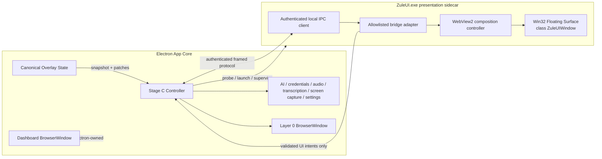
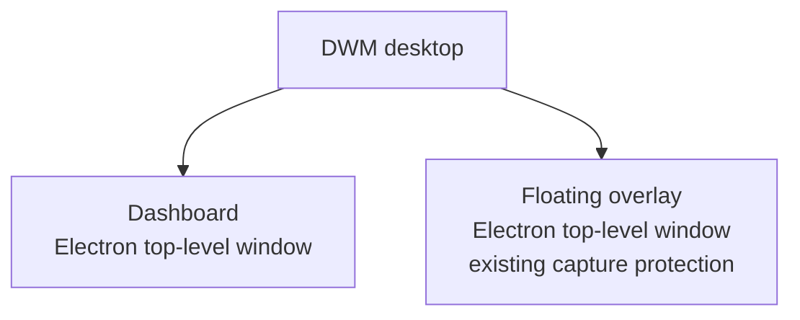
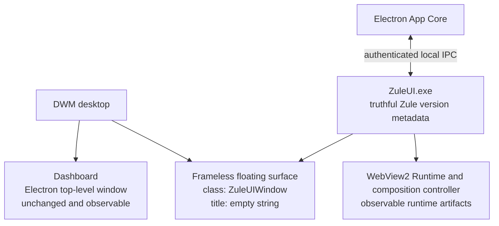

# Design Document: Stealth Window Host — Stage C

## Overview

Stage C replaces only Zule's floating overlay top-level Electron window on Windows with an app-owned native WebView2 sidecar. Electron remains the App Core and retains the Dashboard, canonical overlay state, AI orchestration, credentials, audio, transcription, screen capture, settings, update, and service ownership. `ZuleUI.exe` is a presentation process, not a second application core.

Layer 0—the current Electron floating overlay and its existing capture-protection behavior—remains permanently packaged, tested, and immediately recoverable. Stage A stays failed and disabled after mandatory gates A5 (interaction) and A6 (geometry/lifecycle) failed. Stage B stays disabled with status `not evaluated`; no Stage B path is eligible for runtime selection or release.

Stage C uses truthful, stable app-owned metadata: executable `ZuleUI.exe`, Win32 class `ZuleUIWindow`, and an empty title only for the frameless floating surface. Other app-owned top-level windows must have a non-empty Zule title. Names are never randomized, genericized, or made to resemble Windows, Microsoft, Edge, or another product. The narrow observable benefit is that the floating surface's top-level window is WebView2-hosted under `ZuleUIWindow` rather than Electron-hosted under `Chrome_WidgetWin`; the Dashboard, processes, modules, child windows, and WebView2 Runtime remain observable. No undetectability or monitoring-evasion claim is permitted.

---

## Stage Status and Non-Negotiable Invariants

| Strategy | Status | Runtime eligibility | Reason |
|---|---|---:|---|
| Layer 0 | Working, permanent fallback | Always | Current supported Electron overlay; behavior and protected tests must remain intact. |
| Stage A | Failed and disabled | Never | Real-Windows mandatory gates A5 and A6 failed. Existing code may remain only for historical diagnostics until removed; the selector must make it unreachable. |
| Stage B | Disabled, not evaluated | Never | No release evidence exists; implementation presence does not imply approval. |
| Stage C | Designed; production-disabled until all gates pass | Windows only, gated | Native app-owned WebView2 sidecar described here. |

The following invariants dominate all implementation choices:

1. A requested overlay always has a usable Layer 0 path without restarting Electron.
2. At most one floating overlay surface is visible.
3. Electron is the sole canonical state and service owner.
4. Stage C failure cannot mutate or disable Layer 0.
5. Stage A and Stage B cannot be selected by flags, environment variables, persisted settings, or fallback logic.
6. Production Stage C remains disabled unless every release gate has complete passing evidence for every supported Windows environment.
7. The existing Layer 0 CSS, IPC contracts, capture toggle, lifecycle behavior, and protected tests are not weakened to accommodate Stage C.

---

## Architecture

### Ownership boundary



### Window topology

Layer 0 remains unchanged:



Stage C changes only the floating surface:



The Layer 0 `BrowserWindow` stays warm while Stage C probes and starts. It can remain visible during Stage C startup. Stage C stays hidden until authentication, handshake, full state synchronization, acknowledgement, and first transparent frame are complete. Cutover order is strictly `hide Layer 0 → show Stage C`; fallback order is strictly `hide/close Stage C → show Layer 0`. This ordering prevents duplicate visible surfaces and provides immediate recovery.

### Main sequence

```mermaid
sequenceDiagram
    participant U as Overlay request
    participant L0 as Layer 0
    participant C as Stage C Controller
    participant S as ZuleUI.exe
    participant W as WebView2

    U->>L0: ensure created and show
    U->>C: request Stage C
    C->>C: runtime probe + release gate check
    alt probe or gate fails
        C-->>L0: keep Layer 0 active
    else eligible
        C->>S: spawn once; bootstrap over inherited private channel
        S->>C: authenticated connection
        S->>W: initialize packaged overlay
        S->>C: Ready handshake
        C->>C: verify versions, schema, launch, capabilities
        C->>S: full Overlay State snapshot
        S-->>C: snapshot acknowledgement
        W-->>S: first transparent frame ready
        S-->>C: first-frame-ready
        C->>L0: hide
        C->>S: show floating surface
        Note over C,S: Stage C active; Electron remains service owner
    end
```

## Components and Interfaces

### Component boundaries

| Component | Location | Responsibilities |
|---|---|---|
| `StageCController` | Electron main process | Strategy selection, runtime probe, launch credential, IPC server, sidecar supervision, handshake, state projection, capture parity, cutover/fallback, telemetry. |
| `StageCManifestReader` | Electron main process | Parse and validate packaged manifest, architecture, versions, dependency inventory, and release-gate approval marker. |
| `StageCIpcServer` | Electron main process | Create access-controlled local endpoint, authenticate one launch, frame and validate messages, enforce replay/size/schema rules. |
| `Layer0Adapter` | existing `OverlayManager` path | Preserve current create/show/hide/move/resize/snap/capture behavior and provide warm fallback. |
| `ZuleUI.exe` | native sidecar | Own exactly one floating surface, WebView2 environment/controller, rendering, input, DPI, capture-affinity application, and narrow bridge. |
| `BridgeAdapter` | sidecar + packaged overlay bootstrap | Translate exact reviewed WebView messages to protocol messages; expose no general native API. |
| `ReleaseGateHarness` | Windows test tooling | Produce signed/archived evidence for metadata, scope, startup, rendering, input, geometry, IPC, capture, fallback, performance, stability, packaging, and telemetry gates. |

---

## Native Toolchain Selection

### Observed workspace tooling

A non-mutating probe of this Windows workspace found:

| Tool | Observed status |
|---|---|
| `dotnet` | Not found |
| `msbuild` | Not found |
| MSVC `cl` | Not found |
| `cmake` | Not found |
| `cargo` / `rustc` | Not found |
| `ninja` | Present, but insufficient without a compiler and Windows SDK |

Therefore this design does **not** assume that native code can be built on the current workstation and does not install tooling in this phase.

### Selected release implementation

Stage C uses one implementation: C++20 Win32, WebView2 C++ interfaces, DirectComposition, and the Windows SDK, built with MSVC through an explicit `.vcxproj`/MSBuild project. This is selected because the feature directly owns Win32 messages, DPI, display affinity, composition visuals, process metadata, and WebView2 COM lifetimes; using the native interfaces avoids a second managed runtime and wrapper-specific window behavior.

Toolchain selection is deterministic rather than opportunistic:

```pascal
PROCEDURE SelectStageCToolchain(observedTools)
  IF observedTools has supported MSVC compiler
     AND observedTools has supported MSBuild
     AND observedTools has reviewed Windows SDK THEN
    RETURN MSVC_CPP20
  END IF

  RETURN UNAVAILABLE
END PROCEDURE
```

No .NET, Rust, MinGW, Clang, or ad-hoc compiler fallback is selected automatically. Adding another implementation or compiler is a design and security review, not a local convenience. When `UNAVAILABLE`, JavaScript/TypeScript development and Layer 0 continue normally, but Stage C native build, packaging, and production enablement fail closed.

The implementation phase must provision a pinned Visual Studio Build Tools image in CI containing MSVC, MSBuild, and one reviewed Windows SDK version. The exact versions, installer component identifiers, and image digest are committed in the Stage C dependency lock and copied into the manifest. The WebView2 SDK and loader are exact-version dependencies with source, integrity hash, license, architecture, transitive inventory, and review status. Floating ranges are rejected.

### Build outputs

```pascal
STRUCTURE StageCBuildOutput
  executable = "ZuleUI.exe"
  architecture: x64 OR arm64
  pdb: private release symbol artifact
  manifest: StageCManifest
  dependency_lock: ReviewedDependencyInventory
END STRUCTURE
```

The current Electron package distributes x64 Windows only. Stage C initially builds x64 only; adding arm64 requires a matching Electron artifact, sidecar binary, gate matrix, and dependency review. A package must never contain a sidecar architecture that differs from App Core.

---

## Metadata and Honest Scope

`ZuleUI.exe` version resources use Zule-owned values for `CompanyName`, `ProductName`, `FileDescription`, `InternalName`, `OriginalFilename`, and publisher/signing identity. `OriginalFilename` is `ZuleUI.exe`. The sole frameless floating surface uses class `ZuleUIWindow` and title `""`. Any diagnostic or future top-level sidecar window uses a non-empty title beginning with `Zule`.

The runtime and release harness assert all of the following:

```pascal
INVARIANT FloatingSurface.className = "ZuleUIWindow"
INVARIANT FloatingSurface.title = ""
INVARIANT Sidecar.imageName = "ZuleUI.exe"
INVARIANT every other app-owned top-level window has a non-empty Zule title
INVARIANT no metadata field is randomized for concealment
INVARIANT no metadata field claims Windows, Microsoft, Edge, System, or third-party ownership
```

Stage C documentation and telemetry describe only the selected host strategy and observed metadata. They explicitly state that Dashboard windows, process trees, loaded modules, child windows, WebView2 artifacts, and application behavior remain observable.

---

## Data Models

The examples use structured pseudocode so the Electron and native boundaries share one notation.

```pascal
ENUM HostStrategy
  LAYER_0
  STAGE_C
END ENUM

ENUM StageCPhase
  DISABLED
  LAYER_0_ACTIVE
  PROBING
  LAUNCHING
  AUTHENTICATING
  HANDSHAKING
  SYNCHRONIZING
  WAITING_FIRST_FRAME
  ACTIVE
  FALLING_BACK
  STOPPING
END ENUM

STRUCTURE StageCManifest
  app_version: ExactVersion
  sidecar_version: ExactVersion
  protocol_major: Integer
  protocol_minor: Integer
  bridge_schema_version: Integer
  supported_architectures: Set<Architecture>
  minimum_webview2_version: ExactVersion
  capabilities: Set<CapabilityId>
  native_dependencies: ReviewedDependencyInventory
  release_gate_evidence_id: String OR NULL
END STRUCTURE

STRUCTURE RuntimeProbeResult
  eligible: Boolean
  reason: ProbeFailureReason OR NULL
  architecture: Architecture
  sidecar_path: AbsolutePath OR NULL
  sidecar_signature_valid: Boolean
  webview2_version: ExactVersion OR NULL
  manifest: StageCManifest OR NULL
END STRUCTURE

STRUCTURE ProtocolEnvelope
  protocolVersion: { major: Integer, minor: Integer }
  messageId: UUID
  type: AllowedMessageType
  payload: ExactPayloadForType
END STRUCTURE

STRUCTURE ReadyHandshake
  launch_id: UUID
  sidecar_version: ExactVersion
  protocol_major: Integer
  protocol_minor: Integer
  bridge_schema_version: Integer
  capabilities: Set<CapabilityId>
  webview2_runtime_version: ExactVersion
END STRUCTURE

STRUCTURE OverlayProjection
  revision: NonNegativeInteger
  visibility_requested: Boolean
  bounds_dip: Rectangle
  mode: COMPACT OR EXPANDED OR MAXIMIZED
  capture_protection: Boolean
  render_state: ReviewedFloatingOverlayState
END STRUCTURE

STRUCTURE StageCStatus
  strategy: HostStrategy
  phase: StageCPhase
  failure: TypedStageCFailure OR NULL
  launch_id: UUID OR NULL
  overlay_revision: NonNegativeInteger
  stage_a_status = FAILED_DISABLED_A5_A6
  stage_b_status = DISABLED_NOT_EVALUATED
END STRUCTURE
```

`ReviewedFloatingOverlayState` may contain user-visible transcript, response, and input projection data required to render the current UI, but it never contains provider credentials, raw audio, screenshot bytes, general filesystem paths, or unrestricted service handles. Such payloads are allowed on authenticated IPC only under exact schemas and are never recorded in Stage C telemetry.

### Controller contract

```pascal
INTERFACE StageCController
  PROCEDURE requestOverlay()
  PROCEDURE stopOverlay()
  PROCEDURE applyState(projection: OverlayProjection)
  PROCEDURE setBounds(bounds_dip: Rectangle)
  PROCEDURE setCaptureProtection(enabled: Boolean)
  PROCEDURE shutdown()
  FUNCTION status(): StageCStatus
END INTERFACE
```

### Sidecar contract

```pascal
INTERFACE NativeFloatingSurface
  FUNCTION initialize(bootstrap: PrivateBootstrap): ReadyHandshake OR Failure
  PROCEDURE applySnapshot(projection: OverlayProjection)
  PROCEDURE applyPatch(base_revision, next_revision, patch)
  PROCEDURE setBounds(bounds_dip: Rectangle)
  PROCEDURE setVisible(visible: Boolean)
  PROCEDURE setCaptureProtection(enabled: Boolean)
  PROCEDURE shutdown()
END INTERFACE
```

---

## Runtime Probe and Strategy Selection

The selector has only two runtime outputs: Stage C or Layer 0. Stage A and Stage B are compile-time and runtime denied.

```pascal
PROCEDURE RequestFloatingOverlay()
  Layer0.ensureCreated()
  Layer0.applyCanonicalState()
  Layer0.applyCurrentCaptureProtection()
  Layer0.show()

  IF platform != WINDOWS THEN
    SelectLayer0(NON_WINDOWS)
    RETURN
  END IF

  IF StageC.failed_this_app_launch AND NOT explicit_diagnostic_retry THEN
    SelectLayer0(FAILED_EARLIER_THIS_LAUNCH)
    RETURN
  END IF

  probe = RunRuntimeProbe()
  IF NOT probe.eligible THEN
    SelectLayer0(probe.reason)
    RETURN
  END IF

  AttemptStageC(probe)
END PROCEDURE
```

`RunRuntimeProbe` performs no sidecar launch. It checks, in order:

1. `process.platform = win32` and a supported App Core architecture.
2. Stage C release-gate approval for production; development requires an explicit local diagnostic build marker.
3. Manifest exact schema and integrity.
4. Sidecar presence at the manifest-declared resource path; no PATH search.
5. Sidecar architecture equals App Core architecture.
6. Production Authenticode verification is explicitly valid and publisher identity equals configured Zule publisher. Unknown, offline, warning, or indeterminate is failure.
7. Exact App Core/sidecar release-version equality in production.
8. Exact protocol-major equality and bridge-schema compatibility.
9. WebView2 Runtime presence and minimum version through the supported runtime query API without spawning the sidecar.
10. Every native dependency appears in the reviewed lock with matching integrity metadata.

A failed prelaunch probe leaves Layer 0 visible and does not start `ZuleUI.exe`. If a repeated probe fails while a healthy Stage C instance is already active, it does not tear down that instance; it blocks only the next launch. Probe reasons are typed and content-free.

---

## Authenticated Local IPC

### Transport

The Electron main process creates a unique Windows named pipe endpoint for each launch using Win32 APIs through the existing Windows native boundary. The endpoint name contains a random launch identifier but is not treated as authentication. Its security descriptor grants access only to the current logon SID and the two participating processes; broad `Everyone`, anonymous, network, or low-integrity access is denied. The endpoint is local-only and rejects remote clients.

Before spawn, App Core generates a 32-byte credential and independent nonces from the Windows cryptographic random source. Endpoint, launch identifier, credential, and parent-process identity are delivered as a length-bounded bootstrap record through an inherited one-shot pipe handle. Only the intended child handle is inheritable; no credential or endpoint appears in command-line arguments, environment variables, WebView storage, renderer globals, logs, crash annotations, or telemetry. The handle is closed immediately after bootstrap consumption.

### Mutual authentication

```pascal
PROCEDURE Authenticate(connection, bootstrap)
  server_challenge = RandomBytes(32)
  SEND AuthChallenge(bootstrap.launch_id, server_challenge)

  client_hello = RECEIVE before startup_deadline
  EXPECT client_hello.launch_id = bootstrap.launch_id
  EXPECT client_hello.proof = HMAC_SHA256(
    bootstrap.credential,
    "zule-stage-c-client-v1" || server_challenge || client_hello.client_nonce || bootstrap.launch_id
  )

  IF any expectation fails THEN
    close without side effect
    RETURN AUTHENTICATION_FAILED
  END IF

  server_proof = HMAC_SHA256(
    bootstrap.credential,
    "zule-stage-c-server-v1" || client_hello.client_nonce || server_challenge || bootstrap.launch_id
  )
  SEND AuthAccepted(server_proof)
  mark connection authenticated
END PROCEDURE
```

Authentication crossing 2 seconds emits a content-free threshold event but may continue until the absolute 3-second startup deadline. Invalid credentials close the connection before any state mutation. Credentials are launch-scoped, invalidated on disconnect/exit, and overwritten in mutable buffers on best effort.

### Framing and validation

Each frame is `uint32 little-endian byte_length` followed by strict UTF-8 JSON. The receiver rejects lengths above 1,048,576 bytes before allocation or parsing. It rejects malformed encoding, malformed JSON, unknown types, extra fields, wrong protocol, wrong payload schema, non-canonical identifiers, and unexpected state revisions. Every rejection has zero state side effects.

`messageId` values are unique per launch. A bounded replay cache stores terminal outcomes; a duplicate returns `duplicate-message` and never repeats a mutation. Backpressure limits queued bytes and message count; overflow closes the connection and triggers fallback. Authentication messages are the only accepted messages before authentication.

### Message allowlist

Controller to sidecar:

- `lifecycle.shutdown`
- `state.snapshot`, `state.patch`
- `surface.setBounds`, `surface.setVisibility`, `surface.setCaptureProtection`
- `ai.streamDelta`, `ai.streamCompleted`, `ai.streamFailed`
- `operation.result`

Sidecar to controller:

- `lifecycle.ready`, `lifecycle.shutdownAck`, `surface.firstFrameReady`
- `state.snapshotAck`, `state.patchAck`
- `surface.boundsChanged`, `surface.captureProtectionResult`
- `intent.overlay`, `intent.ai`, `intent.audio`, `intent.screenCapture`
- `diagnostic.contentPolicyEvent`

Each type has a distinct exact schema. There is no generic invoke, arbitrary channel, method name, filesystem request, process request, URL request, or command payload.

---

## Least-Privilege WebView2 Bridge

The sidecar loads only bundled, versioned Zule overlay resources from a virtual host mapped read-only to the packaged overlay directory. Navigation is restricted to that origin. New windows, downloads, external URI launches, permission requests, unapproved navigation, browser accelerator keys, context menus, developer tools in production, and drag/drop are denied.

The bridge uses WebView2 web messaging, not a general COM host object. The page receives one frozen adapter, `window.zuleOverlay`, whose methods correspond one-to-one with reviewed schemas. The adapter cannot access the named pipe, launch credential, process environment, native handles, filesystem, registry, shell, arbitrary network, process creation, or App Core IPC.

```pascal
INTERFACE ZuleOverlayBridge
  PROCEDURE requestOverlayAction(action: AllowedOverlayAction)
  PROCEDURE requestAI(action: AllowedAIAction)
  PROCEDURE requestAudio(action: AllowedAudioAction)
  PROCEDURE requestScreenCapture(action: AllowedScreenCaptureAction)
  PROCEDURE reportDragRegions(revision, regions)
  PROCEDURE reportInteractiveRegions(revision, regions)
  EVENT onStateSnapshot(exact_projection)
  EVENT onStatePatch(exact_patch)
  EVENT onOperationResult(exact_result)
END INTERFACE
```

Before implementation, every method/event must be traced to a current `FloatingCopilot` caller. Unused candidates are excluded. Both the JavaScript adapter and native receiver validate version, exact fields, type, range, count, and size. Native validation is authoritative. The bridge treats all page messages as untrusted even though resources are packaged.

Electron remains solely responsible for provider credentials, AI routing, prompt construction, streaming/cancellation, microphone and loopback capture, preprocessing, transcription, audio device selection, screen-source enumeration, screen capture, permissions, image processing, and retention. The sidecar emits an intent; App Core validates, performs, updates canonical state, and projects a result back.

---

## Lifecycle, Handshake, and State Synchronization

Only one sidecar process and one floating surface may exist per App Core launch. Repeated overlay requests reuse the pending or healthy process. Before diagnostic retry, the controller terminates any owned stale process from the same launch.

```pascal
PROCEDURE AttemptStageC(probe)
  ASSERT Layer0 is usable
  ASSERT no eligible Stage A or Stage B path exists

  IF sidecar is pending OR active THEN
    reuse sidecar
    RETURN
  END IF

  launch_id = RandomUUID()
  create authenticated endpoint and private bootstrap
  spawn exactly one packaged ZuleUI.exe without shell
  phase = AUTHENTICATING
  start absolute 3 second startup deadline

  WAIT for authenticated ReadyHandshake
  VERIFY launch_id, exact release version policy, protocol major,
         protocol minor capabilities, bridge schema, required capabilities,
         architecture, and WebView2 runtime version
  IF verification fails THEN FALLBACK(HANDSHAKE_FAILURE) END IF

  SEND complete OverlayProjection snapshot
  WAIT at most 1 second for matching revision acknowledgement
  IF timeout THEN FALLBACK(STATE_ACK_TIMEOUT) END IF

  WAIT at most 1 second for first transparent frame after acknowledgement
  IF timeout THEN FALLBACK(FIRST_FRAME_TIMEOUT) END IF

  Layer0.hide()
  Sidecar.show()
  phase = ACTIVE
END PROCEDURE
```

The Ready handshake is sent once after WebView2 initialization, bridge initialization, floating-surface creation, and content-policy installation. The floating surface remains hidden before acceptance. Incremental patches include `base_revision` and `next_revision`; a mismatch causes the sidecar to request a full snapshot and keeps the previous complete render state. Reconnect within the same App Core launch always begins with authentication and a full snapshot.

Normal shutdown sends `lifecycle.shutdown`, waits exactly 2 seconds, then terminates the owned process if it remains alive. Process exit closes the endpoint, invalidates credentials, releases handles, and confirms there is no owned `ZuleUI.exe` or `ZuleUIWindow` top-level window. Unexpected exit or IPC disconnect while active begins fallback within 500 ms of notification. Disconnect during normal shutdown does not reopen Layer 0.

After any non-diagnostic Stage C failure, Layer 0 remains selected for the rest of that App Core launch. This prevents crash loops. An explicit diagnostic retry is rate-limited, visible in diagnostics, and never enabled by remote content.

---

## Transparent Rendering and Composition

`ZuleUI.exe` creates one borderless `WS_POPUP` floating surface registered as `ZuleUIWindow`, with no caption text and no menu. It uses per-monitor DPI awareness compatible with Electron. The surface hosts WebView2 through the composition-controller path and a DirectComposition visual tree. The WebView2 default background is transparent, and the composition root is sized to the client area before a resized frame can be shown.

The composition path is chosen over software bitmap copying. It preserves WebView2's renderer/compositor behavior while allowing the native surface to own top-level window identity and hit testing. It does not bypass Windows composition and is not described as doing so.

Rendering invariants:

```pascal
INVARIANT CSS alpha 0 presents as surface alpha 0
INVARIANT premultiplied partial alpha error <= 1 alpha unit
INVARIANT rounded corners and empty regions contain zero opaque artifact pixels
INVARIANT hidden surface contributes no visible desktop frame
INVARIANT controller bounds equal full client area before resized frame is exposed
```

Compact, expanded, and maximized overlay layouts use the same bundled UI semantics as Layer 0. Stage C-specific bootstrap code adapts the bridge and drag-region reporting; it does not fork business logic or service ownership.

---

## Input, Hit Testing, Native Drag, and Focus

The native window owns `WM_NCHITTEST`, pointer/mouse/wheel routing, focus transitions, DPI, and move loops. WebView2 composition input APIs receive client-coordinate pointer events. Keyboard focus is transferred through the supported WebView2 controller focus contract and normal Windows message routing; implementation must use the exact pinned SDK contract rather than synthetic text injection. IME composition, modifiers, navigation/editing keys, and accelerator handling are part of the input gate.

The renderer reports versioned DIP rectangles for drag and interactive regions after layout changes. The sidecar validates finite coordinates, rectangle bounds, count limits, and revision. Regions are transformed to physical client pixels using the active monitor DPI and cached without synchronous renderer calls from `WM_NCHITTEST`.

```pascal
FUNCTION HitTest(screen_point)
  client_px = ScreenToClientSigned(screen_point)
  point_dip = PhysicalToDip(client_px, current_dpi)

  IF region_map missing OR invalid THEN
    RETURN HTCLIENT
  END IF

  drag = point_dip is inside any drag region
  interactive = point_dip is inside any interactive region
  click_through = point_dip is inside a declared click-through region

  IF drag THEN RETURN HTCAPTION END IF
  IF click_through THEN RETURN HTTRANSPARENT END IF
  RETURN HTCLIENT
END FUNCTION
```

Drag wins when a point is both drag and interactive, matching the requirement. Invalid/missing maps fail safe to interactive, never to drag or click-through. `HTCAPTION` delegates movement to the Windows native move loop; no hand-rolled capture loop is used. On move completion or cancellation, no capture remains, and the final DIP bounds are sent to App Core for canonical persistence.

Pointer enter/leave/move/button ordering is preserved. Vertical and horizontal wheel deltas retain signed magnitude. Coordinates must land within one physical pixel of the intended target. Interactive activation moves focus to WebView2 without activating an unrelated Zule window. Click-through is limited to reviewed declared regions and does not globally make the surface noninteractive.

Existing Layer 0 `-webkit-app-region` CSS remains unchanged because it is protected behavior. Stage C may read equivalent DOM region semantics through its adapter, but it must not delete or weaken Layer 0 drag/no-drag rules.

---

## DPI and Multi-Monitor Geometry

App Core stores canonical rectangles in DIPs. The sidecar converts at the target monitor's effective DPI; native window APIs use signed physical coordinates. Conversion rounds rectangle edges, not width/height independently, to avoid drift.

```pascal
FUNCTION DipRectToPhysical(rect_dip, dpi)
  scale = dpi / 96
  left = Round(rect_dip.left * scale)
  top = Round(rect_dip.top * scale)
  right = Round(rect_dip.right * scale)
  bottom = Round(rect_dip.bottom * scale)
  RETURN Rectangle(left, top, right - left, bottom - top)
END FUNCTION
```

`WM_DPICHANGED` applies the OS-recommended physical rectangle before the next visible frame, then updates WebView2 rasterization scale, composition bounds, input conversion, and region maps. Monitor crossing, rotation, add/remove, work-area changes, and scale changes trigger revalidation. Negative virtual-desktop coordinates stay signed. Invalid persisted bounds recenter on the primary work area. If topology recovery fails, the current rectangle is retained and a typed degradation is reported rather than guessing a destructive position.

Move, resize, nudge, recenter, snap, maximize, restore, show, hide, and toggle must produce the same target rectangle as Layer 0 within one physical pixel at scales 1, 1.25, 1.5, 1.75, 2, 2.5, and 3.

---

## Capture Protection

The existing user control retains exactly one meaning. Enabled requests `WDA_EXCLUDEFROMCAPTURE`; disabled requests `WDA_NONE`. In Stage C, the sidecar applies the value to the `ZuleUIWindow` floating surface and immediately reads it back with `GetWindowDisplayAffinity`. Application success without matching read-back is failure.

Capture state is re-applied after surface creation, show, recreation, and display migration. If Stage C cannot apply and verify the requested value, the controller hides Stage C and selects Layer 0, then applies the same current value to the Layer 0 overlay before showing it. Dashboard capture behavior remains Electron-owned and is not transferred to the sidecar.

Capture protection is a platform behavior with known OS/runtime limitations, not a promise that content can never be captured. The release gate compares Stage C with the working Layer 0 result using Electron desktop capture and an external Windows Graphics Capture recorder.

---

## Crash and Fallback Safety

```pascal
PROCEDURE Fallback(reason)
  phase = FALLING_BACK
  preserve canonical OverlayProjection in App Core
  cancel pending sidecar requests

  IF sidecar surface may be visible THEN
    request immediate hide
  END IF
  terminate owned sidecar if unhealthy or unresponsive

  Layer0.ensureCreated()
  Layer0.applyCanonicalState()
  Layer0.applyCurrentBounds()
  Layer0.applyCurrentCaptureProtection()
  Layer0.show()

  close endpoint
  invalidate launch credential
  status.strategy = LAYER_0
  status.failure = reason
  phase = LAYER_0_ACTIVE
  mark Stage C failed for this App Core launch
END PROCEDURE
```

Fallback is idempotent and safe under simultaneous timeout, disconnect, and process-exit notifications. A single transition owner wins through compare-and-swap on the phase; later notifications only contribute content-free diagnostics. The sidecar is hidden or closed before Layer 0 is shown. If the sidecar process has already died, Layer 0 can be shown directly. The 500 ms recovery budget starts at App Core's receipt of process-exit or disconnect notification, not at the unknown instant of the underlying failure.

Layer 0 source, assets, BrowserWindow creation, renderer route, capture logic, and startup support remain in every Stage C package. Stage C implementation may call existing Layer 0 operations through an adapter but may not rewrite them. The following protected suites remain unchanged and passing:

- `src/overlay/dualModeOverlay.preservation.test.ts`
- `src/electron-tests/dualModeOverlay.bugcondition.test.ts`

Those suites protect existing preload/main channel inventory, Dashboard startup behavior, lifecycle ordering, single-window Mode 2 transition behavior, and Layer 0 drag/no-drag CSS. If Stage C requires editing either test, the design is being violated.

---

## Packaging, Signing, and Updating

`electron-builder.yml` currently packages Windows x64 through NSIS and does not yet package Stage C. The implementation adds `ZuleUI.exe`, the Stage C manifest, the exact dependency lock, and packaged overlay resources under a fixed application resources subdirectory such as `resources/stage-c/win32-x64/`. The controller resolves this path from `process.resourcesPath`; it never searches PATH or the working directory.

Production packaging requirements:

1. Build `ZuleUI.exe` for every distributed Windows architecture.
2. Stamp truthful Zule version resources.
3. Sign `ZuleUI.exe` and the installer with the configured Zule publisher identity.
4. Generate the manifest only after binaries and dependency inventory are final.
5. Bind manifest entries to binary hashes, exact versions, architecture, protocol, bridge schema, WebView2 minimum, and release-gate evidence identifier.
6. Package Layer 0 assets regardless of Stage C status.
7. Stage Electron, sidecar, manifest, and dependency lock as one updater transaction.
8. Verify the complete set before activation; any missing, mismatched, unsigned, or indeterminate artifact leaves Layer 0 active.

The current `electron-builder.yml` uses `executableName: DesktopHelper` for the Electron executable. Stage C does not copy or extend that masking behavior. Its required filename is always `ZuleUI.exe`; no Windows or third-party impersonation is permitted. A future cleanup of Electron metadata is outside this Stage C design and must not block the truthful sidecar.

The updater may replace Stage C only when App Core is not running or when both processes are stopped. Partial staged updates are not activated. Rollback packages include the matching Layer 0 implementation and never depend on an older sidecar remaining installed.

---

## Error Handling

| Failure | Detection | Response | Recovery |
|---|---|---|---|
| Unsupported platform | Platform guard | Skip every native probe/load | Layer 0 with existing platform behavior |
| Native build unavailable | Build-time toolchain probe | Fail Stage C target only; do not improvise compiler | Layer 0 development remains available |
| Missing/old WebView2 Runtime | Prelaunch runtime query | Do not launch sidecar | Layer 0; typed reason |
| Missing, wrong-arch, bad-version, or invalid-signature sidecar | Manifest/runtime probe | Do not launch | Layer 0; typed reason |
| Pipe creation or ACL failure | Endpoint setup | Destroy partial endpoint; do not spawn or terminate spawned child | Layer 0 |
| Authentication invalid/timeout | Mutual-auth state machine | Close connection; no state dispatch | Terminate launch; Layer 0 |
| Oversize/malformed/unknown IPC frame | Preparse and schema validation | Reject; zero state mutation; usually close | Active launch falls back on transport loss |
| Handshake incompatibility | Exact version/capability checks | Keep Stage C hidden | Terminate launch; Layer 0 |
| Snapshot ack or first-frame timeout | 1-second phase timer within 3-second startup budget | Keep Stage C hidden | Terminate launch; Layer 0 |
| WebView2/bridge/composition initialization failure | Sidecar typed startup result | Keep Stage C hidden | Terminate launch; Layer 0 |
| Capture-affinity mismatch | Read-back | Hide Stage C | Apply current value to Layer 0 and show |
| Unexpected sidecar exit or IPC disconnect | Process/pipe notification | Begin fallback once | Layer 0 within 500 ms |
| Invalid drag-region map | Native validation | Discard map | Treat region as interactive, not draggable |
| Display topology recovery failure | Geometry validation | Keep current rectangle | Typed degradation; no strategy switch unless unusable |
| Normal shutdown timeout | 2-second wait | Terminate owned child | Close endpoint and invalidate credential |
| Telemetry sink failure | Schema/sink result | Drop event | Supervision, rejection, and fallback continue |

No error message records credentials, endpoint values, protocol payload text, prompts, responses, transcripts, entered text, audio, screenshot/OCR data, or captured content.

---

## Operational Telemetry

Stage C telemetry is an exact allowlist: event name, timestamp, host strategy, lifecycle phase, duration, typed result/failure reason, numeric performance measurements, OS build, architecture, App Core version, sidecar version, protocol version, and WebView2 Runtime version. Unknown fields cause the whole event to be discarded.

Telemetry never includes the bootstrap record, launch credential, endpoint, provider credentials, any user/content fields, protocol payloads, or message payload text. Rejection events contain only category, direction, type if safely decoded, and byte count. When application telemetry is disabled, events remain only in the existing governed local diagnostic channel. Telemetry failure cannot affect validation, sidecar supervision, or fallback.

---

## Measurable Stage C Release Gate

Stage C is production-enabled only when every row passes with complete evidence on Windows 10 22H2 and at least one supported Windows 11 23H2-or-newer build for each distributed architecture. Evidence records test build, OS build, architecture, WebView2 Runtime, App Core version, sidecar version, raw measurement summary, and pass/fail.

| Gate | Workload | Passing threshold |
|---|---|---|
| Metadata | 30 cold launches/environment | Class exactly `ZuleUIWindow`; image exactly `ZuleUI.exe`; only floating surface has blank title; floating overlay contributes no top-level `Chrome_WidgetWin`; truthful Zule version metadata. |
| Scope/honesty | Enumerate windows, processes, modules; inspect release text | Dashboard and runtime observability remain; zero undetectability/impersonation claims. |
| Startup | 30 cold launches/environment | Handshake succeeds every launch within 3 s; p95 ≤ 2 s. |
| Transparency | Compact, expanded, maximized at 100%, 125%, 150%, 200% | Zero opaque artifact pixels in declared fully transparent regions; partial alpha within one unit. |
| Input | Per scale: 100 click targets, 100 keyboard/IME actions, 100 vertical and horizontal scroll actions, 20 drags | Zero misroutes; coordinate error ≤ 1 physical px; no retained capture. |
| Geometry | Move, resize, nudge, recenter, snap, maximize, restore, monitor crossing/removal, negative coordinates, DPI change | Final edge error ≤ 1 physical px; surface remains reachable. |
| IPC security | Authentication, expired credential, replay, unknown type, malformed encoding/JSON, extra field, invalid schema/version, 1,048,577-byte frame | Every case rejected with zero App Core state mutations. |
| Capture | 20 enable/disable cycles/environment in Electron desktop capture and external WGC | Read-back matches request and observed result matches Layer 0. |
| Fallback | Each probe, launch, auth, handshake, WebView2, bridge, first-frame, disconnect, timeout, and crash failure injected 10 times | Layer 0 recovers every time; zero duplicate visible overlays; notification-to-recovery ≤ 500 ms. |
| Performance | 10-minute continuous expanded-overlay update run | ≥ 30 presented fps; p95 local UI-intent round trip ≤ 50 ms. |
| Stability | 60-minute interaction soak plus 100 start/stop cycles | Zero App Core/sidecar crashes, orphan processes, leaked top-level sidecar windows; sidecar private-memory growth ≤ 50 MiB post-warm-up. |
| Packaging | Every production artifact/update set | Presence, arch, hashes, signatures, publisher, manifest, exact versions, protocol, updater consistency, Layer 0 availability all valid. |
| Telemetry privacy | Unique canaries in every prohibited secret/content category | Zero canary occurrences in recorded or transmitted Stage C telemetry. |

A missing result is a failure. Any failure keeps Stage C disabled in production; there are no waivers hidden behind a runtime flag.

---

## Correctness Properties

Properties are stated over generated inputs and modeled state machines. Pure protocol, selector, geometry, and lifecycle properties run cross-platform with `fast-check` 3.23.2 and `vitest` 3.2.4. Windows behavior is additionally checked by the native gate harness.

### Property 1: Strategy exclusion

For every configuration, persisted value, environment, failure, and retry sequence, the strategy selector returns only `LAYER_0` or `STAGE_C`; it never returns Stage A or Stage B. Stage A status is always `FAILED_DISABLED_A5_A6`, and Stage B status is always `DISABLED_NOT_EVALUATED`.

**Validates: Requirements 1.1**

### Property 2: Stable truthful metadata

For every Stage C launch, the floating class equals `ZuleUIWindow`, image basename equals `ZuleUI.exe`, and only the frameless floating surface title is empty. No generated launch value changes product, executable, class, publisher, or version-resource identity.

**Validates: Requirements 2.1**

### Property 3: Probe failure has no launch side effect

For every runtime-probe failure injection point, the sidecar spawn count remains zero, Layer 0 remains usable, and the reported reason identifies that point without content fields.

**Validates: Requirements 3.6**

### Property 4: Single sidecar per App Core launch

For every sequence of concurrent start requests, at most one pending or healthy `ZuleUI.exe` process and one Stage C floating surface are owned by the App Core launch.

**Validates: Requirements 4.1**

### Property 5: Authentication before effects

For every credential other than the current 256-bit launch credential, every altered launch identifier, proof, challenge, or expired credential, the connection closes and the canonical Overlay State, surface state, and service invocation counts remain unchanged.

**Validates: Requirements 5.7**

### Property 6: Exact-envelope validation

For every frame with invalid UTF-8, invalid JSON, length greater than 1,048,576, unknown type, incompatible version, missing field, extra field, or invalid payload, dispatch count and state revision remain unchanged.

**Validates: Requirements 5.12**

### Property 7: Replay idempotence

For every valid mutating message and repetition count `n > 1`, processing the same `messageId` `n` times yields the same state as processing it once and invokes the associated mutation exactly once.

**Validates: Requirements 5.13**

### Property 8: Bridge authority is a subset of the reviewed allowlist

For every WebView message not produced by a current reviewed `FloatingCopilot` bridge method/event, the native invocation count is zero. No bridge input can construct filesystem, registry, shell, process, arbitrary network, arbitrary IPC, pointer, or COM operations.

**Validates: Requirements 6.6**

### Property 9: App Core remains canonical

For every interleaving of snapshots, patches, sidecar intents, disconnects, and reconnects, canonical Overlay State changes only after App Core validates an allowlisted intent. A sidecar patch cannot advance canonical revision, and reconnect renders a complete current snapshot before any incremental patch.

**Validates: Requirements 7.1**

### Property 10: Hidden-until-ready

For every startup event permutation, Stage C visibility remains false until authenticated handshake acceptance, matching snapshot acknowledgement, and first-transparent-frame readiness have all occurred.

**Validates: Requirements 4.8**

### Property 11: At most one visible surface

For every lifecycle sequence, `Visible(Layer0) + Visible(StageC) <= 1`. During successful cutover Layer 0 hide precedes Stage C show; during fallback Stage C hide/close precedes Layer 0 show.

**Validates: Requirements 12.9**

### Property 12: Fallback state preservation

For every Stage C failure point, completed fallback retains the latest canonical state revision, requested visibility, DIP bounds, and capture-protection value, and reports strategy `LAYER_0` with a typed reason.

**Validates: Requirements 12.10**

### Property 13: DPI conversion round trip

For every rectangle with signed coordinates and every scale in `{1, 1.25, 1.5, 1.75, 2, 2.5, 3}`, DIP-to-physical-to-DIP conversion preserves each physical edge within one pixel and is monotonic per edge.

**Validates: Requirements 10.4**

### Property 14: Hit-test precedence and safe default

For every point and region-map state: drag membership returns `HTCAPTION` even with interactive overlap; click-through without drag returns `HTTRANSPARENT`; all other points, including invalid/missing maps, return `HTCLIENT`.

**Validates: Requirements 9.14**

### Property 15: Input coordinate fidelity

For every valid target rectangle and tested DPI, forwarding an event at its physical center produces a DIP coordinate inside the target and differs from the intended physical coordinate by at most one pixel. Signed wheel deltas retain sign and magnitude.

**Validates: Requirements 9.1**

### Property 16: Capture state follows the user value

For every sequence of capture toggles, recreate, show, monitor move, and fallback events, the currently visible floating surface read-back equals the last requested value; a mismatch causes Stage C fallback before exposure.

**Validates: Requirements 11.3**

### Property 17: Lifecycle teardown idempotence

For every repetition and interleaving of stop, normal shutdown, disconnect, and exit notifications, endpoint close, credential invalidation, sidecar termination, and surface destruction occur at most once and leave no owned process or top-level sidecar window.

**Validates: Requirements 4.16**

### Property 18: Failure notification race safety

For every ordering of timeout, pipe disconnect, and process exit for one launch, exactly one fallback transition owns visibility changes and all later notifications leave the final Layer 0 state unchanged.

**Validates: Requirements 12.4**

### Property 19: Package-set consistency

For every package/update artifact set, Stage C is eligible only if App Core, sidecar, manifest, architecture, signatures, exact versions, protocol, and dependency hashes form one valid set and Layer 0 assets are present.

**Validates: Requirements 13.10**

### Property 20: Non-Windows isolation

For every API sequence on macOS or Linux, no Stage C native module is probed, loaded, or launched and existing platform-specific Layer 0 behavior is unchanged.

**Validates: Requirements 14.7**

### Property 21: Telemetry noninterference and content exclusion

For every telemetry candidate, an unknown field discards the event; every prohibited canary value is absent from accepted output; and sink failure leaves protocol rejection, supervision, and fallback outcomes unchanged.

**Validates: Requirements 16.6**

### Property 22: Layer 0 preservation

For every existing Layer 0 input outside Stage C selection, observed preload/main channels, Dashboard startup, overlay lifecycle, CSS drag/no-drag behavior, geometry, and capture toggle equal the pre-Stage-C behavior, and both protected suites pass without modification.

**Validates: Requirements 1.4**

---

## Testing Strategy

### Cross-platform unit and property tests

- Model `StageCController` as a pure state machine and generate lifecycle/failure interleavings for Properties 1, 4, 10–12, 17, and 18.
- Generate framed bytes, Unicode edge cases, exact-schema mutations, replay sequences, and credential/proof mutations for Properties 5–7.
- Generate rectangles, monitor layouts, scale factors, and region overlaps for Properties 13–15.
- Generate package manifests/dependency sets and telemetry objects for Properties 19 and 21.
- Continue running the two protected Layer 0 suites unmodified for Property 22.

### Native sidecar tests

A small native test executable built by the same pinned MSVC toolchain tests COM lifetime ordering, window metadata, DPI conversion against Win32 APIs, hit testing, display-affinity read-back, endpoint ACLs, and cleanup. It uses no unreviewed third-party native test framework; test cases emit structured results consumed by the existing test runner/gate harness.

### Integration tests

- Launch real Electron App Core plus signed/development sidecar on Windows.
- Verify bootstrap secrecy, mutual authentication, exact handshake, full snapshot before patches, and service intents routed back to Electron.
- Compare Layer 0 and Stage C screenshots/alpha masks, action outcomes, bounds, capture toggle, and failure recovery.
- Inject process termination, pipe closure, delayed auth/handshake/ack/frame, WebView2 initialization failure, invalid content policy events, and display changes.
- Assert Stage A/B selection functions remain unreachable even when historical files exist.

### Release evidence

The Release Gate Harness executes the matrix in the previous section and writes immutable, reviewable results keyed by build hashes. Production enablement consumes only an approved evidence identifier matching the packaged hashes. Developers cannot self-assert gate success through an environment variable.

---

## Performance Considerations

The sidecar adds one process, one WebView2 environment/controller, DirectComposition resources, and authenticated local IPC. App Core service work does not move, so no duplicate AI, audio, transcription, capture, or database pipeline is allowed.

Performance budgets are end-to-end and measured after warm-up:

- Handshake p95 ≤ 2 seconds, absolute startup deadline 3 seconds.
- Continuous expanded overlay presents at least 30 fps for 10 minutes.
- Local UI-intent round trip p95 ≤ 50 ms.
- Sidecar private-memory growth ≤ 50 MiB over a 60-minute post-warm-up soak.
- State patches are coalesced by revision when intermediate render states are superseded; terminal/error transitions are never dropped.
- Backpressure is bounded. The controller does not queue unbounded AI deltas or input events.
- Geometry and visibility commands are latest-value operations; acknowledgements remain correlated by message ID.

Optimization must not bypass schema validation, authentication, App Core ownership, or first-frame/cutover ordering. If the performance gate fails, Stage C remains production-disabled; lowering correctness or Layer 0 availability is not an accepted optimization.

---

## Security and Privacy Considerations

- The sidecar is a least-privilege presentation process. It receives no provider credential and owns no capture device or App Core database.
- Local IPC uses per-launch capability material plus OS endpoint access control. Endpoint secrecy alone is never trusted.
- The inherited bootstrap channel prevents secrets from entering arguments, environment variables, or WebView content.
- All transport and bridge messages are size-bounded, strict-schema validated, versioned, replay-protected, and rejected before dispatch on error.
- Packaged web content is still treated as untrusted input. Navigation, permissions, downloads, popups, external URIs, developer tools, context menus, and drop targets are denied in production.
- Production accepts only the exact packaged path, architecture, versions, hashes, and explicitly valid Zule publisher signature.
- Native dependency changes renew integrity, license, vulnerability, transitive, and publisher review.
- Crash safety is a product requirement: every native/COM failure path releases resources and preserves Layer 0.
- Capture protection is verified by read-back and comparative tests; it is not represented as an absolute privacy boundary.
- No randomized concealment metadata, OS impersonation, third-party impersonation, hidden service ownership, or undetectability language is allowed.

---

## Dependencies

| Dependency/tool | Policy | Purpose |
|---|---|---|
| MSVC C++ toolset | Exact version in CI image and dependency lock | Compile C++20 sidecar. |
| MSBuild | Exact version in CI image and dependency lock | Build `.vcxproj` deterministically. |
| Windows SDK | Exact reviewed version in dependency lock | Win32, COM, DPI, DirectComposition, display-affinity APIs. |
| WebView2 SDK + loader | Exact reviewed version, hash, license, architecture, transitive inventory | Native WebView2 host. No floating NuGet/package range. |
| WebView2 Evergreen Runtime | Runtime-probed; minimum exact version in manifest | Rendering runtime; remains observable. |
| DirectComposition / D3D11 / DXGI / Win32 system libraries | OS components; no app-local replacement DLL search | Transparent composition and native window behavior. |
| Existing Electron App Core | Built version recorded exactly in manifest | Dashboard, Layer 0, state, and service ownership. |
| Existing `koffi` boundary | Existing dependency; any Stage C use remains Windows-only and failure-safe | App Core creation of explicitly secured named-pipe endpoint if required by implementation. |
| `fast-check` 3.23.2 / `vitest` 3.2.4 | Existing exact dev dependencies | Cross-platform properties and orchestration tests. |

The Stage C dependency allowlist is the sole exception to the prior no-new-native-dependencies posture. A dependency not in the reviewed exact lock is a build failure. The implementation may not download toolchains or runtime binaries during application startup.

Official API references used for the composition decision are the [WebView2 Composition Controller reference](https://learn.microsoft.com/en-us/microsoft-edge/webview2/reference/winrt/microsoft_web_webview2_core/corewebview2compositioncontroller) and the [WebView2 controller background-color reference](https://learn.microsoft.com/zh-cn/microsoft-edge/webview2/reference/win32/icorewebview2controller2). Content from these references is paraphrased for compliance with licensing restrictions.

---

## Planned Implementation Surface

Only `design.md` changes in this phase. A later approved implementation phase is expected to add or update:

| Area | Expected change |
|---|---|
| `native/stage-c/ZuleUI.vcxproj` and native sources | Win32 process, `ZuleUIWindow`, WebView2 composition, IPC client, bridge, input, DPI, capture, cleanup. |
| Stage C dependency lock/manifest generator | Exact toolchain, SDK, loader, architecture, hashes, licenses, reviews. |
| `electron/stageC/*` | Controller, manifest reader, probe, authenticated IPC server, lifecycle state machine, telemetry schemas. |
| `electron/overlayManager.ts` | Delegate strategy to controller while preserving the current Layer 0 adapter; hard-deny Stage A/B. |
| Packaged overlay bootstrap | Narrow WebView2 adapter and drag/interactive-region reporting; reuse presentational logic. |
| `electron-builder.yml` | Add signed sidecar, manifest, resources, and atomic update packaging; retain Layer 0. |
| Windows gate harness | Metadata, transparency, input, geometry, IPC, capture, fallback, performance, stability, packaging, telemetry evidence. |

Historical Stage A/B source may be deleted in a later cleanup after protected tests and diagnostics are migrated, but it must remain disabled throughout. No implementation task may reactivate it as a temporary fallback.
